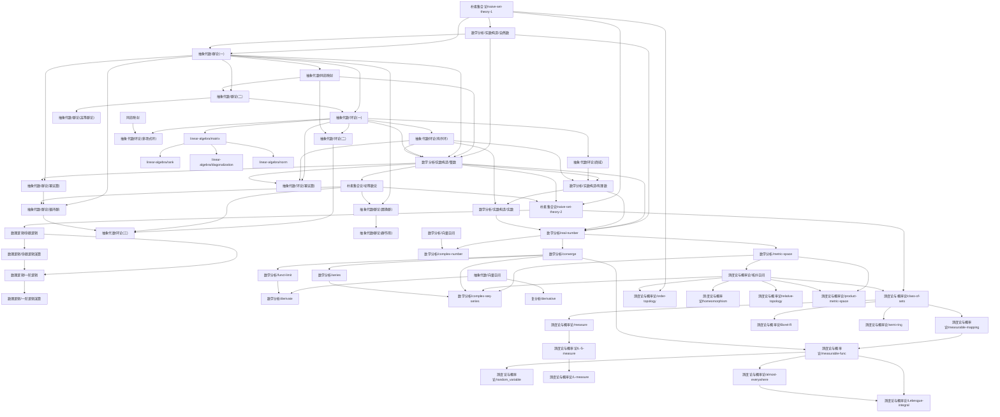

```mermaid
graph TD
1["数学分析/实数构造/整数"] --> 0["朴素集合论/初等数论"]
3["朴素集合论/naive-set-theory-1"] --> 2["朴素集合论/naive-set-theory-2"]
1["数学分析/实数构造/整数"] --> 2["朴素集合论/naive-set-theory-2"]
0["朴素集合论/初等数论"] --> 2["朴素集合论/naive-set-theory-2"]
5["数理逻辑/命题逻辑"] --> 4["数理逻辑/命题逻辑演算"]
5["数理逻辑/命题逻辑"] --> 6["数理逻辑/一阶逻辑"]
4["数理逻辑/命题逻辑演算"] --> 6["数理逻辑/一阶逻辑"]
2["朴素集合论/naive-set-theory-2"] --> 5["数理逻辑/命题逻辑"]
6["数理逻辑/一阶逻辑"] --> 7["数理逻辑/一阶逻辑演算"]
9["抽象代数/群论(一)"] --> 8["抽象代数/群论(置换群)"]
0["朴素集合论/初等数论"] --> 8["抽象代数/群论(置换群)"]
9["抽象代数/群论(一)"] --> 10["抽象代数/群论(二)"]
11["抽象代数/同态映射"] --> 10["抽象代数/群论(二)"]
13["抽象代数/环论(一)"] --> 12["抽象代数/环论(有序环)"]
9["抽象代数/群论(一)"] --> 11["抽象代数/同态映射"]
9["抽象代数/群论(一)"] --> 14["抽象代数/群论(幂运算)"]
1["数学分析/实数构造/整数"] --> 14["抽象代数/群论(幂运算)"]
13["抽象代数/环论(一)"] --> 15["抽象代数/环论(商域)"]
13["抽象代数/环论(一)"] --> 16["抽象代数/环论(幂运算)"]
12["抽象代数/环论(有序环)"] --> 16["抽象代数/环论(幂运算)"]
1["数学分析/实数构造/整数"] --> 16["抽象代数/环论(幂运算)"]
9["抽象代数/群论(一)"] --> 17["抽象代数/群论(循环群)"]
14["抽象代数/群论(幂运算)"] --> 17["抽象代数/群论(循环群)"]
0["朴素集合论/初等数论"] --> 17["抽象代数/群论(循环群)"]
9["抽象代数/群论(一)"] --> 13["抽象代数/环论(一)"]
10["抽象代数/群论(二)"] --> 13["抽象代数/环论(一)"]
19["抽象代数/环论(二)"] --> 18["抽象代数/环论(三)"]
0["朴素集合论/初等数论"] --> 18["抽象代数/环论(三)"]
17["抽象代数/群论(循环群)"] --> 18["抽象代数/环论(三)"]
13["抽象代数/环论(一)"] --> 19["抽象代数/环论(二)"]
11["抽象代数/同态映射"] --> 19["抽象代数/环论(二)"]
10["抽象代数/群论(二)"] --> 20["抽象代数/群论(高等群论)"]
13["抽象代数/环论(一)"] --> 21["抽象代数/环论(多项式环)"]
22["同态映射"] --> 21["抽象代数/环论(多项式环)"]
3["朴素集合论/naive-set-theory-1"] --> 9["抽象代数/群论(一)"]
23["数学分析/实数构造/自然数"] --> 9["抽象代数/群论(一)"]
8["抽象代数/群论(置换群)"] --> 24["抽象代数/群论(群作用)"]
26["数学分析/converge"] --> 25["数学分析/funct-limit"]
28["数学分析/real-number"] --> 27["数学分析/complex-number"]
29["数学分析/向量空间"] --> 27["数学分析/complex-number"]
31["抽象代数/向量空间"] --> 30["数学分析/derivate"]
25["数学分析/funct-limit"] --> 30["数学分析/derivate"]
33["数学分析/metric-space"] --> 32["数学分析/complex-seq-series"]
34["测度论与概率论/拓扑空间"] --> 32["数学分析/complex-seq-series"]
26["数学分析/converge"] --> 32["数学分析/complex-seq-series"]
35["数学分析/series"] --> 32["数学分析/complex-seq-series"]
28["数学分析/real-number"] --> 33["数学分析/metric-space"]
23["数学分析/实数构造/自然数"] --> 1["数学分析/实数构造/整数"]
11["抽象代数/同态映射"] --> 1["数学分析/实数构造/整数"]
9["抽象代数/群论(一)"] --> 1["数学分析/实数构造/整数"]
13["抽象代数/环论(一)"] --> 1["数学分析/实数构造/整数"]
12["抽象代数/环论(有序环)"] --> 1["数学分析/实数构造/整数"]
1["数学分析/实数构造/整数"] --> 36["数学分析/实数构造/有理数"]
15["抽象代数/环论(商域)"] --> 36["数学分析/实数构造/有理数"]
12["抽象代数/环论(有序环)"] --> 36["数学分析/实数构造/有理数"]
3["朴素集合论/naive-set-theory-1"] --> 23["数学分析/实数构造/自然数"]
36["数学分析/实数构造/有理数"] --> 37["数学分析/实数构造/实数"]
12["抽象代数/环论(有序环)"] --> 37["数学分析/实数构造/实数"]
28["数学分析/real-number"] --> 26["数学分析/converge"]
26["数学分析/converge"] --> 35["数学分析/series"]
23["数学分析/实数构造/自然数"] --> 28["数学分析/real-number"]
1["数学分析/实数构造/整数"] --> 28["数学分析/real-number"]
36["数学分析/实数构造/有理数"] --> 28["数学分析/real-number"]
37["数学分析/实数构造/实数"] --> 28["数学分析/real-number"]
31["抽象代数/向量空间"] --> 38["复分析/derivative"]
40["linear-algebra/matrix"] --> 39["linear-algebra/rank"]
13["抽象代数/环论(一)"] --> 40["linear-algebra/matrix"]
40["linear-algebra/matrix"] --> 41["linear-algebra/diagonalization"]
40["linear-algebra/matrix"] --> 42["linear-algebra/norm"]
2["朴素集合论/naive-set-theory-2"] --> 43["测度论与概率论/class-of-sets"]
34["测度论与概率论/拓扑空间"] --> 43["测度论与概率论/class-of-sets"]
45["测度论与概率论/measurable-mapping"] --> 44["测度论与概率论/measurable-func"]
26["数学分析/converge"] --> 44["测度论与概率论/measurable-func"]
47["测度论与概率论/measure"] --> 46["测度论与概率论/L-S-measure"]
3["朴素集合论/naive-set-theory-1"] --> 48["测度论与概率论/order-topology"]
34["测度论与概率论/拓扑空间"] --> 48["测度论与概率论/order-topology"]
44["测度论与概率论/measurable-func"] --> 49["测度论与概率论/random_variable"]
43["测度论与概率论/class-of-sets"] --> 50["测度论与概率论/Borel-R"]
34["测度论与概率论/拓扑空间"] --> 51["测度论与概率论/homeomorphism"]
43["测度论与概率论/class-of-sets"] --> 52["测度论与概率论/semi-ring"]
34["测度论与概率论/拓扑空间"] --> 53["测度论与概率论/relative-topology"]
46["测度论与概率论/L-S-measure"] --> 54["测度论与概率论/L-measure"]
44["测度论与概率论/measurable-func"] --> 55["测度论与概率论/almost-everywhere"]
43["测度论与概率论/class-of-sets"] --> 45["测度论与概率论/measurable-mapping"]
33["数学分析/metric-space"] --> 34["测度论与概率论/拓扑空间"]
43["测度论与概率论/class-of-sets"] --> 47["测度论与概率论/measure"]
33["数学分析/metric-space"] --> 56["测度论与概率论/product-metric-space"]
34["测度论与概率论/拓扑空间"] --> 56["测度论与概率论/product-metric-space"]
44["测度论与概率论/measurable-func"] --> 57["测度论与概率论/Lebesgue-integral"]
55["测度论与概率论/almost-everywhere"] --> 57["测度论与概率论/Lebesgue-integral"]
```