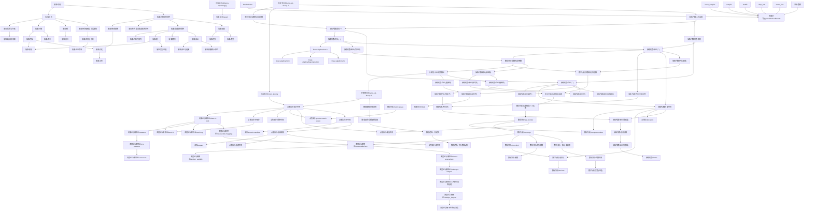

```mermaid
graph TD
1["数理逻辑/一阶逻辑"] --> 0["数理逻辑/一阶逻辑演算"]
2["数理逻辑/命题逻辑演算"] --> 1["数理逻辑/一阶逻辑"]
3["数理逻辑/命题逻辑"] --> 2["数理逻辑/命题逻辑演算"]
5["朴素集合论/naive-set-theory-2"] --> 3["数理逻辑/命题逻辑"]
5["朴素集合论/naive-set-theory-2"] --> 6["点集拓扑/拓扑空间"]
7["朴素集合论/zorn_lemma"] --> 6["点集拓扑/拓扑空间"]
9["点集拓扑/子空间"] --> 8["点集拓扑/连续映射"]
6["点集拓扑/拓扑空间"] --> 9["点集拓扑/子空间"]
12["数学分析/real-number"] --> 11["点集拓扑/度量空间"]
6["点集拓扑/拓扑空间"] --> 11["点集拓扑/度量空间"]
8["点集拓扑/连续映射"] --> 13["点集拓扑/紧空间"]
15["数学分析/metric-space"] --> 14["点集拓扑/product-metric-space"]
6["点集拓扑/拓扑空间"] --> 14["点集拓扑/product-metric-space"]
8["点集拓扑/连续映射"] --> 16["点集拓扑/连通空间"]
6["点集拓扑/拓扑空间"] --> 17["点集拓扑/乘积空间"]
6["点集拓扑/拓扑空间"] --> 18["点集拓扑/序拓扑"]
20["抽象代数/群论(循环群)"] --> 19["抽象代数/环论(有限环)"]
22["抽象代数/环论(一)"] --> 21["抽象代数/环论(二)"]
23["抽象代数/同态映射"] --> 21["抽象代数/环论(二)"]
19["抽象代数/环论(有限环)"] --> 24["抽象代数/环论(杂)"]
25["抽象代数/环论(多项式环)"] --> 24["抽象代数/环论(杂)"]
27["朴素集合论/naive-set-theory-1"] --> 26["抽象代数/二元运算"]
29["抽象代数/群论(二)"] --> 28["抽象代数/群论(杂)"]
20["抽象代数/群论(循环群)"] --> 28["抽象代数/群论(杂)"]
31["抽象代数/域论(域拓展)"] --> 30["抽象代数/形式导数"]
32["抽象代数/群论(一)"] --> 29["抽象代数/群论(二)"]
23["抽象代数/同态映射"] --> 29["抽象代数/群论(二)"]
33["抽象代数/群论(幂运算)"] --> 20["抽象代数/群论(循环群)"]
34["朴素集合论/初等数论"] --> 20["抽象代数/群论(循环群)"]
33["抽象代数/群论(幂运算)"] --> 35["抽象代数/环论(幂运算)"]
29["抽象代数/群论(二)"] --> 36["抽象代数/群论(群作用)"]
37["抽象代数/群论(置换群)"] --> 36["抽象代数/群论(群作用)"]
21["抽象代数/环论(二)"] --> 38["抽象代数/环论(商域)"]
32["抽象代数/群论(一)"] --> 22["抽象代数/环论(一)"]
29["抽象代数/群论(二)"] --> 39["抽象代数/群论(高等群论)"]
41["抽象代数/域论(有限域)"] --> 40["抽象代数/Galois"]
42["数学分析/实数构造/自然数"] --> 32["抽象代数/群论(一)"]
26["抽象代数/二元运算"] --> 32["抽象代数/群论(一)"]
29["抽象代数/群论(二)"] --> 43["抽象代数/向量空间"]
21["抽象代数/环论(二)"] --> 43["抽象代数/向量空间"]
22["抽象代数/环论(一)"] --> 45["抽象代数/环论(有序环)"]
21["抽象代数/环论(二)"] --> 25["抽象代数/环论(多项式环)"]
24["抽象代数/环论(杂)"] --> 31["抽象代数/域论(域拓展)"]
43["抽象代数/向量空间"] --> 31["抽象代数/域论(域拓展)"]
30["抽象代数/形式导数"] --> 41["抽象代数/域论(有限域)"]
46["数学分析/实数构造/整数"] --> 33["抽象代数/群论(幂运算)"]
29["抽象代数/群论(二)"] --> 47["抽象代数/群论(群列)"]
26["抽象代数/二元运算"] --> 23["抽象代数/同态映射"]
34["朴素集合论/初等数论"] --> 37["抽象代数/群论(置换群)"]
8["点集拓扑/连续映射"] --> 49["流形/prepare"]
9["点集拓扑/子空间"] --> 50["流形/smooth-manifold"]
53["机器学习/diffusion-inpainting(1)"] --> 52["机器学习/repaint"]
36["抽象代数/群论(群作用)"] --> 54["机器学习/SE(3)"]
27["朴素集合论/naive-set-theory-1"] --> 7["朴素集合论/zorn_lemma"]
46["数学分析/实数构造/整数"] --> 34["朴素集合论/初等数论"]
34["朴素集合论/初等数论"] --> 5["朴素集合论/naive-set-theory-2"]
43["抽象代数/向量空间"] --> 57["复分析/derivative"]
62["数学分析/非负级数"] --> 61["数学分析/级数"]
64["数学分析/实数次幂"] --> 63["数学分析/实数(代理)"]
66["数学分析/converge"] --> 65["数学分析/一些标准极限"]
68["数学分析/无穷小"] --> 67["数学分析/derivate"]
12["数学分析/real-number"] --> 66["数学分析/converge"]
65["数学分析/一些标准极限"] --> 64["数学分析/实数次幂"]
66["数学分析/converge"] --> 62["数学分析/非负级数"]
43["抽象代数/向量空间"] --> 68["数学分析/无穷小"]
69["数学分析/funct-limit"] --> 68["数学分析/无穷小"]
66["数学分析/converge"] --> 69["数学分析/funct-limit"]
12["数学分析/real-number"] --> 71["数学分析/complex-number"]
43["抽象代数/向量空间"] --> 71["数学分析/complex-number"]
72["数学分析/实数构造/广义实数"] --> 12["数学分析/real-number"]
76["linear-algebra/matrix"] --> 75["linear-algebra/rank"]
22["抽象代数/环论(一)"] --> 76["linear-algebra/matrix"]
76["linear-algebra/matrix"] --> 78["linear-algebra/diagonalization"]
76["linear-algebra/matrix"] --> 79["linear-algebra/norm"]
81["故事/劳动"] --> 80["故事/异化"]
82["故事/绝对精神"] --> 80["故事/异化"]
84["故事/纯粹理性批判"] --> 83["故事/固执"]
86["故事/经济基础与上层建筑"] --> 85["故事/性别与权利"]
88["故事/价格"] --> 87["故事/资本"]
83["故事/固执"] --> 89["故事/改变"]
91["故事/安全"] --> 90["故事/狡猾的小说家"]
84["故事/纯粹理性批判"] --> 92["故事/实践理性批判"]
93["故事/时间"] --> 84["故事/纯粹理性批判"]
92["故事/实践理性批判"] --> 91["故事/安全"]
94["故事/货币"] --> 86["故事/经济基础与上层建筑"]
92["故事/实践理性批判"] --> 95["故事/拥有"]
94["故事/货币"] --> 96["故事/税"]
96["故事/税"] --> 97["故事/房价"]
99["故事/货币与行政"] --> 98["故事/政治机构图"]
83["故事/固执"] --> 100["故事/变化"]
92["故事/实践理性批判"] --> 101["故事/爱"]
94["故事/货币"] --> 88["故事/价格"]
84["故事/纯粹理性批判"] --> 103["故事/作为意志和表象的世界"]
84["故事/纯粹理性批判"] --> 82["故事/绝对精神"]
94["故事/货币"] --> 99["故事/货币与行政"]
91["故事/安全"] --> 104["故事/安全与道德"]
85["故事/性别与权利"] --> 105["故事/神圣叙事"]
80["故事/异化"] --> 106["故事/工作"]
101["故事/爱"] --> 107["故事/爱与幸福"]
93["故事/时间"] --> 94["故事/货币"]
101["故事/爱"] --> 108["故事/孩子"]
81["故事/劳动"] --> 108["故事/孩子"]
88["故事/价格"] --> 81["故事/劳动"]
92["故事/实践理性批判"] --> 109["故事/判断力批判"]
6["点集拓扑/拓扑空间"] --> 110["测度论与概率论/class-of-sets"]
112["测度论与概率论/almost-everywhere"] --> 111["测度论与概率论/Lebesgue-integral"]
114["测度论与概率论/Stieltjes_integral"] --> 113["测度论与概率论/符号测度"]
115["测度论与概率论/三大积分收敛定理"] --> 114["测度论与概率论/Stieltjes_integral"]
110["测度论与概率论/class-of-sets"] --> 116["测度论与概率论/measurable-mapping"]
118["测度论与概率论/measure"] --> 117["测度论与概率论/L-S-measure"]
116["测度论与概率论/measurable-mapping"] --> 119["测度论与概率论/measurable-func"]
66["数学分析/converge"] --> 119["测度论与概率论/measurable-func"]
110["测度论与概率论/class-of-sets"] --> 120["测度论与概率论/semi-ring"]
111["测度论与概率论/Lebesgue-integral"] --> 115["测度论与概率论/三大积分收敛定理"]
119["测度论与概率论/measurable-func"] --> 112["测度论与概率论/almost-everywhere"]
119["测度论与概率论/measurable-func"] --> 121["测度论与概率论/random_variable"]
110["测度论与概率论/class-of-sets"] --> 118["测度论与概率论/measure"]
117["测度论与概率论/L-S-measure"] --> 123["测度论与概率论/L-measure"]
110["测度论与概率论/class-of-sets"] --> 124["测度论与概率论/Borel-R"]
18["点集拓扑/序拓扑"] --> 124["测度论与概率论/Borel-R"]
126["数学分析/实数构造/有理数"] --> 125["数学分析/实数构造/实数"]
35["抽象代数/环论(幂运算)"] --> 125["数学分析/实数构造/实数"]
46["数学分析/实数构造/整数"] --> 126["数学分析/实数构造/有理数"]
38["抽象代数/环论(商域)"] --> 126["数学分析/实数构造/有理数"]
125["数学分析/实数构造/实数"] --> 72["数学分析/实数构造/广义实数"]
27["朴素集合论/naive-set-theory-1"] --> 42["数学分析/实数构造/自然数"]
21["抽象代数/环论(二)"] --> 46["数学分析/实数构造/整数"]
45["抽象代数/环论(有序环)"] --> 46["数学分析/实数构造/整数"]
128["原始数据"] --> 127["机器学习/pytorch/torch.utils.data"]
129["batch_size"] --> 127["机器学习/pytorch/torch.utils.data"]
130["drop_last"] --> 127["机器学习/pytorch/torch.utils.data"]
131["shuffle"] --> 127["机器学习/pytorch/torch.utils.data"]
132["sampler"] --> 127["机器学习/pytorch/torch.utils.data"]
133["batch_sampler"] --> 127["机器学习/pytorch/torch.utils.data"]
134["batched data"] --> 127["机器学习/pytorch/torch.utils.data"]
```
