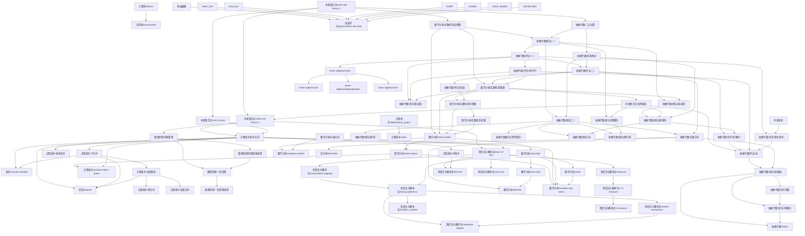

```mermaid
graph TD
1["点集拓扑/拓扑空间"] --> 0["流形/smooth-manifold"]
2["点集拓扑/子空间"] --> 0["流形/smooth-manifold"]
1["点集拓扑/拓扑空间"] --> 3["流形/prepare"]
2["点集拓扑/子空间"] --> 3["流形/prepare"]
4["点集拓扑/连续映射"] --> 3["流形/prepare"]
6["朴素集合论/naive-set-theory-1"] --> 5["朴素集合论/zorn_lemma"]
8["数学分析/实数构造/整数"] --> 7["朴素集合论/初等数论"]
6["朴素集合论/naive-set-theory-1"] --> 9["朴素集合论/naive-set-theory-2"]
7["朴素集合论/初等数论"] --> 9["朴素集合论/naive-set-theory-2"]
4["点集拓扑/连续映射"] --> 10["点集拓扑/紧空间"]
2["点集拓扑/子空间"] --> 4["点集拓扑/连续映射"]
4["点集拓扑/连续映射"] --> 11["点集拓扑/连通空间"]
1["点集拓扑/拓扑空间"] --> 12["点集拓扑/序拓扑"]
14["点集拓扑/dependency_graph"] --> 13["点集拓扑/index"]
1["点集拓扑/拓扑空间"] --> 2["点集拓扑/子空间"]
1["点集拓扑/拓扑空间"] --> 15["点集拓扑/乘积空间"]
9["朴素集合论/naive-set-theory-2"] --> 1["点集拓扑/拓扑空间"]
5["朴素集合论/zorn_lemma"] --> 1["点集拓扑/拓扑空间"]
17["数学分析/metric-space"] --> 16["点集拓扑/product-metric-space"]
1["点集拓扑/拓扑空间"] --> 16["点集拓扑/product-metric-space"]
19["计算机/docker"] --> 18["计算机/easyconnect"]
21["数理逻辑/命题逻辑"] --> 20["数理逻辑/命题逻辑演算"]
21["数理逻辑/命题逻辑"] --> 22["数理逻辑/一阶逻辑"]
20["数理逻辑/命题逻辑演算"] --> 22["数理逻辑/一阶逻辑"]
9["朴素集合论/naive-set-theory-2"] --> 21["数理逻辑/命题逻辑"]
22["数理逻辑/一阶逻辑"] --> 23["数理逻辑/一阶逻辑演算"]
25["抽象代数/群论(二)"] --> 24["抽象代数/群论(群列)"]
27["抽象代数/群论(一)"] --> 26["抽象代数/群论(置换群)"]
7["朴素集合论/初等数论"] --> 26["抽象代数/群论(置换群)"]
27["抽象代数/群论(一)"] --> 25["抽象代数/群论(二)"]
28["抽象代数/同态映射"] --> 25["抽象代数/群论(二)"]
30["抽象代数/环论(一)"] --> 29["抽象代数/环论(有序环)"]
31["抽象代数/二元运算"] --> 28["抽象代数/同态映射"]
27["抽象代数/群论(一)"] --> 32["抽象代数/群论(幂运算)"]
8["数学分析/实数构造/整数"] --> 32["抽象代数/群论(幂运算)"]
34["抽象代数/环论(二)"] --> 33["抽象代数/环论(商域)"]
30["抽象代数/环论(一)"] --> 35["抽象代数/环论(幂运算)"]
29["抽象代数/环论(有序环)"] --> 35["抽象代数/环论(幂运算)"]
8["数学分析/实数构造/整数"] --> 35["抽象代数/环论(幂运算)"]
32["抽象代数/群论(幂运算)"] --> 36["抽象代数/群论(循环群)"]
7["朴素集合论/初等数论"] --> 36["抽象代数/群论(循环群)"]
28["抽象代数/同态映射"] --> 36["抽象代数/群论(循环群)"]
7["朴素集合论/初等数论"] --> 37["抽象代数/环论(杂)"]
38["抽象代数/环论(有限环)"] --> 37["抽象代数/环论(杂)"]
29["抽象代数/环论(有序环)"] --> 37["抽象代数/环论(杂)"]
39["抽象代数/环论(多项式环)"] --> 37["抽象代数/环论(杂)"]
34["抽象代数/环论(二)"] --> 38["抽象代数/环论(有限环)"]
36["抽象代数/群论(循环群)"] --> 38["抽象代数/环论(有限环)"]
27["抽象代数/群论(一)"] --> 30["抽象代数/环论(一)"]
41["抽象代数/域论(域拓展)"] --> 40["抽象代数/形式导数"]
25["抽象代数/群论(二)"] --> 42["抽象代数/向量空间"]
34["抽象代数/环论(二)"] --> 42["抽象代数/向量空间"]
30["抽象代数/环论(一)"] --> 34["抽象代数/环论(二)"]
28["抽象代数/同态映射"] --> 34["抽象代数/环论(二)"]
41["抽象代数/域论(域拓展)"] --> 43["抽象代数/Galois"]
44["抽象代数/域论(有限域)"] --> 43["抽象代数/Galois"]
25["抽象代数/群论(二)"] --> 45["抽象代数/群论(高等群论)"]
25["抽象代数/群论(二)"] --> 46["抽象代数/群论(杂)"]
36["抽象代数/群论(循环群)"] --> 46["抽象代数/群论(杂)"]
30["抽象代数/环论(一)"] --> 39["抽象代数/环论(多项式环)"]
47["同态映射"] --> 39["抽象代数/环论(多项式环)"]
37["抽象代数/环论(杂)"] --> 41["抽象代数/域论(域拓展)"]
42["抽象代数/向量空间"] --> 41["抽象代数/域论(域拓展)"]
6["朴素集合论/naive-set-theory-1"] --> 31["抽象代数/二元运算"]
48["数学分析/实数构造/自然数"] --> 27["抽象代数/群论(一)"]
31["抽象代数/二元运算"] --> 27["抽象代数/群论(一)"]
25["抽象代数/群论(二)"] --> 49["抽象代数/群论(群作用)"]
26["抽象代数/群论(置换群)"] --> 49["抽象代数/群论(群作用)"]
41["抽象代数/域论(域拓展)"] --> 44["抽象代数/域论(有限域)"]
40["抽象代数/形式导数"] --> 44["抽象代数/域论(有限域)"]
51["数学分析/converge"] --> 50["数学分析/funct-limit"]
53["数学分析/real-number"] --> 52["数学分析/complex-number"]
54["数学分析/向量空间"] --> 52["数学分析/complex-number"]
42["抽象代数/向量空间"] --> 55["数学分析/derivate"]
50["数学分析/funct-limit"] --> 55["数学分析/derivate"]
17["数学分析/metric-space"] --> 56["数学分析/complex-seq-series"]
1["点集拓扑/拓扑空间"] --> 56["数学分析/complex-seq-series"]
51["数学分析/converge"] --> 56["数学分析/complex-seq-series"]
57["数学分析/series"] --> 56["数学分析/complex-seq-series"]
53["数学分析/real-number"] --> 17["数学分析/metric-space"]
13["点集拓扑/index"] --> 17["数学分析/metric-space"]
48["数学分析/实数构造/自然数"] --> 8["数学分析/实数构造/整数"]
34["抽象代数/环论(二)"] --> 8["数学分析/实数构造/整数"]
29["抽象代数/环论(有序环)"] --> 8["数学分析/实数构造/整数"]
8["数学分析/实数构造/整数"] --> 58["数学分析/实数构造/有理数"]
33["抽象代数/环论(商域)"] --> 58["数学分析/实数构造/有理数"]
6["朴素集合论/naive-set-theory-1"] --> 48["数学分析/实数构造/自然数"]
58["数学分析/实数构造/有理数"] --> 59["数学分析/实数构造/实数"]
53["数学分析/real-number"] --> 51["数学分析/converge"]
51["数学分析/converge"] --> 57["数学分析/series"]
48["数学分析/实数构造/自然数"] --> 53["数学分析/real-number"]
8["数学分析/实数构造/整数"] --> 53["数学分析/real-number"]
58["数学分析/实数构造/有理数"] --> 53["数学分析/real-number"]
59["数学分析/实数构造/实数"] --> 53["数学分析/real-number"]
42["抽象代数/向量空间"] --> 60["复分析/derivative"]
62["原始数据"] --> 61["机器学习/pytorch/torch.utils.data"]
63["batch_size"] --> 61["机器学习/pytorch/torch.utils.data"]
64["drop_last"] --> 61["机器学习/pytorch/torch.utils.data"]
65["shuffle"] --> 61["机器学习/pytorch/torch.utils.data"]
66["sampler"] --> 61["机器学习/pytorch/torch.utils.data"]
67["batch_sampler"] --> 61["机器学习/pytorch/torch.utils.data"]
68["batched data"] --> 61["机器学习/pytorch/torch.utils.data"]
70["linear-algebra/matrix"] --> 69["linear-algebra/rank"]
30["抽象代数/环论(一)"] --> 70["linear-algebra/matrix"]
70["linear-algebra/matrix"] --> 71["linear-algebra/diagonalization"]
70["linear-algebra/matrix"] --> 72["linear-algebra/norm"]
9["朴素集合论/naive-set-theory-2"] --> 73["测度论与概率论/class-of-sets"]
1["点集拓扑/拓扑空间"] --> 73["测度论与概率论/class-of-sets"]
75["测度论与概率论/measurable-mapping"] --> 74["测度论与概率论/measurable-func"]
51["数学分析/converge"] --> 74["测度论与概率论/measurable-func"]
77["测度论与概率论/measure"] --> 76["测度论与概率论/L-S-measure"]
74["测度论与概率论/measurable-func"] --> 78["测度论与概率论/random_variable"]
73["测度论与概率论/class-of-sets"] --> 79["测度论与概率论/Borel-R"]
12["点集拓扑/序拓扑"] --> 79["测度论与概率论/Borel-R"]
73["测度论与概率论/class-of-sets"] --> 80["测度论与概率论/semi-ring"]
76["测度论与概率论/L-S-measure"] --> 81["测度论与概率论/L-measure"]
74["测度论与概率论/measurable-func"] --> 82["测度论与概率论/almost-everywhere"]
73["测度论与概率论/class-of-sets"] --> 75["测度论与概率论/measurable-mapping"]
73["测度论与概率论/class-of-sets"] --> 77["测度论与概率论/measure"]
74["测度论与概率论/measurable-func"] --> 83["测度论与概率论/Lebesgue-integral"]
82["测度论与概率论/almost-everywhere"] --> 83["测度论与概率论/Lebesgue-integral"]
```