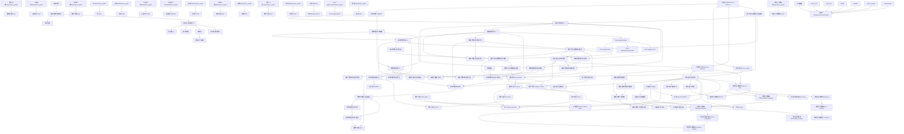

```mermaid
graph TD
1["数理逻辑/一阶逻辑"] --> 0["数理逻辑/一阶逻辑演算"]
2["数理逻辑/命题逻辑"] --> 1["数理逻辑/一阶逻辑"]
3["数理逻辑/命题逻辑演算"] --> 1["数理逻辑/一阶逻辑"]
2["数理逻辑/命题逻辑"] --> 3["数理逻辑/命题逻辑演算"]
5["数理逻辑/dependency_graph"] --> 4["数理逻辑/index"]
6["朴素集合论/naive-set-theory-2"] --> 2["数理逻辑/命题逻辑"]
6["朴素集合论/naive-set-theory-2"] --> 7["点集拓扑/拓扑空间"]
8["朴素集合论/zorn_lemma"] --> 7["点集拓扑/拓扑空间"]
10["点集拓扑/子空间"] --> 9["点集拓扑/连续映射"]
12["点集拓扑/dependency_graph"] --> 11["点集拓扑/index"]
7["点集拓扑/拓扑空间"] --> 10["点集拓扑/子空间"]
14["数学分析/real-number"] --> 13["点集拓扑/度量空间"]
7["点集拓扑/拓扑空间"] --> 13["点集拓扑/度量空间"]
9["点集拓扑/连续映射"] --> 15["点集拓扑/紧空间"]
17["数学分析/metric-space"] --> 16["点集拓扑/product-metric-space"]
7["点集拓扑/拓扑空间"] --> 16["点集拓扑/product-metric-space"]
9["点集拓扑/连续映射"] --> 18["点集拓扑/连通空间"]
7["点集拓扑/拓扑空间"] --> 19["点集拓扑/乘积空间"]
7["点集拓扑/拓扑空间"] --> 20["点集拓扑/序拓扑"]
22["抽象代数/环论(二)"] --> 21["抽象代数/环论(有限环)"]
23["抽象代数/群论(循环群)"] --> 21["抽象代数/环论(有限环)"]
24["抽象代数/环论(一)"] --> 22["抽象代数/环论(二)"]
25["抽象代数/同态映射"] --> 22["抽象代数/环论(二)"]
27["朴素集合论/初等数论"] --> 26["抽象代数/环论(杂)"]
21["抽象代数/环论(有限环)"] --> 26["抽象代数/环论(杂)"]
28["抽象代数/环论(有序环)"] --> 26["抽象代数/环论(杂)"]
29["抽象代数/环论(多项式环)"] --> 26["抽象代数/环论(杂)"]
31["朴素集合论/naive-set-theory-1"] --> 30["抽象代数/二元运算"]
33["抽象代数/群论(二)"] --> 32["抽象代数/群论(杂)"]
23["抽象代数/群论(循环群)"] --> 32["抽象代数/群论(杂)"]
35["抽象代数/域论(域拓展)"] --> 34["抽象代数/形式导数"]
36["抽象代数/群论(一)"] --> 33["抽象代数/群论(二)"]
25["抽象代数/同态映射"] --> 33["抽象代数/群论(二)"]
37["抽象代数/群论(幂运算)"] --> 23["抽象代数/群论(循环群)"]
27["朴素集合论/初等数论"] --> 23["抽象代数/群论(循环群)"]
25["抽象代数/同态映射"] --> 23["抽象代数/群论(循环群)"]
24["抽象代数/环论(一)"] --> 38["抽象代数/环论(幂运算)"]
28["抽象代数/环论(有序环)"] --> 38["抽象代数/环论(幂运算)"]
39["数学分析/实数构造/整数"] --> 38["抽象代数/环论(幂运算)"]
33["抽象代数/群论(二)"] --> 40["抽象代数/群论(群作用)"]
41["抽象代数/群论(置换群)"] --> 40["抽象代数/群论(群作用)"]
22["抽象代数/环论(二)"] --> 42["抽象代数/环论(商域)"]
36["抽象代数/群论(一)"] --> 24["抽象代数/环论(一)"]
33["抽象代数/群论(二)"] --> 43["抽象代数/群论(高等群论)"]
35["抽象代数/域论(域拓展)"] --> 44["抽象代数/Galois"]
45["抽象代数/域论(有限域)"] --> 44["抽象代数/Galois"]
46["数学分析/实数构造/自然数"] --> 36["抽象代数/群论(一)"]
30["抽象代数/二元运算"] --> 36["抽象代数/群论(一)"]
33["抽象代数/群论(二)"] --> 47["抽象代数/向量空间"]
22["抽象代数/环论(二)"] --> 47["抽象代数/向量空间"]
49["抽象代数/dependency_graph"] --> 48["抽象代数/index"]
24["抽象代数/环论(一)"] --> 28["抽象代数/环论(有序环)"]
24["抽象代数/环论(一)"] --> 29["抽象代数/环论(多项式环)"]
50["同态映射"] --> 29["抽象代数/环论(多项式环)"]
26["抽象代数/环论(杂)"] --> 35["抽象代数/域论(域拓展)"]
47["抽象代数/向量空间"] --> 35["抽象代数/域论(域拓展)"]
35["抽象代数/域论(域拓展)"] --> 45["抽象代数/域论(有限域)"]
34["抽象代数/形式导数"] --> 45["抽象代数/域论(有限域)"]
36["抽象代数/群论(一)"] --> 37["抽象代数/群论(幂运算)"]
39["数学分析/实数构造/整数"] --> 37["抽象代数/群论(幂运算)"]
33["抽象代数/群论(二)"] --> 51["抽象代数/群论(群列)"]
30["抽象代数/二元运算"] --> 25["抽象代数/同态映射"]
36["抽象代数/群论(一)"] --> 41["抽象代数/群论(置换群)"]
27["朴素集合论/初等数论"] --> 41["抽象代数/群论(置换群)"]
17["数学分析/metric-space"] --> 52["杂/complex-seq-series"]
7["点集拓扑/拓扑空间"] --> 52["杂/complex-seq-series"]
53["数学分析/converge"] --> 52["杂/complex-seq-series"]
54["数学分析/series"] --> 52["杂/complex-seq-series"]
56["杂/dependency_graph"] --> 55["杂/index"]
7["点集拓扑/拓扑空间"] --> 57["流形/prepare"]
10["点集拓扑/子空间"] --> 57["流形/prepare"]
9["点集拓扑/连续映射"] --> 57["流形/prepare"]
7["点集拓扑/拓扑空间"] --> 58["流形/smooth-manifold"]
10["点集拓扑/子空间"] --> 58["流形/smooth-manifold"]
60["流形/dependency_graph"] --> 59["流形/index"]
62["机器学习/dependency_graph"] --> 61["机器学习/index"]
31["朴素集合论/naive-set-theory-1"] --> 8["朴素集合论/zorn_lemma"]
39["数学分析/实数构造/整数"] --> 27["朴素集合论/初等数论"]
64["朴素集合论/dependency_graph"] --> 63["朴素集合论/index"]
31["朴素集合论/naive-set-theory-1"] --> 6["朴素集合论/naive-set-theory-2"]
27["朴素集合论/初等数论"] --> 6["朴素集合论/naive-set-theory-2"]
47["抽象代数/向量空间"] --> 65["复分析/derivative"]
67["复分析/dependency_graph"] --> 66["复分析/index"]
69["微分方程/dependency_graph"] --> 68["微分方程/index"]
71["范畴/dependency_graph"] --> 70["范畴/index"]
47["抽象代数/向量空间"] --> 72["数学分析/derivate"]
73["数学分析/funct-limit"] --> 72["数学分析/derivate"]
14["数学分析/real-number"] --> 53["数学分析/converge"]
75["数学分析/dependency_graph"] --> 74["数学分析/index"]
53["数学分析/converge"] --> 73["数学分析/funct-limit"]
14["数学分析/real-number"] --> 76["数学分析/complex-number"]
77["数学分析/向量空间"] --> 76["数学分析/complex-number"]
53["数学分析/converge"] --> 54["数学分析/series"]
46["数学分析/实数构造/自然数"] --> 14["数学分析/real-number"]
39["数学分析/实数构造/整数"] --> 14["数学分析/real-number"]
78["数学分析/实数构造/有理数"] --> 14["数学分析/real-number"]
79["数学分析/实数构造/实数"] --> 14["数学分析/real-number"]
81["计算机/dependency_graph"] --> 80["计算机/index"]
83["计算机/docker"] --> 82["计算机/easyconnect"]
85["linear-algebra/matrix"] --> 84["linear-algebra/rank"]
87["linear-algebra/dependency_graph"] --> 86["linear-algebra/index"]
24["抽象代数/环论(一)"] --> 85["linear-algebra/matrix"]
85["linear-algebra/matrix"] --> 88["linear-algebra/diagonalization"]
85["linear-algebra/matrix"] --> 89["linear-algebra/norm"]
91["故事/纯粹理性批判"] --> 90["故事/固执"]
91["故事/纯粹理性批判"] --> 92["故事/实践理性批判"]
93["故事/时间"] --> 91["故事/纯粹理性批判"]
92["故事/实践理性批判"] --> 94["故事/安全"]
92["故事/实践理性批判"] --> 95["故事/拥有"]
92["故事/实践理性批判"] --> 96["故事/爱"]
98["故事/dependency_graph"] --> 97["故事/index"]
96["故事/爱"] --> 99["故事/爱与幸福"]
92["故事/实践理性批判"] --> 100["故事/判断力批判"]
6["朴素集合论/naive-set-theory-2"] --> 101["测度论与概率论/class-of-sets"]
7["点集拓扑/拓扑空间"] --> 101["测度论与概率论/class-of-sets"]
103["测度论与概率论/measurable-func"] --> 102["测度论与概率论/Lebesgue-integral"]
104["测度论与概率论/almost-everywhere"] --> 102["测度论与概率论/Lebesgue-integral"]
101["测度论与概率论/class-of-sets"] --> 105["测度论与概率论/measurable-mapping"]
107["测度论与概率论/measure"] --> 106["测度论与概率论/L-S-measure"]
105["测度论与概率论/measurable-mapping"] --> 103["测度论与概率论/measurable-func"]
53["数学分析/converge"] --> 103["测度论与概率论/measurable-func"]
101["测度论与概率论/class-of-sets"] --> 108["测度论与概率论/semi-ring"]
103["测度论与概率论/measurable-func"] --> 104["测度论与概率论/almost-everywhere"]
103["测度论与概率论/measurable-func"] --> 109["测度论与概率论/random_variable"]
111["测度论与概率论/dependency_graph"] --> 110["测度论与概率论/index"]
101["测度论与概率论/class-of-sets"] --> 107["测度论与概率论/measure"]
106["测度论与概率论/L-S-measure"] --> 112["测度论与概率论/L-measure"]
101["测度论与概率论/class-of-sets"] --> 113["测度论与概率论/Borel-R"]
20["点集拓扑/序拓扑"] --> 113["测度论与概率论/Borel-R"]
78["数学分析/实数构造/有理数"] --> 79["数学分析/实数构造/实数"]
39["数学分析/实数构造/整数"] --> 78["数学分析/实数构造/有理数"]
42["抽象代数/环论(商域)"] --> 78["数学分析/实数构造/有理数"]
31["朴素集合论/naive-set-theory-1"] --> 46["数学分析/实数构造/自然数"]
46["数学分析/实数构造/自然数"] --> 39["数学分析/实数构造/整数"]
22["抽象代数/环论(二)"] --> 39["数学分析/实数构造/整数"]
28["抽象代数/环论(有序环)"] --> 39["数学分析/实数构造/整数"]
115["原始数据"] --> 114["机器学习/pytorch/torch.utils.data"]
116["batch_size"] --> 114["机器学习/pytorch/torch.utils.data"]
117["drop_last"] --> 114["机器学习/pytorch/torch.utils.data"]
118["shuffle"] --> 114["机器学习/pytorch/torch.utils.data"]
119["sampler"] --> 114["机器学习/pytorch/torch.utils.data"]
120["batch_sampler"] --> 114["机器学习/pytorch/torch.utils.data"]
121["batched data"] --> 114["机器学习/pytorch/torch.utils.data"]
```