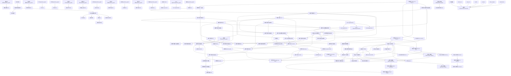

```mermaid
graph TD
1["数理逻辑/一阶逻辑"] --> 0["数理逻辑/一阶逻辑演算"]
2["数理逻辑/命题逻辑"] --> 1["数理逻辑/一阶逻辑"]
3["数理逻辑/命题逻辑演算"] --> 1["数理逻辑/一阶逻辑"]
2["数理逻辑/命题逻辑"] --> 3["数理逻辑/命题逻辑演算"]
5["数理逻辑/dependency_graph"] --> 4["数理逻辑/index"]
6["朴素集合论/naive-set-theory-2"] --> 2["数理逻辑/命题逻辑"]
6["朴素集合论/naive-set-theory-2"] --> 7["点集拓扑/拓扑空间"]
8["朴素集合论/zorn_lemma"] --> 7["点集拓扑/拓扑空间"]
10["点集拓扑/子空间"] --> 9["点集拓扑/连续映射"]
12["点集拓扑/dependency_graph"] --> 11["点集拓扑/index"]
7["点集拓扑/拓扑空间"] --> 10["点集拓扑/子空间"]
9["点集拓扑/连续映射"] --> 13["点集拓扑/紧空间"]
15["数学分析/metric-space"] --> 14["点集拓扑/product-metric-space"]
7["点集拓扑/拓扑空间"] --> 14["点集拓扑/product-metric-space"]
9["点集拓扑/连续映射"] --> 16["点集拓扑/连通空间"]
7["点集拓扑/拓扑空间"] --> 17["点集拓扑/乘积空间"]
7["点集拓扑/拓扑空间"] --> 18["点集拓扑/序拓扑"]
20["抽象代数/环论(二)"] --> 19["抽象代数/环论(有限环)"]
21["抽象代数/群论(循环群)"] --> 19["抽象代数/环论(有限环)"]
22["抽象代数/环论(一)"] --> 20["抽象代数/环论(二)"]
23["抽象代数/同态映射"] --> 20["抽象代数/环论(二)"]
25["朴素集合论/初等数论"] --> 24["抽象代数/环论(杂)"]
19["抽象代数/环论(有限环)"] --> 24["抽象代数/环论(杂)"]
26["抽象代数/环论(有序环)"] --> 24["抽象代数/环论(杂)"]
27["抽象代数/环论(多项式环)"] --> 24["抽象代数/环论(杂)"]
29["朴素集合论/naive-set-theory-1"] --> 28["抽象代数/二元运算"]
31["抽象代数/群论(二)"] --> 30["抽象代数/群论(杂)"]
21["抽象代数/群论(循环群)"] --> 30["抽象代数/群论(杂)"]
33["抽象代数/域论(域拓展)"] --> 32["抽象代数/形式导数"]
34["抽象代数/群论(一)"] --> 31["抽象代数/群论(二)"]
23["抽象代数/同态映射"] --> 31["抽象代数/群论(二)"]
35["抽象代数/群论(幂运算)"] --> 21["抽象代数/群论(循环群)"]
25["朴素集合论/初等数论"] --> 21["抽象代数/群论(循环群)"]
23["抽象代数/同态映射"] --> 21["抽象代数/群论(循环群)"]
22["抽象代数/环论(一)"] --> 36["抽象代数/环论(幂运算)"]
26["抽象代数/环论(有序环)"] --> 36["抽象代数/环论(幂运算)"]
37["数学分析/实数构造/整数"] --> 36["抽象代数/环论(幂运算)"]
31["抽象代数/群论(二)"] --> 38["抽象代数/群论(群作用)"]
39["抽象代数/群论(置换群)"] --> 38["抽象代数/群论(群作用)"]
20["抽象代数/环论(二)"] --> 40["抽象代数/环论(商域)"]
34["抽象代数/群论(一)"] --> 22["抽象代数/环论(一)"]
31["抽象代数/群论(二)"] --> 41["抽象代数/群论(高等群论)"]
33["抽象代数/域论(域拓展)"] --> 42["抽象代数/Galois"]
43["抽象代数/域论(有限域)"] --> 42["抽象代数/Galois"]
44["数学分析/实数构造/自然数"] --> 34["抽象代数/群论(一)"]
28["抽象代数/二元运算"] --> 34["抽象代数/群论(一)"]
31["抽象代数/群论(二)"] --> 45["抽象代数/向量空间"]
20["抽象代数/环论(二)"] --> 45["抽象代数/向量空间"]
47["抽象代数/dependency_graph"] --> 46["抽象代数/index"]
22["抽象代数/环论(一)"] --> 26["抽象代数/环论(有序环)"]
22["抽象代数/环论(一)"] --> 27["抽象代数/环论(多项式环)"]
48["同态映射"] --> 27["抽象代数/环论(多项式环)"]
24["抽象代数/环论(杂)"] --> 33["抽象代数/域论(域拓展)"]
45["抽象代数/向量空间"] --> 33["抽象代数/域论(域拓展)"]
33["抽象代数/域论(域拓展)"] --> 43["抽象代数/域论(有限域)"]
32["抽象代数/形式导数"] --> 43["抽象代数/域论(有限域)"]
34["抽象代数/群论(一)"] --> 35["抽象代数/群论(幂运算)"]
37["数学分析/实数构造/整数"] --> 35["抽象代数/群论(幂运算)"]
31["抽象代数/群论(二)"] --> 49["抽象代数/群论(群列)"]
28["抽象代数/二元运算"] --> 23["抽象代数/同态映射"]
34["抽象代数/群论(一)"] --> 39["抽象代数/群论(置换群)"]
25["朴素集合论/初等数论"] --> 39["抽象代数/群论(置换群)"]
51["杂/dependency_graph"] --> 50["杂/index"]
7["点集拓扑/拓扑空间"] --> 52["流形/prepare"]
10["点集拓扑/子空间"] --> 52["流形/prepare"]
9["点集拓扑/连续映射"] --> 52["流形/prepare"]
7["点集拓扑/拓扑空间"] --> 53["流形/smooth-manifold"]
10["点集拓扑/子空间"] --> 53["流形/smooth-manifold"]
55["流形/dependency_graph"] --> 54["流形/index"]
57["机器学习/dependency_graph"] --> 56["机器学习/index"]
29["朴素集合论/naive-set-theory-1"] --> 8["朴素集合论/zorn_lemma"]
37["数学分析/实数构造/整数"] --> 25["朴素集合论/初等数论"]
59["朴素集合论/dependency_graph"] --> 58["朴素集合论/index"]
29["朴素集合论/naive-set-theory-1"] --> 6["朴素集合论/naive-set-theory-2"]
25["朴素集合论/初等数论"] --> 6["朴素集合论/naive-set-theory-2"]
45["抽象代数/向量空间"] --> 60["复分析/derivative"]
62["复分析/dependency_graph"] --> 61["复分析/index"]
64["微分方程/dependency_graph"] --> 63["微分方程/index"]
66["范畴/dependency_graph"] --> 65["范畴/index"]
67["数学分析/real-number"] --> 15["数学分析/metric-space"]
11["点集拓扑/index"] --> 15["数学分析/metric-space"]
15["数学分析/metric-space"] --> 68["数学分析/complex-seq-series"]
7["点集拓扑/拓扑空间"] --> 68["数学分析/complex-seq-series"]
69["数学分析/converge"] --> 68["数学分析/complex-seq-series"]
70["数学分析/series"] --> 68["数学分析/complex-seq-series"]
45["抽象代数/向量空间"] --> 71["数学分析/derivate"]
72["数学分析/funct-limit"] --> 71["数学分析/derivate"]
67["数学分析/real-number"] --> 69["数学分析/converge"]
74["数学分析/dependency_graph"] --> 73["数学分析/index"]
69["数学分析/converge"] --> 72["数学分析/funct-limit"]
67["数学分析/real-number"] --> 75["数学分析/complex-number"]
76["数学分析/向量空间"] --> 75["数学分析/complex-number"]
69["数学分析/converge"] --> 70["数学分析/series"]
44["数学分析/实数构造/自然数"] --> 67["数学分析/real-number"]
37["数学分析/实数构造/整数"] --> 67["数学分析/real-number"]
77["数学分析/实数构造/有理数"] --> 67["数学分析/real-number"]
78["数学分析/实数构造/实数"] --> 67["数学分析/real-number"]
80["计算机/dependency_graph"] --> 79["计算机/index"]
82["计算机/docker"] --> 81["计算机/easyconnect"]
84["linear-algebra/matrix"] --> 83["linear-algebra/rank"]
86["linear-algebra/dependency_graph"] --> 85["linear-algebra/index"]
22["抽象代数/环论(一)"] --> 84["linear-algebra/matrix"]
84["linear-algebra/matrix"] --> 87["linear-algebra/diagonalization"]
84["linear-algebra/matrix"] --> 88["linear-algebra/norm"]
90["故事/纯粹理性批判"] --> 89["故事/固执"]
90["故事/纯粹理性批判"] --> 91["故事/实践理性批判"]
92["故事/时间"] --> 90["故事/纯粹理性批判"]
91["故事/实践理性批判"] --> 93["故事/安全"]
91["故事/实践理性批判"] --> 94["故事/拥有"]
91["故事/实践理性批判"] --> 95["故事/爱"]
97["故事/dependency_graph"] --> 96["故事/index"]
95["故事/爱"] --> 98["故事/爱与幸福"]
91["故事/实践理性批判"] --> 99["故事/判断力批判"]
6["朴素集合论/naive-set-theory-2"] --> 100["测度论与概率论/class-of-sets"]
7["点集拓扑/拓扑空间"] --> 100["测度论与概率论/class-of-sets"]
102["测度论与概率论/measurable-func"] --> 101["测度论与概率论/Lebesgue-integral"]
103["测度论与概率论/almost-everywhere"] --> 101["测度论与概率论/Lebesgue-integral"]
100["测度论与概率论/class-of-sets"] --> 104["测度论与概率论/measurable-mapping"]
106["测度论与概率论/measure"] --> 105["测度论与概率论/L-S-measure"]
104["测度论与概率论/measurable-mapping"] --> 102["测度论与概率论/measurable-func"]
69["数学分析/converge"] --> 102["测度论与概率论/measurable-func"]
100["测度论与概率论/class-of-sets"] --> 107["测度论与概率论/semi-ring"]
102["测度论与概率论/measurable-func"] --> 103["测度论与概率论/almost-everywhere"]
102["测度论与概率论/measurable-func"] --> 108["测度论与概率论/random_variable"]
110["测度论与概率论/dependency_graph"] --> 109["测度论与概率论/index"]
100["测度论与概率论/class-of-sets"] --> 106["测度论与概率论/measure"]
105["测度论与概率论/L-S-measure"] --> 111["测度论与概率论/L-measure"]
100["测度论与概率论/class-of-sets"] --> 112["测度论与概率论/Borel-R"]
18["点集拓扑/序拓扑"] --> 112["测度论与概率论/Borel-R"]
77["数学分析/实数构造/有理数"] --> 78["数学分析/实数构造/实数"]
37["数学分析/实数构造/整数"] --> 77["数学分析/实数构造/有理数"]
40["抽象代数/环论(商域)"] --> 77["数学分析/实数构造/有理数"]
29["朴素集合论/naive-set-theory-1"] --> 44["数学分析/实数构造/自然数"]
44["数学分析/实数构造/自然数"] --> 37["数学分析/实数构造/整数"]
20["抽象代数/环论(二)"] --> 37["数学分析/实数构造/整数"]
26["抽象代数/环论(有序环)"] --> 37["数学分析/实数构造/整数"]
114["原始数据"] --> 113["机器学习/pytorch/torch.utils.data"]
115["batch_size"] --> 113["机器学习/pytorch/torch.utils.data"]
116["drop_last"] --> 113["机器学习/pytorch/torch.utils.data"]
117["shuffle"] --> 113["机器学习/pytorch/torch.utils.data"]
118["sampler"] --> 113["机器学习/pytorch/torch.utils.data"]
119["batch_sampler"] --> 113["机器学习/pytorch/torch.utils.data"]
120["batched data"] --> 113["机器学习/pytorch/torch.utils.data"]
```