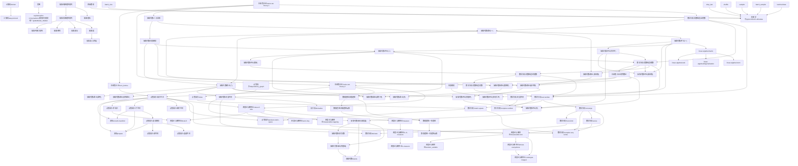

```mermaid
graph TD
1["点集拓扑/拓扑空间"] --> 0["流形/smooth-manifold"]
2["点集拓扑/子空间"] --> 0["流形/smooth-manifold"]
1["点集拓扑/拓扑空间"] --> 3["流形/prepare"]
2["点集拓扑/子空间"] --> 3["流形/prepare"]
4["点集拓扑/连续映射"] --> 3["流形/prepare"]
6["朴素集合论/naive-set-theory-1"] --> 5["朴素集合论/zorn_lemma"]
8["数学分析/实数构造/整数"] --> 7["朴素集合论/初等数论"]
6["朴素集合论/naive-set-theory-1"] --> 9["朴素集合论/naive-set-theory-2"]
7["朴素集合论/初等数论"] --> 9["朴素集合论/naive-set-theory-2"]
4["点集拓扑/连续映射"] --> 10["点集拓扑/紧空间"]
2["点集拓扑/子空间"] --> 4["点集拓扑/连续映射"]
4["点集拓扑/连续映射"] --> 11["点集拓扑/连通空间"]
1["点集拓扑/拓扑空间"] --> 12["点集拓扑/序拓扑"]
14["点集拓扑/dependency_graph"] --> 13["点集拓扑/index"]
1["点集拓扑/拓扑空间"] --> 2["点集拓扑/子空间"]
1["点集拓扑/拓扑空间"] --> 15["点集拓扑/乘积空间"]
9["朴素集合论/naive-set-theory-2"] --> 1["点集拓扑/拓扑空间"]
5["朴素集合论/zorn_lemma"] --> 1["点集拓扑/拓扑空间"]
17["数学分析/metric-space"] --> 16["点集拓扑/product-metric-space"]
1["点集拓扑/拓扑空间"] --> 16["点集拓扑/product-metric-space"]
19["计算机/docker"] --> 18["计算机/easyconnect"]
21["范畴"] --> 20["copilot/copilot-conversations/如何区分态射呢？@20260102_160432"]
23["数理逻辑/命题逻辑"] --> 22["数理逻辑/命题逻辑演算"]
23["数理逻辑/命题逻辑"] --> 24["数理逻辑/一阶逻辑"]
22["数理逻辑/命题逻辑演算"] --> 24["数理逻辑/一阶逻辑"]
9["朴素集合论/naive-set-theory-2"] --> 23["数理逻辑/命题逻辑"]
24["数理逻辑/一阶逻辑"] --> 25["数理逻辑/一阶逻辑演算"]
27["抽象代数/群论(二)"] --> 26["抽象代数/群论(群列)"]
29["抽象代数/群论(一)"] --> 28["抽象代数/群论(置换群)"]
7["朴素集合论/初等数论"] --> 28["抽象代数/群论(置换群)"]
29["抽象代数/群论(一)"] --> 27["抽象代数/群论(二)"]
30["抽象代数/同态映射"] --> 27["抽象代数/群论(二)"]
32["抽象代数/环论(一)"] --> 31["抽象代数/环论(有序环)"]
33["抽象代数/二元运算"] --> 30["抽象代数/同态映射"]
29["抽象代数/群论(一)"] --> 34["抽象代数/群论(幂运算)"]
8["数学分析/实数构造/整数"] --> 34["抽象代数/群论(幂运算)"]
36["抽象代数/环论(二)"] --> 35["抽象代数/环论(商域)"]
32["抽象代数/环论(一)"] --> 37["抽象代数/环论(幂运算)"]
31["抽象代数/环论(有序环)"] --> 37["抽象代数/环论(幂运算)"]
8["数学分析/实数构造/整数"] --> 37["抽象代数/环论(幂运算)"]
34["抽象代数/群论(幂运算)"] --> 38["抽象代数/群论(循环群)"]
7["朴素集合论/初等数论"] --> 38["抽象代数/群论(循环群)"]
30["抽象代数/同态映射"] --> 38["抽象代数/群论(循环群)"]
7["朴素集合论/初等数论"] --> 39["抽象代数/环论(杂)"]
40["抽象代数/环论(有限环)"] --> 39["抽象代数/环论(杂)"]
31["抽象代数/环论(有序环)"] --> 39["抽象代数/环论(杂)"]
41["抽象代数/环论(多项式环)"] --> 39["抽象代数/环论(杂)"]
36["抽象代数/环论(二)"] --> 40["抽象代数/环论(有限环)"]
38["抽象代数/群论(循环群)"] --> 40["抽象代数/环论(有限环)"]
29["抽象代数/群论(一)"] --> 32["抽象代数/环论(一)"]
43["抽象代数/域论(域拓展)"] --> 42["抽象代数/形式导数"]
27["抽象代数/群论(二)"] --> 44["抽象代数/向量空间"]
36["抽象代数/环论(二)"] --> 44["抽象代数/向量空间"]
32["抽象代数/环论(一)"] --> 36["抽象代数/环论(二)"]
30["抽象代数/同态映射"] --> 36["抽象代数/环论(二)"]
43["抽象代数/域论(域拓展)"] --> 45["抽象代数/Galois"]
46["抽象代数/域论(有限域)"] --> 45["抽象代数/Galois"]
27["抽象代数/群论(二)"] --> 47["抽象代数/群论(高等群论)"]
27["抽象代数/群论(二)"] --> 48["抽象代数/群论(杂)"]
38["抽象代数/群论(循环群)"] --> 48["抽象代数/群论(杂)"]
32["抽象代数/环论(一)"] --> 41["抽象代数/环论(多项式环)"]
49["同态映射"] --> 41["抽象代数/环论(多项式环)"]
39["抽象代数/环论(杂)"] --> 43["抽象代数/域论(域拓展)"]
44["抽象代数/向量空间"] --> 43["抽象代数/域论(域拓展)"]
6["朴素集合论/naive-set-theory-1"] --> 33["抽象代数/二元运算"]
50["数学分析/实数构造/自然数"] --> 29["抽象代数/群论(一)"]
33["抽象代数/二元运算"] --> 29["抽象代数/群论(一)"]
27["抽象代数/群论(二)"] --> 51["抽象代数/群论(群作用)"]
28["抽象代数/群论(置换群)"] --> 51["抽象代数/群论(群作用)"]
43["抽象代数/域论(域拓展)"] --> 46["抽象代数/域论(有限域)"]
42["抽象代数/形式导数"] --> 46["抽象代数/域论(有限域)"]
53["故事/纯粹理性批判"] --> 52["故事/实践理性批判"]
52["故事/实践理性批判"] --> 54["故事/判断力批判"]
56["故事/爱"] --> 55["故事/爱与幸福"]
52["故事/实践理性批判"] --> 57["故事/拥有"]
52["故事/实践理性批判"] --> 58["故事/安全"]
53["故事/纯粹理性批判"] --> 59["故事/固执"]
52["故事/实践理性批判"] --> 56["故事/爱"]
61["数学分析/converge"] --> 60["数学分析/funct-limit"]
63["数学分析/real-number"] --> 62["数学分析/complex-number"]
64["数学分析/向量空间"] --> 62["数学分析/complex-number"]
44["抽象代数/向量空间"] --> 65["数学分析/derivate"]
60["数学分析/funct-limit"] --> 65["数学分析/derivate"]
17["数学分析/metric-space"] --> 66["数学分析/complex-seq-series"]
1["点集拓扑/拓扑空间"] --> 66["数学分析/complex-seq-series"]
61["数学分析/converge"] --> 66["数学分析/complex-seq-series"]
67["数学分析/series"] --> 66["数学分析/complex-seq-series"]
63["数学分析/real-number"] --> 17["数学分析/metric-space"]
13["点集拓扑/index"] --> 17["数学分析/metric-space"]
50["数学分析/实数构造/自然数"] --> 8["数学分析/实数构造/整数"]
36["抽象代数/环论(二)"] --> 8["数学分析/实数构造/整数"]
31["抽象代数/环论(有序环)"] --> 8["数学分析/实数构造/整数"]
8["数学分析/实数构造/整数"] --> 68["数学分析/实数构造/有理数"]
35["抽象代数/环论(商域)"] --> 68["数学分析/实数构造/有理数"]
6["朴素集合论/naive-set-theory-1"] --> 50["数学分析/实数构造/自然数"]
68["数学分析/实数构造/有理数"] --> 69["数学分析/实数构造/实数"]
63["数学分析/real-number"] --> 61["数学分析/converge"]
61["数学分析/converge"] --> 67["数学分析/series"]
50["数学分析/实数构造/自然数"] --> 63["数学分析/real-number"]
8["数学分析/实数构造/整数"] --> 63["数学分析/real-number"]
68["数学分析/实数构造/有理数"] --> 63["数学分析/real-number"]
69["数学分析/实数构造/实数"] --> 63["数学分析/real-number"]
44["抽象代数/向量空间"] --> 70["复分析/derivative"]
72["原始数据"] --> 71["机器学习/pytorch/torch.utils.data"]
73["batch_size"] --> 71["机器学习/pytorch/torch.utils.data"]
74["drop_last"] --> 71["机器学习/pytorch/torch.utils.data"]
75["shuffle"] --> 71["机器学习/pytorch/torch.utils.data"]
76["sampler"] --> 71["机器学习/pytorch/torch.utils.data"]
77["batch_sampler"] --> 71["机器学习/pytorch/torch.utils.data"]
78["batched data"] --> 71["机器学习/pytorch/torch.utils.data"]
80["linear-algebra/matrix"] --> 79["linear-algebra/rank"]
32["抽象代数/环论(一)"] --> 80["linear-algebra/matrix"]
80["linear-algebra/matrix"] --> 81["linear-algebra/diagonalization"]
80["linear-algebra/matrix"] --> 82["linear-algebra/norm"]
9["朴素集合论/naive-set-theory-2"] --> 83["测度论与概率论/class-of-sets"]
1["点集拓扑/拓扑空间"] --> 83["测度论与概率论/class-of-sets"]
85["测度论与概率论/measurable-mapping"] --> 84["测度论与概率论/measurable-func"]
61["数学分析/converge"] --> 84["测度论与概率论/measurable-func"]
87["测度论与概率论/measure"] --> 86["测度论与概率论/L-S-measure"]
84["测度论与概率论/measurable-func"] --> 88["测度论与概率论/random_variable"]
83["测度论与概率论/class-of-sets"] --> 89["测度论与概率论/Borel-R"]
12["点集拓扑/序拓扑"] --> 89["测度论与概率论/Borel-R"]
83["测度论与概率论/class-of-sets"] --> 90["测度论与概率论/semi-ring"]
86["测度论与概率论/L-S-measure"] --> 91["测度论与概率论/L-measure"]
84["测度论与概率论/measurable-func"] --> 92["测度论与概率论/almost-everywhere"]
83["测度论与概率论/class-of-sets"] --> 85["测度论与概率论/measurable-mapping"]
83["测度论与概率论/class-of-sets"] --> 87["测度论与概率论/measure"]
84["测度论与概率论/measurable-func"] --> 93["测度论与概率论/Lebesgue-integral"]
92["测度论与概率论/almost-everywhere"] --> 93["测度论与概率论/Lebesgue-integral"]
```