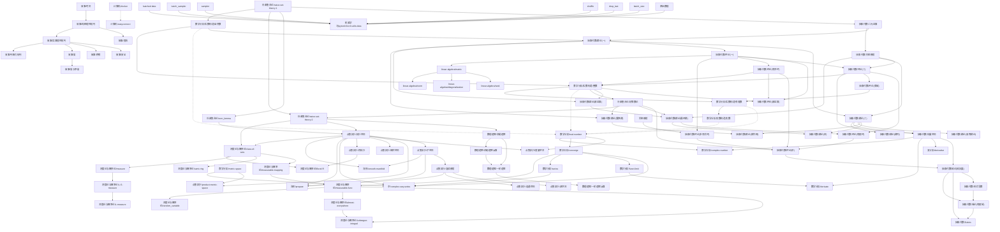

```mermaid
graph TD
1["数理逻辑/一阶逻辑"] --> 0["数理逻辑/一阶逻辑演算"]
2["数理逻辑/命题逻辑"] --> 1["数理逻辑/一阶逻辑"]
3["数理逻辑/命题逻辑演算"] --> 1["数理逻辑/一阶逻辑"]
2["数理逻辑/命题逻辑"] --> 3["数理逻辑/命题逻辑演算"]
5["朴素集合论/naive-set-theory-2"] --> 2["数理逻辑/命题逻辑"]
5["朴素集合论/naive-set-theory-2"] --> 6["点集拓扑/拓扑空间"]
7["朴素集合论/zorn_lemma"] --> 6["点集拓扑/拓扑空间"]
9["点集拓扑/子空间"] --> 8["点集拓扑/连续映射"]
6["点集拓扑/拓扑空间"] --> 9["点集拓扑/子空间"]
12["数学分析/real-number"] --> 11["点集拓扑/度量空间"]
6["点集拓扑/拓扑空间"] --> 11["点集拓扑/度量空间"]
8["点集拓扑/连续映射"] --> 13["点集拓扑/紧空间"]
15["数学分析/metric-space"] --> 14["点集拓扑/product-metric-space"]
6["点集拓扑/拓扑空间"] --> 14["点集拓扑/product-metric-space"]
8["点集拓扑/连续映射"] --> 16["点集拓扑/连通空间"]
6["点集拓扑/拓扑空间"] --> 17["点集拓扑/乘积空间"]
6["点集拓扑/拓扑空间"] --> 18["点集拓扑/序拓扑"]
20["抽象代数/环论(二)"] --> 19["抽象代数/环论(有限环)"]
21["抽象代数/群论(循环群)"] --> 19["抽象代数/环论(有限环)"]
22["抽象代数/环论(一)"] --> 20["抽象代数/环论(二)"]
23["抽象代数/同态映射"] --> 20["抽象代数/环论(二)"]
25["朴素集合论/初等数论"] --> 24["抽象代数/环论(杂)"]
19["抽象代数/环论(有限环)"] --> 24["抽象代数/环论(杂)"]
26["抽象代数/环论(有序环)"] --> 24["抽象代数/环论(杂)"]
27["抽象代数/环论(多项式环)"] --> 24["抽象代数/环论(杂)"]
29["朴素集合论/naive-set-theory-1"] --> 28["抽象代数/二元运算"]
31["抽象代数/群论(二)"] --> 30["抽象代数/群论(杂)"]
21["抽象代数/群论(循环群)"] --> 30["抽象代数/群论(杂)"]
33["抽象代数/域论(域拓展)"] --> 32["抽象代数/形式导数"]
34["抽象代数/群论(一)"] --> 31["抽象代数/群论(二)"]
23["抽象代数/同态映射"] --> 31["抽象代数/群论(二)"]
35["抽象代数/群论(幂运算)"] --> 21["抽象代数/群论(循环群)"]
25["朴素集合论/初等数论"] --> 21["抽象代数/群论(循环群)"]
23["抽象代数/同态映射"] --> 21["抽象代数/群论(循环群)"]
22["抽象代数/环论(一)"] --> 36["抽象代数/环论(幂运算)"]
26["抽象代数/环论(有序环)"] --> 36["抽象代数/环论(幂运算)"]
37["数学分析/实数构造/整数"] --> 36["抽象代数/环论(幂运算)"]
31["抽象代数/群论(二)"] --> 38["抽象代数/群论(群作用)"]
39["抽象代数/群论(置换群)"] --> 38["抽象代数/群论(群作用)"]
20["抽象代数/环论(二)"] --> 40["抽象代数/环论(商域)"]
34["抽象代数/群论(一)"] --> 22["抽象代数/环论(一)"]
31["抽象代数/群论(二)"] --> 41["抽象代数/群论(高等群论)"]
33["抽象代数/域论(域拓展)"] --> 42["抽象代数/Galois"]
43["抽象代数/域论(有限域)"] --> 42["抽象代数/Galois"]
44["数学分析/实数构造/自然数"] --> 34["抽象代数/群论(一)"]
28["抽象代数/二元运算"] --> 34["抽象代数/群论(一)"]
31["抽象代数/群论(二)"] --> 45["抽象代数/向量空间"]
20["抽象代数/环论(二)"] --> 45["抽象代数/向量空间"]
22["抽象代数/环论(一)"] --> 26["抽象代数/环论(有序环)"]
22["抽象代数/环论(一)"] --> 27["抽象代数/环论(多项式环)"]
47["同态映射"] --> 27["抽象代数/环论(多项式环)"]
24["抽象代数/环论(杂)"] --> 33["抽象代数/域论(域拓展)"]
45["抽象代数/向量空间"] --> 33["抽象代数/域论(域拓展)"]
33["抽象代数/域论(域拓展)"] --> 43["抽象代数/域论(有限域)"]
32["抽象代数/形式导数"] --> 43["抽象代数/域论(有限域)"]
34["抽象代数/群论(一)"] --> 35["抽象代数/群论(幂运算)"]
37["数学分析/实数构造/整数"] --> 35["抽象代数/群论(幂运算)"]
31["抽象代数/群论(二)"] --> 48["抽象代数/群论(群列)"]
28["抽象代数/二元运算"] --> 23["抽象代数/同态映射"]
34["抽象代数/群论(一)"] --> 39["抽象代数/群论(置换群)"]
25["朴素集合论/初等数论"] --> 39["抽象代数/群论(置换群)"]
15["数学分析/metric-space"] --> 49["杂/complex-seq-series"]
6["点集拓扑/拓扑空间"] --> 49["杂/complex-seq-series"]
50["数学分析/converge"] --> 49["杂/complex-seq-series"]
51["数学分析/series"] --> 49["杂/complex-seq-series"]
6["点集拓扑/拓扑空间"] --> 53["流形/prepare"]
9["点集拓扑/子空间"] --> 53["流形/prepare"]
8["点集拓扑/连续映射"] --> 53["流形/prepare"]
6["点集拓扑/拓扑空间"] --> 54["流形/smooth-manifold"]
9["点集拓扑/子空间"] --> 54["流形/smooth-manifold"]
29["朴素集合论/naive-set-theory-1"] --> 7["朴素集合论/zorn_lemma"]
37["数学分析/实数构造/整数"] --> 25["朴素集合论/初等数论"]
29["朴素集合论/naive-set-theory-1"] --> 5["朴素集合论/naive-set-theory-2"]
25["朴素集合论/初等数论"] --> 5["朴素集合论/naive-set-theory-2"]
45["抽象代数/向量空间"] --> 58["复分析/derivative"]
45["抽象代数/向量空间"] --> 62["数学分析/derivate"]
63["数学分析/funct-limit"] --> 62["数学分析/derivate"]
12["数学分析/real-number"] --> 50["数学分析/converge"]
50["数学分析/converge"] --> 63["数学分析/funct-limit"]
12["数学分析/real-number"] --> 65["数学分析/complex-number"]
45["抽象代数/向量空间"] --> 65["数学分析/complex-number"]
50["数学分析/converge"] --> 51["数学分析/series"]
44["数学分析/实数构造/自然数"] -.-> 12["数学分析/real-number"]
37["数学分析/实数构造/整数"] -.-> 12["数学分析/real-number"]
66["数学分析/实数构造/有理数"] -.-> 12["数学分析/real-number"]
67["数学分析/实数构造/实数"] -.-> 12["数学分析/real-number"]
70["计算机/docker"] -.-> 69["计算机/easyconnect"]
72["linear-algebra/matrix"] --> 71["linear-algebra/rank"]
22["抽象代数/环论(一)"] --> 72["linear-algebra/matrix"]
72["linear-algebra/matrix"] --> 74["linear-algebra/diagonalization"]
72["linear-algebra/matrix"] --> 75["linear-algebra/norm"]
77["故事/纯粹理性批判"] --> 76["故事/固执"]
77["故事/纯粹理性批判"] --> 78["故事/实践理性批判"]
79["故事/时间"] --> 77["故事/纯粹理性批判"]
78["故事/实践理性批判"] --> 80["故事/安全"]
78["故事/实践理性批判"] --> 81["故事/拥有"]
78["故事/实践理性批判"] --> 82["故事/爱"]
82["故事/爱"] --> 84["故事/爱与幸福"]
78["故事/实践理性批判"] --> 85["故事/判断力批判"]
5["朴素集合论/naive-set-theory-2"] --> 86["测度论与概率论/class-of-sets"]
6["点集拓扑/拓扑空间"] --> 86["测度论与概率论/class-of-sets"]
88["测度论与概率论/measurable-func"] --> 87["测度论与概率论/Lebesgue-integral"]
89["测度论与概率论/almost-everywhere"] --> 87["测度论与概率论/Lebesgue-integral"]
86["测度论与概率论/class-of-sets"] --> 90["测度论与概率论/measurable-mapping"]
92["测度论与概率论/measure"] --> 91["测度论与概率论/L-S-measure"]
90["测度论与概率论/measurable-mapping"] --> 88["测度论与概率论/measurable-func"]
50["数学分析/converge"] --> 88["测度论与概率论/measurable-func"]
86["测度论与概率论/class-of-sets"] --> 93["测度论与概率论/semi-ring"]
88["测度论与概率论/measurable-func"] --> 89["测度论与概率论/almost-everywhere"]
88["测度论与概率论/measurable-func"] --> 94["测度论与概率论/random_variable"]
86["测度论与概率论/class-of-sets"] --> 92["测度论与概率论/measure"]
91["测度论与概率论/L-S-measure"] --> 96["测度论与概率论/L-measure"]
86["测度论与概率论/class-of-sets"] --> 97["测度论与概率论/Borel-R"]
18["点集拓扑/序拓扑"] --> 97["测度论与概率论/Borel-R"]
66["数学分析/实数构造/有理数"] --> 67["数学分析/实数构造/实数"]
37["数学分析/实数构造/整数"] --> 66["数学分析/实数构造/有理数"]
40["抽象代数/环论(商域)"] --> 66["数学分析/实数构造/有理数"]
29["朴素集合论/naive-set-theory-1"] --> 44["数学分析/实数构造/自然数"]
44["数学分析/实数构造/自然数"] --> 37["数学分析/实数构造/整数"]
20["抽象代数/环论(二)"] --> 37["数学分析/实数构造/整数"]
26["抽象代数/环论(有序环)"] --> 37["数学分析/实数构造/整数"]
99["原始数据"] --> 98["机器学习/pytorch/torch.utils.data"]
100["batch_size"] --> 98["机器学习/pytorch/torch.utils.data"]
101["drop_last"] --> 98["机器学习/pytorch/torch.utils.data"]
102["shuffle"] --> 98["机器学习/pytorch/torch.utils.data"]
103["sampler"] --> 98["机器学习/pytorch/torch.utils.data"]
104["batch_sampler"] --> 98["机器学习/pytorch/torch.utils.data"]
105["batched data"] --> 98["机器学习/pytorch/torch.utils.data"]
```