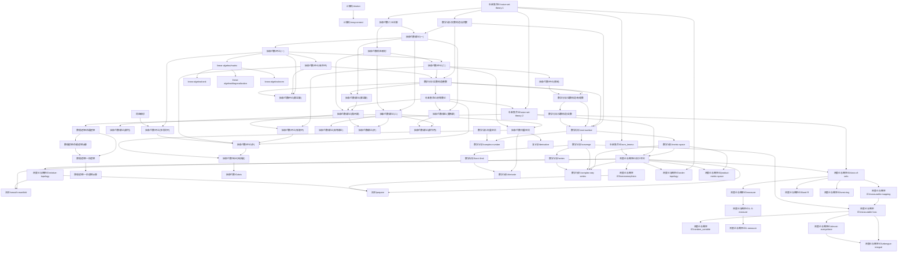

```mermaid
graph TD
1["测度论与概率论/拓扑空间"] --> 0["流形/smooth-manifold"]
2["测度论与概率论/relative-topology"] --> 0["流形/smooth-manifold"]
1["测度论与概率论/拓扑空间"] --> 3["流形/prepare"]
2["测度论与概率论/relative-topology"] --> 3["流形/prepare"]
4["测度论与概率论/homeomorphism"] --> 3["流形/prepare"]
6["朴素集合论/naive-set-theory-1"] --> 5["朴素集合论/zorn_lemma"]
8["数学分析/实数构造/整数"] --> 7["朴素集合论/初等数论"]
6["朴素集合论/naive-set-theory-1"] --> 9["朴素集合论/naive-set-theory-2"]
7["朴素集合论/初等数论"] --> 9["朴素集合论/naive-set-theory-2"]
11["计算机/docker"] --> 10["计算机/easyconnect"]
13["数理逻辑/命题逻辑"] --> 12["数理逻辑/命题逻辑演算"]
13["数理逻辑/命题逻辑"] --> 14["数理逻辑/一阶逻辑"]
12["数理逻辑/命题逻辑演算"] --> 14["数理逻辑/一阶逻辑"]
9["朴素集合论/naive-set-theory-2"] --> 13["数理逻辑/命题逻辑"]
14["数理逻辑/一阶逻辑"] --> 15["数理逻辑/一阶逻辑演算"]
17["抽象代数/群论(二)"] --> 16["抽象代数/群论(群列)"]
19["抽象代数/群论(一)"] --> 18["抽象代数/群论(置换群)"]
7["朴素集合论/初等数论"] --> 18["抽象代数/群论(置换群)"]
19["抽象代数/群论(一)"] --> 17["抽象代数/群论(二)"]
20["抽象代数/同态映射"] --> 17["抽象代数/群论(二)"]
22["抽象代数/环论(一)"] --> 21["抽象代数/环论(有序环)"]
23["抽象代数/二元运算"] --> 20["抽象代数/同态映射"]
19["抽象代数/群论(一)"] --> 24["抽象代数/群论(幂运算)"]
8["数学分析/实数构造/整数"] --> 24["抽象代数/群论(幂运算)"]
26["抽象代数/环论(二)"] --> 25["抽象代数/环论(商域)"]
22["抽象代数/环论(一)"] --> 27["抽象代数/环论(幂运算)"]
21["抽象代数/环论(有序环)"] --> 27["抽象代数/环论(幂运算)"]
8["数学分析/实数构造/整数"] --> 27["抽象代数/环论(幂运算)"]
24["抽象代数/群论(幂运算)"] --> 28["抽象代数/群论(循环群)"]
7["朴素集合论/初等数论"] --> 28["抽象代数/群论(循环群)"]
20["抽象代数/同态映射"] --> 28["抽象代数/群论(循环群)"]
7["朴素集合论/初等数论"] --> 29["抽象代数/环论(杂)"]
30["抽象代数/环论(有限环)"] --> 29["抽象代数/环论(杂)"]
21["抽象代数/环论(有序环)"] --> 29["抽象代数/环论(杂)"]
31["抽象代数/环论(多项式环)"] --> 29["抽象代数/环论(杂)"]
26["抽象代数/环论(二)"] --> 30["抽象代数/环论(有限环)"]
28["抽象代数/群论(循环群)"] --> 30["抽象代数/环论(有限环)"]
19["抽象代数/群论(一)"] --> 22["抽象代数/环论(一)"]
17["抽象代数/群论(二)"] --> 32["抽象代数/向量空间"]
26["抽象代数/环论(二)"] --> 32["抽象代数/向量空间"]
22["抽象代数/环论(一)"] --> 26["抽象代数/环论(二)"]
20["抽象代数/同态映射"] --> 26["抽象代数/环论(二)"]
34["抽象代数/域论(域拓展)"] --> 33["抽象代数/Galois"]
17["抽象代数/群论(二)"] --> 35["抽象代数/群论(高等群论)"]
17["抽象代数/群论(二)"] --> 36["抽象代数/群论(杂)"]
28["抽象代数/群论(循环群)"] --> 36["抽象代数/群论(杂)"]
22["抽象代数/环论(一)"] --> 31["抽象代数/环论(多项式环)"]
37["同态映射"] --> 31["抽象代数/环论(多项式环)"]
29["抽象代数/环论(杂)"] --> 34["抽象代数/域论(域拓展)"]
32["抽象代数/向量空间"] --> 34["抽象代数/域论(域拓展)"]
6["朴素集合论/naive-set-theory-1"] --> 23["抽象代数/二元运算"]
38["数学分析/实数构造/自然数"] --> 19["抽象代数/群论(一)"]
23["抽象代数/二元运算"] --> 19["抽象代数/群论(一)"]
17["抽象代数/群论(二)"] --> 39["抽象代数/群论(群作用)"]
18["抽象代数/群论(置换群)"] --> 39["抽象代数/群论(群作用)"]
41["数学分析/converge"] --> 40["数学分析/funct-limit"]
43["数学分析/real-number"] --> 42["数学分析/complex-number"]
44["数学分析/向量空间"] --> 42["数学分析/complex-number"]
32["抽象代数/向量空间"] --> 45["数学分析/derivate"]
40["数学分析/funct-limit"] --> 45["数学分析/derivate"]
47["数学分析/metric-space"] --> 46["数学分析/complex-seq-series"]
1["测度论与概率论/拓扑空间"] --> 46["数学分析/complex-seq-series"]
41["数学分析/converge"] --> 46["数学分析/complex-seq-series"]
48["数学分析/series"] --> 46["数学分析/complex-seq-series"]
43["数学分析/real-number"] --> 47["数学分析/metric-space"]
38["数学分析/实数构造/自然数"] --> 8["数学分析/实数构造/整数"]
26["抽象代数/环论(二)"] --> 8["数学分析/实数构造/整数"]
21["抽象代数/环论(有序环)"] --> 8["数学分析/实数构造/整数"]
8["数学分析/实数构造/整数"] --> 49["数学分析/实数构造/有理数"]
25["抽象代数/环论(商域)"] --> 49["数学分析/实数构造/有理数"]
6["朴素集合论/naive-set-theory-1"] --> 38["数学分析/实数构造/自然数"]
49["数学分析/实数构造/有理数"] --> 50["数学分析/实数构造/实数"]
43["数学分析/real-number"] --> 41["数学分析/converge"]
41["数学分析/converge"] --> 48["数学分析/series"]
38["数学分析/实数构造/自然数"] --> 43["数学分析/real-number"]
8["数学分析/实数构造/整数"] --> 43["数学分析/real-number"]
49["数学分析/实数构造/有理数"] --> 43["数学分析/real-number"]
50["数学分析/实数构造/实数"] --> 43["数学分析/real-number"]
32["抽象代数/向量空间"] --> 51["复分析/derivative"]
53["linear-algebra/matrix"] --> 52["linear-algebra/rank"]
22["抽象代数/环论(一)"] --> 53["linear-algebra/matrix"]
53["linear-algebra/matrix"] --> 54["linear-algebra/diagonalization"]
53["linear-algebra/matrix"] --> 55["linear-algebra/norm"]
9["朴素集合论/naive-set-theory-2"] --> 56["测度论与概率论/class-of-sets"]
1["测度论与概率论/拓扑空间"] --> 56["测度论与概率论/class-of-sets"]
58["测度论与概率论/measurable-mapping"] --> 57["测度论与概率论/measurable-func"]
41["数学分析/converge"] --> 57["测度论与概率论/measurable-func"]
60["测度论与概率论/measure"] --> 59["测度论与概率论/L-S-measure"]
6["朴素集合论/naive-set-theory-1"] --> 61["测度论与概率论/order-topology"]
1["测度论与概率论/拓扑空间"] --> 61["测度论与概率论/order-topology"]
57["测度论与概率论/measurable-func"] --> 62["测度论与概率论/random_variable"]
56["测度论与概率论/class-of-sets"] --> 63["测度论与概率论/Borel-R"]
1["测度论与概率论/拓扑空间"] --> 4["测度论与概率论/homeomorphism"]
56["测度论与概率论/class-of-sets"] --> 64["测度论与概率论/semi-ring"]
1["测度论与概率论/拓扑空间"] --> 2["测度论与概率论/relative-topology"]
59["测度论与概率论/L-S-measure"] --> 65["测度论与概率论/L-measure"]
57["测度论与概率论/measurable-func"] --> 66["测度论与概率论/almost-everywhere"]
56["测度论与概率论/class-of-sets"] --> 58["测度论与概率论/measurable-mapping"]
47["数学分析/metric-space"] --> 1["测度论与概率论/拓扑空间"]
9["朴素集合论/naive-set-theory-2"] --> 1["测度论与概率论/拓扑空间"]
5["朴素集合论/zorn_lemma"] --> 1["测度论与概率论/拓扑空间"]
56["测度论与概率论/class-of-sets"] --> 60["测度论与概率论/measure"]
47["数学分析/metric-space"] --> 67["测度论与概率论/product-metric-space"]
1["测度论与概率论/拓扑空间"] --> 67["测度论与概率论/product-metric-space"]
57["测度论与概率论/measurable-func"] --> 68["测度论与概率论/Lebesgue-integral"]
66["测度论与概率论/almost-everywhere"] --> 68["测度论与概率论/Lebesgue-integral"]
```