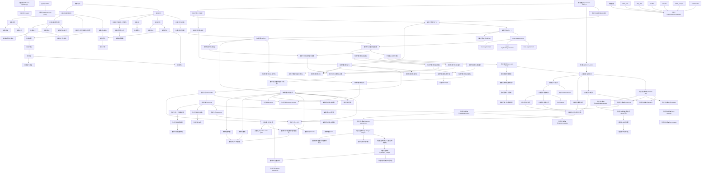

```mermaid
graph TD
1["数理逻辑/一阶逻辑"] --> 0["数理逻辑/一阶逻辑演算"]
2["数理逻辑/命题逻辑演算"] --> 1["数理逻辑/一阶逻辑"]
3["数理逻辑/命题逻辑"] --> 2["数理逻辑/命题逻辑演算"]
5["朴素集合论/naive-set-theory-2"] --> 3["数理逻辑/命题逻辑"]
5["朴素集合论/naive-set-theory-2"] --> 6["点集拓扑/拓扑空间"]
7["朴素集合论/zorn_lemma"] --> 6["点集拓扑/拓扑空间"]
9["点集拓扑/子空间"] --> 8["点集拓扑/连续映射"]
6["点集拓扑/拓扑空间"] --> 9["点集拓扑/子空间"]
12["数学分析/real-number"] --> 11["点集拓扑/度量空间"]
13["点集拓扑/点集拓扑(代理)"] --> 11["点集拓扑/度量空间"]
8["点集拓扑/连续映射"] --> 14["点集拓扑/紧空间"]
11["点集拓扑/度量空间"] --> 15["点集拓扑/product-metric-space"]
14["点集拓扑/紧空间"] --> 13["点集拓扑/点集拓扑(代理)"]
16["点集拓扑/连通空间"] --> 13["点集拓扑/点集拓扑(代理)"]
17["点集拓扑/乘积空间"] --> 13["点集拓扑/点集拓扑(代理)"]
18["点集拓扑/序拓扑"] --> 13["点集拓扑/点集拓扑(代理)"]
8["点集拓扑/连续映射"] --> 16["点集拓扑/连通空间"]
6["点集拓扑/拓扑空间"] --> 17["点集拓扑/乘积空间"]
6["点集拓扑/拓扑空间"] --> 18["点集拓扑/序拓扑"]
20["抽象代数/向量空间"] --> 19["抽象代数/代数"]
22["抽象代数/群论(循环群)"] --> 21["抽象代数/环论(有限环)"]
24["抽象代数/环论(一)"] --> 23["抽象代数/环论(二)"]
25["抽象代数/同态映射"] --> 23["抽象代数/环论(二)"]
21["抽象代数/环论(有限环)"] --> 26["抽象代数/环论(杂)"]
27["抽象代数/环论(多项式环)"] --> 26["抽象代数/环论(杂)"]
29["朴素集合论/naive-set-theory-1"] --> 28["抽象代数/二元运算"]
31["抽象代数/群论(二)"] --> 30["抽象代数/群论(杂)"]
22["抽象代数/群论(循环群)"] --> 30["抽象代数/群论(杂)"]
33["抽象代数/域论(域拓展)"] --> 32["抽象代数/形式导数"]
34["抽象代数/群论(一)"] --> 31["抽象代数/群论(二)"]
25["抽象代数/同态映射"] --> 31["抽象代数/群论(二)"]
35["抽象代数/群论(幂运算)"] --> 22["抽象代数/群论(循环群)"]
36["朴素集合论/初等数论"] --> 22["抽象代数/群论(循环群)"]
35["抽象代数/群论(幂运算)"] --> 37["抽象代数/环论(幂运算)"]
31["抽象代数/群论(二)"] --> 38["抽象代数/群论(群作用)"]
39["抽象代数/群论(置换群)"] --> 38["抽象代数/群论(群作用)"]
20["抽象代数/向量空间"] --> 40["抽象代数/格"]
23["抽象代数/环论(二)"] --> 41["抽象代数/环论(商域)"]
34["抽象代数/群论(一)"] --> 24["抽象代数/环论(一)"]
31["抽象代数/群论(二)"] --> 42["抽象代数/群论(高等群论)"]
44["抽象代数/域论(有限域)"] --> 43["抽象代数/Galois"]
45["数学分析/实数构造/自然数"] --> 34["抽象代数/群论(一)"]
28["抽象代数/二元运算"] --> 34["抽象代数/群论(一)"]
31["抽象代数/群论(二)"] --> 20["抽象代数/向量空间"]
23["抽象代数/环论(二)"] --> 20["抽象代数/向量空间"]
24["抽象代数/环论(一)"] --> 47["抽象代数/环论(有序环)"]
23["抽象代数/环论(二)"] --> 27["抽象代数/环论(多项式环)"]
26["抽象代数/环论(杂)"] --> 33["抽象代数/域论(域拓展)"]
20["抽象代数/向量空间"] --> 33["抽象代数/域论(域拓展)"]
32["抽象代数/形式导数"] --> 44["抽象代数/域论(有限域)"]
48["数学分析/实数构造/整数"] --> 35["抽象代数/群论(幂运算)"]
31["抽象代数/群论(二)"] --> 49["抽象代数/群论(群列)"]
28["抽象代数/二元运算"] --> 25["抽象代数/同态映射"]
36["朴素集合论/初等数论"] --> 39["抽象代数/群论(置换群)"]
8["点集拓扑/连续映射"] --> 51["流形/prepare"]
9["点集拓扑/子空间"] --> 52["流形/smooth-manifold"]
55["机器学习/diffusion-inpainting(1)"] --> 54["机器学习/repaint"]
38["抽象代数/群论(群作用)"] --> 56["机器学习/SE(3)"]
59["机器学习/随机过程"] --> 58["机器学习/马尔可夫"]
60["测度论与概率论/积空间sigma代数"] --> 59["机器学习/随机过程"]
29["朴素集合论/naive-set-theory-1"] --> 7["朴素集合论/zorn_lemma"]
48["数学分析/实数构造/整数"] --> 36["朴素集合论/初等数论"]
36["朴素集合论/初等数论"] --> 5["朴素集合论/naive-set-theory-2"]
20["抽象代数/向量空间"] --> 62["复分析/derivative"]
20["抽象代数/向量空间"] --> 66["数学分析/有限维赋范线性空间"]
11["点集拓扑/度量空间"] --> 66["数学分析/有限维赋范线性空间"]
19["抽象代数/代数"] --> 67["数学分析/Rn-代数-格"]
40["抽象代数/格"] --> 67["数学分析/Rn-代数-格"]
66["数学分析/有限维赋范线性空间"] --> 67["数学分析/Rn-代数-格"]
69["数学分析/非负级数"] --> 68["数学分析/级数"]
71["数学分析/实数次幂"] --> 70["数学分析/实数(代理)"]
73["数学分析/converge"] --> 72["数学分析/一些标准极限"]
75["数学分析/无穷小"] --> 74["数学分析/derivate"]
12["数学分析/real-number"] --> 73["数学分析/converge"]
72["数学分析/一些标准极限"] --> 71["数学分析/实数次幂"]
73["数学分析/converge"] --> 69["数学分析/非负级数"]
20["抽象代数/向量空间"] --> 76["数学分析/范数"]
78["测度论与概率论/Lebesgue-integral"] --> 77["数学分析/复值可测函数的L积分"]
20["抽象代数/向量空间"] --> 75["数学分析/无穷小"]
79["数学分析/funct-limit"] --> 75["数学分析/无穷小"]
73["数学分析/converge"] --> 79["数学分析/funct-limit"]
12["数学分析/real-number"] --> 81["数学分析/complex-number"]
20["抽象代数/向量空间"] --> 81["数学分析/complex-number"]
82["数学分析/实数构造/广义实数"] --> 12["数学分析/real-number"]
11["点集拓扑/度量空间"] --> 83["数学分析/函数序列"]
84["测度论与概率论/Stieltjes_integral"] --> 83["数学分析/函数序列"]
78["测度论与概率论/Lebesgue-integral"] --> 85["数学分析/平方可积"]
83["数学分析/函数序列"] --> 86["数学分析/Stone–Weierstrass"]
88["计算机/netbird"] --> 87["计算机/netbird-reverse-proxy"]
92["linear-algebra/matrix"] --> 91["linear-algebra/rank"]
24["抽象代数/环论(一)"] --> 92["linear-algebra/matrix"]
92["linear-algebra/matrix"] --> 94["linear-algebra/diagonalization"]
92["linear-algebra/matrix"] --> 95["linear-algebra/norm"]
97["故事/劳动"] --> 96["故事/异化"]
98["故事/绝对精神"] --> 96["故事/异化"]
100["故事/纯粹理性批判"] --> 99["故事/固执"]
102["故事/经济基础与上层建筑"] --> 101["故事/性别与权利"]
104["故事/价格"] --> 103["故事/资本"]
99["故事/固执"] --> 105["故事/改变"]
107["故事/作为意志和表象的世界"] --> 106["故事/期望"]
108["故事/安全"] --> 106["故事/期望"]
108["故事/安全"] --> 109["故事/狡猾的小说家"]
100["故事/纯粹理性批判"] --> 110["故事/实践理性批判"]
111["故事/时间"] --> 100["故事/纯粹理性批判"]
110["故事/实践理性批判"] --> 108["故事/安全"]
112["故事/货币"] --> 102["故事/经济基础与上层建筑"]
110["故事/实践理性批判"] --> 113["故事/拥有"]
112["故事/货币"] --> 114["故事/税"]
114["故事/税"] --> 115["故事/房价"]
117["故事/货币与行政"] --> 116["故事/政治机构图"]
99["故事/固执"] --> 118["故事/变化"]
120["故事/幸福"] --> 119["故事/爱"]
112["故事/货币"] --> 104["故事/价格"]
100["故事/纯粹理性批判"] --> 107["故事/作为意志和表象的世界"]
100["故事/纯粹理性批判"] --> 98["故事/绝对精神"]
112["故事/货币"] --> 117["故事/货币与行政"]
108["故事/安全"] --> 122["故事/安全与道德"]
101["故事/性别与权利"] --> 123["故事/神圣叙事"]
96["故事/异化"] --> 124["故事/工作"]
119["故事/爱"] --> 125["故事/爱与幸福"]
111["故事/时间"] --> 112["故事/货币"]
119["故事/爱"] --> 126["故事/孩子"]
97["故事/劳动"] --> 126["故事/孩子"]
104["故事/价格"] --> 97["故事/劳动"]
110["故事/实践理性批判"] --> 127["故事/判断力批判"]
106["故事/期望"] --> 120["故事/幸福"]
6["点集拓扑/拓扑空间"] --> 128["测度论与概率论/class-of-sets"]
129["测度论与概率论/almost-everywhere"] --> 78["测度论与概率论/Lebesgue-integral"]
84["测度论与概率论/Stieltjes_integral"] --> 130["测度论与概率论/符号测度"]
131["测度论与概率论/measurable-mapping"] --> 60["测度论与概率论/积空间sigma代数"]
132["测度论与概率论/三大积分收敛定理"] --> 84["测度论与概率论/Stieltjes_integral"]
128["测度论与概率论/class-of-sets"] --> 131["测度论与概率论/measurable-mapping"]
134["测度论与概率论/measure"] --> 133["测度论与概率论/L-S-measure"]
131["测度论与概率论/measurable-mapping"] --> 135["测度论与概率论/measurable-func"]
73["数学分析/converge"] --> 135["测度论与概率论/measurable-func"]
128["测度论与概率论/class-of-sets"] --> 136["测度论与概率论/semi-ring"]
78["测度论与概率论/Lebesgue-integral"] --> 132["测度论与概率论/三大积分收敛定理"]
135["测度论与概率论/measurable-func"] --> 129["测度论与概率论/almost-everywhere"]
135["测度论与概率论/measurable-func"] --> 137["测度论与概率论/random_variable"]
128["测度论与概率论/class-of-sets"] --> 134["测度论与概率论/measure"]
133["测度论与概率论/L-S-measure"] --> 139["测度论与概率论/L-measure"]
128["测度论与概率论/class-of-sets"] --> 140["测度论与概率论/Borel-R"]
18["点集拓扑/序拓扑"] --> 140["测度论与概率论/Borel-R"]
142["数学分析/实数构造/有理数"] --> 141["数学分析/实数构造/实数"]
37["抽象代数/环论(幂运算)"] --> 141["数学分析/实数构造/实数"]
48["数学分析/实数构造/整数"] --> 142["数学分析/实数构造/有理数"]
41["抽象代数/环论(商域)"] --> 142["数学分析/实数构造/有理数"]
141["数学分析/实数构造/实数"] --> 82["数学分析/实数构造/广义实数"]
29["朴素集合论/naive-set-theory-1"] --> 45["数学分析/实数构造/自然数"]
23["抽象代数/环论(二)"] --> 48["数学分析/实数构造/整数"]
47["抽象代数/环论(有序环)"] --> 48["数学分析/实数构造/整数"]
144["原始数据"] --> 143["机器学习/pytorch/torch.utils.data"]
145["batch_size"] --> 143["机器学习/pytorch/torch.utils.data"]
146["drop_last"] --> 143["机器学习/pytorch/torch.utils.data"]
147["shuffle"] --> 143["机器学习/pytorch/torch.utils.data"]
148["sampler"] --> 143["机器学习/pytorch/torch.utils.data"]
149["batch_sampler"] --> 143["机器学习/pytorch/torch.utils.data"]
150["batched data"] --> 143["机器学习/pytorch/torch.utils.data"]
```
