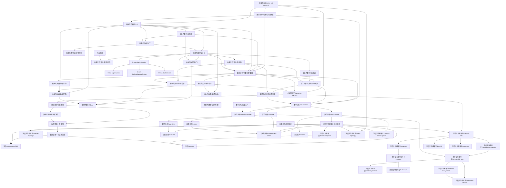

```mermaid
graph TD
1["测度论与概率论/拓扑空间"] --> 0["流形/smooth-manifold"]
2["测度论与概率论/relative-topology"] --> 0["流形/smooth-manifold"]
1["测度论与概率论/拓扑空间"] --> 3["流形/prepare"]
2["测度论与概率论/relative-topology"] --> 3["流形/prepare"]
4["测度论与概率论/homeomorphism"] --> 3["流形/prepare"]
6["数学分析/实数构造/整数"] --> 5["朴素集合论/初等数论"]
8["朴素集合论/naive-set-theory-1"] --> 7["朴素集合论/naive-set-theory-2"]
6["数学分析/实数构造/整数"] --> 7["朴素集合论/naive-set-theory-2"]
5["朴素集合论/初等数论"] --> 7["朴素集合论/naive-set-theory-2"]
10["数理逻辑/命题逻辑"] --> 9["数理逻辑/命题逻辑演算"]
10["数理逻辑/命题逻辑"] --> 11["数理逻辑/一阶逻辑"]
9["数理逻辑/命题逻辑演算"] --> 11["数理逻辑/一阶逻辑"]
7["朴素集合论/naive-set-theory-2"] --> 10["数理逻辑/命题逻辑"]
11["数理逻辑/一阶逻辑"] --> 12["数理逻辑/一阶逻辑演算"]
14["抽象代数/群论(一)"] --> 13["抽象代数/群论(置换群)"]
5["朴素集合论/初等数论"] --> 13["抽象代数/群论(置换群)"]
14["抽象代数/群论(一)"] --> 15["抽象代数/群论(二)"]
16["抽象代数/同态映射"] --> 15["抽象代数/群论(二)"]
18["抽象代数/环论(一)"] --> 17["抽象代数/环论(有序环)"]
14["抽象代数/群论(一)"] --> 16["抽象代数/同态映射"]
14["抽象代数/群论(一)"] --> 19["抽象代数/群论(幂运算)"]
6["数学分析/实数构造/整数"] --> 19["抽象代数/群论(幂运算)"]
18["抽象代数/环论(一)"] --> 20["抽象代数/环论(商域)"]
18["抽象代数/环论(一)"] --> 21["抽象代数/环论(幂运算)"]
17["抽象代数/环论(有序环)"] --> 21["抽象代数/环论(幂运算)"]
6["数学分析/实数构造/整数"] --> 21["抽象代数/环论(幂运算)"]
14["抽象代数/群论(一)"] --> 22["抽象代数/群论(循环群)"]
19["抽象代数/群论(幂运算)"] --> 22["抽象代数/群论(循环群)"]
5["朴素集合论/初等数论"] --> 22["抽象代数/群论(循环群)"]
14["抽象代数/群论(一)"] --> 18["抽象代数/环论(一)"]
15["抽象代数/群论(二)"] --> 18["抽象代数/环论(一)"]
24["抽象代数/环论(二)"] --> 23["抽象代数/环论(三)"]
5["朴素集合论/初等数论"] --> 23["抽象代数/环论(三)"]
22["抽象代数/群论(循环群)"] --> 23["抽象代数/环论(三)"]
18["抽象代数/环论(一)"] --> 24["抽象代数/环论(二)"]
16["抽象代数/同态映射"] --> 24["抽象代数/环论(二)"]
15["抽象代数/群论(二)"] --> 25["抽象代数/群论(高等群论)"]
18["抽象代数/环论(一)"] --> 26["抽象代数/环论(多项式环)"]
27["同态映射"] --> 26["抽象代数/环论(多项式环)"]
8["朴素集合论/naive-set-theory-1"] --> 14["抽象代数/群论(一)"]
28["数学分析/实数构造/自然数"] --> 14["抽象代数/群论(一)"]
13["抽象代数/群论(置换群)"] --> 29["抽象代数/群论(群作用)"]
31["数学分析/converge"] --> 30["数学分析/funct-limit"]
33["数学分析/real-number"] --> 32["数学分析/complex-number"]
34["数学分析/向量空间"] --> 32["数学分析/complex-number"]
36["抽象代数/向量空间"] --> 35["数学分析/derivate"]
30["数学分析/funct-limit"] --> 35["数学分析/derivate"]
38["数学分析/metric-space"] --> 37["数学分析/complex-seq-series"]
1["测度论与概率论/拓扑空间"] --> 37["数学分析/complex-seq-series"]
31["数学分析/converge"] --> 37["数学分析/complex-seq-series"]
39["数学分析/series"] --> 37["数学分析/complex-seq-series"]
33["数学分析/real-number"] --> 38["数学分析/metric-space"]
28["数学分析/实数构造/自然数"] --> 6["数学分析/实数构造/整数"]
16["抽象代数/同态映射"] --> 6["数学分析/实数构造/整数"]
14["抽象代数/群论(一)"] --> 6["数学分析/实数构造/整数"]
18["抽象代数/环论(一)"] --> 6["数学分析/实数构造/整数"]
17["抽象代数/环论(有序环)"] --> 6["数学分析/实数构造/整数"]
6["数学分析/实数构造/整数"] --> 40["数学分析/实数构造/有理数"]
20["抽象代数/环论(商域)"] --> 40["数学分析/实数构造/有理数"]
17["抽象代数/环论(有序环)"] --> 40["数学分析/实数构造/有理数"]
8["朴素集合论/naive-set-theory-1"] --> 28["数学分析/实数构造/自然数"]
40["数学分析/实数构造/有理数"] --> 41["数学分析/实数构造/实数"]
17["抽象代数/环论(有序环)"] --> 41["数学分析/实数构造/实数"]
33["数学分析/real-number"] --> 31["数学分析/converge"]
31["数学分析/converge"] --> 39["数学分析/series"]
28["数学分析/实数构造/自然数"] --> 33["数学分析/real-number"]
6["数学分析/实数构造/整数"] --> 33["数学分析/real-number"]
40["数学分析/实数构造/有理数"] --> 33["数学分析/real-number"]
41["数学分析/实数构造/实数"] --> 33["数学分析/real-number"]
36["抽象代数/向量空间"] --> 42["复分析/derivative"]
44["linear-algebra/matrix"] --> 43["linear-algebra/rank"]
18["抽象代数/环论(一)"] --> 44["linear-algebra/matrix"]
44["linear-algebra/matrix"] --> 45["linear-algebra/diagonalization"]
44["linear-algebra/matrix"] --> 46["linear-algebra/norm"]
7["朴素集合论/naive-set-theory-2"] --> 47["测度论与概率论/class-of-sets"]
1["测度论与概率论/拓扑空间"] --> 47["测度论与概率论/class-of-sets"]
49["测度论与概率论/measurable-mapping"] --> 48["测度论与概率论/measurable-func"]
31["数学分析/converge"] --> 48["测度论与概率论/measurable-func"]
51["测度论与概率论/measure"] --> 50["测度论与概率论/L-S-measure"]
8["朴素集合论/naive-set-theory-1"] --> 52["测度论与概率论/order-topology"]
1["测度论与概率论/拓扑空间"] --> 52["测度论与概率论/order-topology"]
48["测度论与概率论/measurable-func"] --> 53["测度论与概率论/random_variable"]
47["测度论与概率论/class-of-sets"] --> 54["测度论与概率论/Borel-R"]
1["测度论与概率论/拓扑空间"] --> 4["测度论与概率论/homeomorphism"]
47["测度论与概率论/class-of-sets"] --> 55["测度论与概率论/semi-ring"]
1["测度论与概率论/拓扑空间"] --> 2["测度论与概率论/relative-topology"]
50["测度论与概率论/L-S-measure"] --> 56["测度论与概率论/L-measure"]
48["测度论与概率论/measurable-func"] --> 57["测度论与概率论/almost-everywhere"]
47["测度论与概率论/class-of-sets"] --> 49["测度论与概率论/measurable-mapping"]
38["数学分析/metric-space"] --> 1["测度论与概率论/拓扑空间"]
47["测度论与概率论/class-of-sets"] --> 51["测度论与概率论/measure"]
38["数学分析/metric-space"] --> 58["测度论与概率论/product-metric-space"]
1["测度论与概率论/拓扑空间"] --> 58["测度论与概率论/product-metric-space"]
48["测度论与概率论/measurable-func"] --> 59["测度论与概率论/Lebesgue-integral"]
57["测度论与概率论/almost-everywhere"] --> 59["测度论与概率论/Lebesgue-integral"]
```