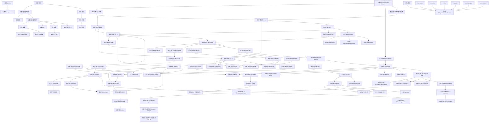

```mermaid
graph TD
1["数理逻辑/一阶逻辑"] --> 0["数理逻辑/一阶逻辑演算"]
2["数理逻辑/命题逻辑演算"] --> 1["数理逻辑/一阶逻辑"]
3["数理逻辑/命题逻辑"] --> 2["数理逻辑/命题逻辑演算"]
5["朴素集合论/naive-set-theory-2"] --> 3["数理逻辑/命题逻辑"]
5["朴素集合论/naive-set-theory-2"] --> 6["点集拓扑/拓扑空间"]
7["朴素集合论/zorn_lemma"] --> 6["点集拓扑/拓扑空间"]
9["点集拓扑/子空间"] --> 8["点集拓扑/连续映射"]
6["点集拓扑/拓扑空间"] --> 9["点集拓扑/子空间"]
12["数学分析/real-number"] --> 11["点集拓扑/度量空间"]
6["点集拓扑/拓扑空间"] --> 11["点集拓扑/度量空间"]
8["点集拓扑/连续映射"] --> 13["点集拓扑/紧空间"]
15["数学分析/metric-space"] --> 14["点集拓扑/product-metric-space"]
6["点集拓扑/拓扑空间"] --> 14["点集拓扑/product-metric-space"]
8["点集拓扑/连续映射"] --> 16["点集拓扑/连通空间"]
6["点集拓扑/拓扑空间"] --> 17["点集拓扑/乘积空间"]
6["点集拓扑/拓扑空间"] --> 18["点集拓扑/序拓扑"]
20["抽象代数/群论(循环群)"] --> 19["抽象代数/环论(有限环)"]
22["抽象代数/环论(一)"] --> 21["抽象代数/环论(二)"]
23["抽象代数/同态映射"] --> 21["抽象代数/环论(二)"]
19["抽象代数/环论(有限环)"] --> 24["抽象代数/环论(杂)"]
25["抽象代数/环论(多项式环)"] --> 24["抽象代数/环论(杂)"]
27["朴素集合论/naive-set-theory-1"] --> 26["抽象代数/二元运算"]
29["抽象代数/群论(二)"] --> 28["抽象代数/群论(杂)"]
20["抽象代数/群论(循环群)"] --> 28["抽象代数/群论(杂)"]
31["抽象代数/域论(域拓展)"] --> 30["抽象代数/形式导数"]
32["抽象代数/群论(一)"] --> 29["抽象代数/群论(二)"]
23["抽象代数/同态映射"] --> 29["抽象代数/群论(二)"]
33["抽象代数/群论(幂运算)"] --> 20["抽象代数/群论(循环群)"]
34["朴素集合论/初等数论"] --> 20["抽象代数/群论(循环群)"]
36["数学分析/实数构造/整数"] --> 35["抽象代数/环论(幂运算)"]
29["抽象代数/群论(二)"] --> 37["抽象代数/群论(群作用)"]
38["抽象代数/群论(置换群)"] --> 37["抽象代数/群论(群作用)"]
21["抽象代数/环论(二)"] --> 39["抽象代数/环论(商域)"]
32["抽象代数/群论(一)"] --> 22["抽象代数/环论(一)"]
29["抽象代数/群论(二)"] --> 40["抽象代数/群论(高等群论)"]
42["抽象代数/域论(有限域)"] --> 41["抽象代数/Galois"]
43["数学分析/实数构造/自然数"] --> 32["抽象代数/群论(一)"]
26["抽象代数/二元运算"] --> 32["抽象代数/群论(一)"]
29["抽象代数/群论(二)"] --> 44["抽象代数/向量空间"]
21["抽象代数/环论(二)"] --> 44["抽象代数/向量空间"]
22["抽象代数/环论(一)"] --> 46["抽象代数/环论(有序环)"]
21["抽象代数/环论(二)"] --> 25["抽象代数/环论(多项式环)"]
24["抽象代数/环论(杂)"] --> 31["抽象代数/域论(域拓展)"]
44["抽象代数/向量空间"] --> 31["抽象代数/域论(域拓展)"]
30["抽象代数/形式导数"] --> 42["抽象代数/域论(有限域)"]
36["数学分析/实数构造/整数"] --> 33["抽象代数/群论(幂运算)"]
29["抽象代数/群论(二)"] --> 47["抽象代数/群论(群列)"]
26["抽象代数/二元运算"] --> 23["抽象代数/同态映射"]
34["朴素集合论/初等数论"] --> 38["抽象代数/群论(置换群)"]
8["点集拓扑/连续映射"] --> 49["流形/prepare"]
9["点集拓扑/子空间"] --> 50["流形/smooth-manifold"]
27["朴素集合论/naive-set-theory-1"] --> 7["朴素集合论/zorn_lemma"]
36["数学分析/实数构造/整数"] --> 34["朴素集合论/初等数论"]
34["朴素集合论/初等数论"] --> 5["朴素集合论/naive-set-theory-2"]
44["抽象代数/向量空间"] --> 54["复分析/derivative"]
59["数学分析/非负级数"] --> 58["数学分析/级数"]
44["抽象代数/向量空间"] --> 60["数学分析/derivate"]
61["数学分析/funct-limit"] --> 60["数学分析/derivate"]
12["数学分析/real-number"] --> 62["数学分析/converge"]
62["数学分析/converge"] --> 59["数学分析/非负级数"]
62["数学分析/converge"] --> 61["数学分析/funct-limit"]
12["数学分析/real-number"] --> 64["数学分析/complex-number"]
44["抽象代数/向量空间"] --> 64["数学分析/complex-number"]
65["数学分析/实数构造/实数"] -.-> 12["数学分析/real-number"]
68["计算机/docker"] -.-> 67["计算机/easyconnect"]
70["linear-algebra/matrix"] --> 69["linear-algebra/rank"]
22["抽象代数/环论(一)"] --> 70["linear-algebra/matrix"]
70["linear-algebra/matrix"] --> 72["linear-algebra/diagonalization"]
70["linear-algebra/matrix"] --> 73["linear-algebra/norm"]
75["故事/纯粹理性批判"] --> 74["故事/固执"]
77["故事/价格"] --> 76["故事/资本"]
79["故事/安全"] --> 78["故事/狡猾的小说家"]
75["故事/纯粹理性批判"] --> 80["故事/实践理性批判"]
81["故事/时间"] --> 75["故事/纯粹理性批判"]
80["故事/实践理性批判"] --> 79["故事/安全"]
80["故事/实践理性批判"] --> 82["故事/拥有"]
80["故事/实践理性批判"] --> 83["故事/爱"]
84["故事/货币"] --> 77["故事/价格"]
79["故事/安全"] --> 86["故事/安全与道德"]
83["故事/爱"] --> 87["故事/爱与幸福"]
81["故事/时间"] --> 84["故事/货币"]
80["故事/实践理性批判"] --> 88["故事/判断力批判"]
6["点集拓扑/拓扑空间"] --> 89["测度论与概率论/class-of-sets"]
91["测度论与概率论/almost-everywhere"] --> 90["测度论与概率论/Lebesgue-integral"]
89["测度论与概率论/class-of-sets"] --> 92["测度论与概率论/measurable-mapping"]
94["测度论与概率论/measure"] --> 93["测度论与概率论/L-S-measure"]
92["测度论与概率论/measurable-mapping"] --> 95["测度论与概率论/measurable-func"]
62["数学分析/converge"] --> 95["测度论与概率论/measurable-func"]
89["测度论与概率论/class-of-sets"] --> 96["测度论与概率论/semi-ring"]
90["测度论与概率论/Lebesgue-integral"] --> 97["测度论与概率论/三大积分收敛定理"]
95["测度论与概率论/measurable-func"] --> 91["测度论与概率论/almost-everywhere"]
95["测度论与概率论/measurable-func"] --> 98["测度论与概率论/random_variable"]
89["测度论与概率论/class-of-sets"] --> 94["测度论与概率论/measure"]
93["测度论与概率论/L-S-measure"] --> 100["测度论与概率论/L-measure"]
89["测度论与概率论/class-of-sets"] --> 101["测度论与概率论/Borel-R"]
18["点集拓扑/序拓扑"] --> 101["测度论与概率论/Borel-R"]
102["数学分析/实数构造/有理数"] --> 65["数学分析/实数构造/实数"]
36["数学分析/实数构造/整数"] --> 102["数学分析/实数构造/有理数"]
39["抽象代数/环论(商域)"] --> 102["数学分析/实数构造/有理数"]
27["朴素集合论/naive-set-theory-1"] --> 43["数学分析/实数构造/自然数"]
21["抽象代数/环论(二)"] --> 36["数学分析/实数构造/整数"]
46["抽象代数/环论(有序环)"] --> 36["数学分析/实数构造/整数"]
104["原始数据"] --> 103["机器学习/pytorch/torch.utils.data"]
105["batch_size"] --> 103["机器学习/pytorch/torch.utils.data"]
106["drop_last"] --> 103["机器学习/pytorch/torch.utils.data"]
107["shuffle"] --> 103["机器学习/pytorch/torch.utils.data"]
108["sampler"] --> 103["机器学习/pytorch/torch.utils.data"]
109["batch_sampler"] --> 103["机器学习/pytorch/torch.utils.data"]
110["batched data"] --> 103["机器学习/pytorch/torch.utils.data"]
```