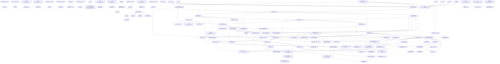

```mermaid
graph TD
1["点集拓扑/拓扑空间"] --> 0["流形/smooth-manifold"]
2["点集拓扑/子空间"] --> 0["流形/smooth-manifold"]
1["点集拓扑/拓扑空间"] --> 3["流形/prepare"]
2["点集拓扑/子空间"] --> 3["流形/prepare"]
4["点集拓扑/连续映射"] --> 3["流形/prepare"]
6["流形/dependency_graph"] --> 5["流形/index"]
8["杂/dependency_graph"] --> 7["杂/index"]
10["朴素集合论/naive-set-theory-1"] --> 9["朴素集合论/zorn_lemma"]
12["数学分析/实数构造/整数"] --> 11["朴素集合论/初等数论"]
10["朴素集合论/naive-set-theory-1"] --> 13["朴素集合论/naive-set-theory-2"]
11["朴素集合论/初等数论"] --> 13["朴素集合论/naive-set-theory-2"]
15["朴素集合论/dependency_graph"] --> 14["朴素集合论/index"]
17["微分方程/dependency_graph"] --> 16["微分方程/index"]
19["范畴/dependency_graph"] --> 18["范畴/index"]
4["点集拓扑/连续映射"] --> 20["点集拓扑/紧空间"]
2["点集拓扑/子空间"] --> 4["点集拓扑/连续映射"]
4["点集拓扑/连续映射"] --> 21["点集拓扑/连通空间"]
1["点集拓扑/拓扑空间"] --> 22["点集拓扑/序拓扑"]
24["点集拓扑/dependency_graph"] --> 23["点集拓扑/index"]
1["点集拓扑/拓扑空间"] --> 2["点集拓扑/子空间"]
1["点集拓扑/拓扑空间"] --> 25["点集拓扑/乘积空间"]
13["朴素集合论/naive-set-theory-2"] --> 1["点集拓扑/拓扑空间"]
9["朴素集合论/zorn_lemma"] --> 1["点集拓扑/拓扑空间"]
27["数学分析/metric-space"] --> 26["点集拓扑/product-metric-space"]
1["点集拓扑/拓扑空间"] --> 26["点集拓扑/product-metric-space"]
29["计算机/dependency_graph"] --> 28["计算机/index"]
31["计算机/docker"] --> 30["计算机/easyconnect"]
33["copilot/dependency_graph"] --> 32["copilot/index"]
35["范畴"] --> 34["copilot/copilot-conversations/如何区分态射呢？@20260102_160432"]
37["数理逻辑/命题逻辑"] --> 36["数理逻辑/命题逻辑演算"]
37["数理逻辑/命题逻辑"] --> 38["数理逻辑/一阶逻辑"]
36["数理逻辑/命题逻辑演算"] --> 38["数理逻辑/一阶逻辑"]
40["数理逻辑/dependency_graph"] --> 39["数理逻辑/index"]
13["朴素集合论/naive-set-theory-2"] --> 37["数理逻辑/命题逻辑"]
38["数理逻辑/一阶逻辑"] --> 41["数理逻辑/一阶逻辑演算"]
43["抽象代数/群论(二)"] --> 42["抽象代数/群论(群列)"]
45["抽象代数/群论(一)"] --> 44["抽象代数/群论(置换群)"]
11["朴素集合论/初等数论"] --> 44["抽象代数/群论(置换群)"]
45["抽象代数/群论(一)"] --> 43["抽象代数/群论(二)"]
46["抽象代数/同态映射"] --> 43["抽象代数/群论(二)"]
48["抽象代数/环论(一)"] --> 47["抽象代数/环论(有序环)"]
49["抽象代数/二元运算"] --> 46["抽象代数/同态映射"]
45["抽象代数/群论(一)"] --> 50["抽象代数/群论(幂运算)"]
12["数学分析/实数构造/整数"] --> 50["抽象代数/群论(幂运算)"]
52["抽象代数/环论(二)"] --> 51["抽象代数/环论(商域)"]
48["抽象代数/环论(一)"] --> 53["抽象代数/环论(幂运算)"]
47["抽象代数/环论(有序环)"] --> 53["抽象代数/环论(幂运算)"]
12["数学分析/实数构造/整数"] --> 53["抽象代数/环论(幂运算)"]
50["抽象代数/群论(幂运算)"] --> 54["抽象代数/群论(循环群)"]
11["朴素集合论/初等数论"] --> 54["抽象代数/群论(循环群)"]
46["抽象代数/同态映射"] --> 54["抽象代数/群论(循环群)"]
11["朴素集合论/初等数论"] --> 55["抽象代数/环论(杂)"]
56["抽象代数/环论(有限环)"] --> 55["抽象代数/环论(杂)"]
47["抽象代数/环论(有序环)"] --> 55["抽象代数/环论(杂)"]
57["抽象代数/环论(多项式环)"] --> 55["抽象代数/环论(杂)"]
52["抽象代数/环论(二)"] --> 56["抽象代数/环论(有限环)"]
54["抽象代数/群论(循环群)"] --> 56["抽象代数/环论(有限环)"]
45["抽象代数/群论(一)"] --> 48["抽象代数/环论(一)"]
59["抽象代数/域论(域拓展)"] --> 58["抽象代数/形式导数"]
43["抽象代数/群论(二)"] --> 60["抽象代数/向量空间"]
52["抽象代数/环论(二)"] --> 60["抽象代数/向量空间"]
62["抽象代数/dependency_graph"] --> 61["抽象代数/index"]
48["抽象代数/环论(一)"] --> 52["抽象代数/环论(二)"]
46["抽象代数/同态映射"] --> 52["抽象代数/环论(二)"]
59["抽象代数/域论(域拓展)"] --> 63["抽象代数/Galois"]
64["抽象代数/域论(有限域)"] --> 63["抽象代数/Galois"]
43["抽象代数/群论(二)"] --> 65["抽象代数/群论(高等群论)"]
43["抽象代数/群论(二)"] --> 66["抽象代数/群论(杂)"]
54["抽象代数/群论(循环群)"] --> 66["抽象代数/群论(杂)"]
48["抽象代数/环论(一)"] --> 57["抽象代数/环论(多项式环)"]
67["同态映射"] --> 57["抽象代数/环论(多项式环)"]
55["抽象代数/环论(杂)"] --> 59["抽象代数/域论(域拓展)"]
60["抽象代数/向量空间"] --> 59["抽象代数/域论(域拓展)"]
10["朴素集合论/naive-set-theory-1"] --> 49["抽象代数/二元运算"]
68["数学分析/实数构造/自然数"] --> 45["抽象代数/群论(一)"]
49["抽象代数/二元运算"] --> 45["抽象代数/群论(一)"]
43["抽象代数/群论(二)"] --> 69["抽象代数/群论(群作用)"]
44["抽象代数/群论(置换群)"] --> 69["抽象代数/群论(群作用)"]
59["抽象代数/域论(域拓展)"] --> 64["抽象代数/域论(有限域)"]
58["抽象代数/形式导数"] --> 64["抽象代数/域论(有限域)"]
71["故事/纯粹理性批判"] --> 70["故事/实践理性批判"]
70["故事/实践理性批判"] --> 72["故事/判断力批判"]
74["故事/爱"] --> 73["故事/爱与幸福"]
70["故事/实践理性批判"] --> 75["故事/拥有"]
76["故事/时间"] --> 71["故事/纯粹理性批判"]
70["故事/实践理性批判"] --> 77["故事/安全"]
79["故事/dependency_graph"] --> 78["故事/index"]
71["故事/纯粹理性批判"] --> 80["故事/固执"]
70["故事/实践理性批判"] --> 74["故事/爱"]
82["数学分析/converge"] --> 81["数学分析/funct-limit"]
84["数学分析/real-number"] --> 83["数学分析/complex-number"]
85["数学分析/向量空间"] --> 83["数学分析/complex-number"]
60["抽象代数/向量空间"] --> 86["数学分析/derivate"]
81["数学分析/funct-limit"] --> 86["数学分析/derivate"]
27["数学分析/metric-space"] --> 87["数学分析/complex-seq-series"]
1["点集拓扑/拓扑空间"] --> 87["数学分析/complex-seq-series"]
82["数学分析/converge"] --> 87["数学分析/complex-seq-series"]
88["数学分析/series"] --> 87["数学分析/complex-seq-series"]
84["数学分析/real-number"] --> 27["数学分析/metric-space"]
23["点集拓扑/index"] --> 27["数学分析/metric-space"]
68["数学分析/实数构造/自然数"] --> 12["数学分析/实数构造/整数"]
52["抽象代数/环论(二)"] --> 12["数学分析/实数构造/整数"]
47["抽象代数/环论(有序环)"] --> 12["数学分析/实数构造/整数"]
12["数学分析/实数构造/整数"] --> 89["数学分析/实数构造/有理数"]
51["抽象代数/环论(商域)"] --> 89["数学分析/实数构造/有理数"]
10["朴素集合论/naive-set-theory-1"] --> 68["数学分析/实数构造/自然数"]
89["数学分析/实数构造/有理数"] --> 90["数学分析/实数构造/实数"]
92["数学分析/dependency_graph"] --> 91["数学分析/index"]
84["数学分析/real-number"] --> 82["数学分析/converge"]
82["数学分析/converge"] --> 88["数学分析/series"]
68["数学分析/实数构造/自然数"] --> 84["数学分析/real-number"]
12["数学分析/实数构造/整数"] --> 84["数学分析/real-number"]
89["数学分析/实数构造/有理数"] --> 84["数学分析/real-number"]
90["数学分析/实数构造/实数"] --> 84["数学分析/real-number"]
60["抽象代数/向量空间"] --> 93["复分析/derivative"]
95["复分析/dependency_graph"] --> 94["复分析/index"]
97["原始数据"] --> 96["机器学习/pytorch/torch.utils.data"]
98["batch_size"] --> 96["机器学习/pytorch/torch.utils.data"]
99["drop_last"] --> 96["机器学习/pytorch/torch.utils.data"]
100["shuffle"] --> 96["机器学习/pytorch/torch.utils.data"]
101["sampler"] --> 96["机器学习/pytorch/torch.utils.data"]
102["batch_sampler"] --> 96["机器学习/pytorch/torch.utils.data"]
103["batched data"] --> 96["机器学习/pytorch/torch.utils.data"]
105["机器学习/dependency_graph"] --> 104["机器学习/index"]
107["linear-algebra/matrix"] --> 106["linear-algebra/rank"]
48["抽象代数/环论(一)"] --> 107["linear-algebra/matrix"]
107["linear-algebra/matrix"] --> 108["linear-algebra/diagonalization"]
110["linear-algebra/dependency_graph"] --> 109["linear-algebra/index"]
107["linear-algebra/matrix"] --> 111["linear-algebra/norm"]
13["朴素集合论/naive-set-theory-2"] --> 112["测度论与概率论/class-of-sets"]
1["点集拓扑/拓扑空间"] --> 112["测度论与概率论/class-of-sets"]
114["测度论与概率论/measurable-mapping"] --> 113["测度论与概率论/measurable-func"]
82["数学分析/converge"] --> 113["测度论与概率论/measurable-func"]
116["测度论与概率论/measure"] --> 115["测度论与概率论/L-S-measure"]
113["测度论与概率论/measurable-func"] --> 117["测度论与概率论/random_variable"]
112["测度论与概率论/class-of-sets"] --> 118["测度论与概率论/Borel-R"]
22["点集拓扑/序拓扑"] --> 118["测度论与概率论/Borel-R"]
112["测度论与概率论/class-of-sets"] --> 119["测度论与概率论/semi-ring"]
115["测度论与概率论/L-S-measure"] --> 120["测度论与概率论/L-measure"]
122["测度论与概率论/dependency_graph"] --> 121["测度论与概率论/index"]
113["测度论与概率论/measurable-func"] --> 123["测度论与概率论/almost-everywhere"]
112["测度论与概率论/class-of-sets"] --> 114["测度论与概率论/measurable-mapping"]
112["测度论与概率论/class-of-sets"] --> 116["测度论与概率论/measure"]
113["测度论与概率论/measurable-func"] --> 124["测度论与概率论/Lebesgue-integral"]
123["测度论与概率论/almost-everywhere"] --> 124["测度论与概率论/Lebesgue-integral"]
```