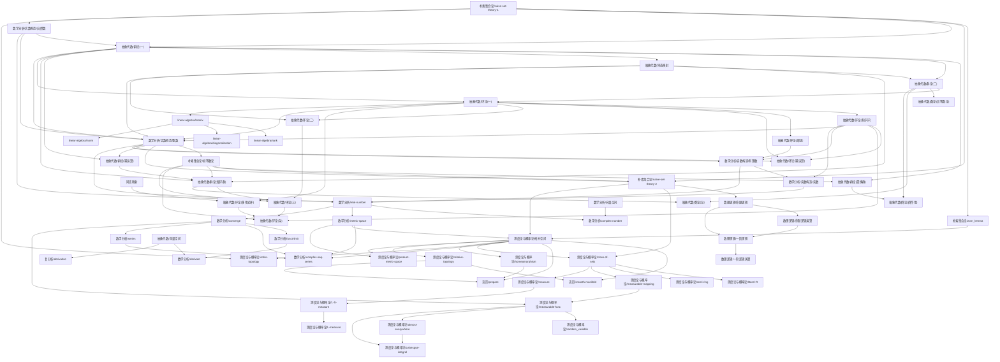

```mermaid
graph TD
1["测度论与概率论/拓扑空间"] --> 0["流形/smooth-manifold"]
2["测度论与概率论/relative-topology"] --> 0["流形/smooth-manifold"]
1["测度论与概率论/拓扑空间"] --> 3["流形/prepare"]
2["测度论与概率论/relative-topology"] --> 3["流形/prepare"]
4["测度论与概率论/homeomorphism"] --> 3["流形/prepare"]
6["朴素集合论/naive-set-theory-1"] --> 5["朴素集合论/zorn_lemma"]
8["数学分析/实数构造/整数"] --> 7["朴素集合论/初等数论"]
6["朴素集合论/naive-set-theory-1"] --> 9["朴素集合论/naive-set-theory-2"]
8["数学分析/实数构造/整数"] --> 9["朴素集合论/naive-set-theory-2"]
7["朴素集合论/初等数论"] --> 9["朴素集合论/naive-set-theory-2"]
11["数理逻辑/命题逻辑"] --> 10["数理逻辑/命题逻辑演算"]
11["数理逻辑/命题逻辑"] --> 12["数理逻辑/一阶逻辑"]
10["数理逻辑/命题逻辑演算"] --> 12["数理逻辑/一阶逻辑"]
9["朴素集合论/naive-set-theory-2"] --> 11["数理逻辑/命题逻辑"]
12["数理逻辑/一阶逻辑"] --> 13["数理逻辑/一阶逻辑演算"]
15["抽象代数/群论(一)"] --> 14["抽象代数/群论(置换群)"]
7["朴素集合论/初等数论"] --> 14["抽象代数/群论(置换群)"]
15["抽象代数/群论(一)"] --> 16["抽象代数/群论(二)"]
17["抽象代数/同态映射"] --> 16["抽象代数/群论(二)"]
19["抽象代数/环论(一)"] --> 18["抽象代数/环论(有序环)"]
15["抽象代数/群论(一)"] --> 17["抽象代数/同态映射"]
15["抽象代数/群论(一)"] --> 20["抽象代数/群论(幂运算)"]
8["数学分析/实数构造/整数"] --> 20["抽象代数/群论(幂运算)"]
19["抽象代数/环论(一)"] --> 21["抽象代数/环论(商域)"]
19["抽象代数/环论(一)"] --> 22["抽象代数/环论(幂运算)"]
18["抽象代数/环论(有序环)"] --> 22["抽象代数/环论(幂运算)"]
8["数学分析/实数构造/整数"] --> 22["抽象代数/环论(幂运算)"]
15["抽象代数/群论(一)"] --> 23["抽象代数/群论(循环群)"]
20["抽象代数/群论(幂运算)"] --> 23["抽象代数/群论(循环群)"]
7["朴素集合论/初等数论"] --> 23["抽象代数/群论(循环群)"]
17["抽象代数/同态映射"] --> 23["抽象代数/群论(循环群)"]
7["朴素集合论/初等数论"] --> 24["抽象代数/环论(杂)"]
25["抽象代数/环论(三)"] --> 24["抽象代数/环论(杂)"]
18["抽象代数/环论(有序环)"] --> 24["抽象代数/环论(杂)"]
26["抽象代数/环论(多项式环)"] --> 24["抽象代数/环论(杂)"]
15["抽象代数/群论(一)"] --> 19["抽象代数/环论(一)"]
16["抽象代数/群论(二)"] --> 19["抽象代数/环论(一)"]
27["抽象代数/环论(二)"] --> 25["抽象代数/环论(三)"]
7["朴素集合论/初等数论"] --> 25["抽象代数/环论(三)"]
23["抽象代数/群论(循环群)"] --> 25["抽象代数/环论(三)"]
19["抽象代数/环论(一)"] --> 27["抽象代数/环论(二)"]
17["抽象代数/同态映射"] --> 27["抽象代数/环论(二)"]
16["抽象代数/群论(二)"] --> 28["抽象代数/群论(高等群论)"]
16["抽象代数/群论(二)"] --> 29["抽象代数/群论(杂)"]
23["抽象代数/群论(循环群)"] --> 29["抽象代数/群论(杂)"]
19["抽象代数/环论(一)"] --> 26["抽象代数/环论(多项式环)"]
30["同态映射"] --> 26["抽象代数/环论(多项式环)"]
6["朴素集合论/naive-set-theory-1"] --> 15["抽象代数/群论(一)"]
31["数学分析/实数构造/自然数"] --> 15["抽象代数/群论(一)"]
16["抽象代数/群论(二)"] --> 32["抽象代数/群论(群作用)"]
14["抽象代数/群论(置换群)"] --> 32["抽象代数/群论(群作用)"]
34["数学分析/converge"] --> 33["数学分析/funct-limit"]
36["数学分析/real-number"] --> 35["数学分析/complex-number"]
37["数学分析/向量空间"] --> 35["数学分析/complex-number"]
39["抽象代数/向量空间"] --> 38["数学分析/derivate"]
33["数学分析/funct-limit"] --> 38["数学分析/derivate"]
41["数学分析/metric-space"] --> 40["数学分析/complex-seq-series"]
1["测度论与概率论/拓扑空间"] --> 40["数学分析/complex-seq-series"]
34["数学分析/converge"] --> 40["数学分析/complex-seq-series"]
42["数学分析/series"] --> 40["数学分析/complex-seq-series"]
36["数学分析/real-number"] --> 41["数学分析/metric-space"]
31["数学分析/实数构造/自然数"] --> 8["数学分析/实数构造/整数"]
17["抽象代数/同态映射"] --> 8["数学分析/实数构造/整数"]
15["抽象代数/群论(一)"] --> 8["数学分析/实数构造/整数"]
19["抽象代数/环论(一)"] --> 8["数学分析/实数构造/整数"]
18["抽象代数/环论(有序环)"] --> 8["数学分析/实数构造/整数"]
8["数学分析/实数构造/整数"] --> 43["数学分析/实数构造/有理数"]
21["抽象代数/环论(商域)"] --> 43["数学分析/实数构造/有理数"]
18["抽象代数/环论(有序环)"] --> 43["数学分析/实数构造/有理数"]
6["朴素集合论/naive-set-theory-1"] --> 31["数学分析/实数构造/自然数"]
43["数学分析/实数构造/有理数"] --> 44["数学分析/实数构造/实数"]
18["抽象代数/环论(有序环)"] --> 44["数学分析/实数构造/实数"]
36["数学分析/real-number"] --> 34["数学分析/converge"]
34["数学分析/converge"] --> 42["数学分析/series"]
31["数学分析/实数构造/自然数"] --> 36["数学分析/real-number"]
8["数学分析/实数构造/整数"] --> 36["数学分析/real-number"]
43["数学分析/实数构造/有理数"] --> 36["数学分析/real-number"]
44["数学分析/实数构造/实数"] --> 36["数学分析/real-number"]
39["抽象代数/向量空间"] --> 45["复分析/derivative"]
47["linear-algebra/matrix"] --> 46["linear-algebra/rank"]
19["抽象代数/环论(一)"] --> 47["linear-algebra/matrix"]
47["linear-algebra/matrix"] --> 48["linear-algebra/diagonalization"]
47["linear-algebra/matrix"] --> 49["linear-algebra/norm"]
9["朴素集合论/naive-set-theory-2"] --> 50["测度论与概率论/class-of-sets"]
1["测度论与概率论/拓扑空间"] --> 50["测度论与概率论/class-of-sets"]
52["测度论与概率论/measurable-mapping"] --> 51["测度论与概率论/measurable-func"]
34["数学分析/converge"] --> 51["测度论与概率论/measurable-func"]
54["测度论与概率论/measure"] --> 53["测度论与概率论/L-S-measure"]
6["朴素集合论/naive-set-theory-1"] --> 55["测度论与概率论/order-topology"]
1["测度论与概率论/拓扑空间"] --> 55["测度论与概率论/order-topology"]
51["测度论与概率论/measurable-func"] --> 56["测度论与概率论/random_variable"]
50["测度论与概率论/class-of-sets"] --> 57["测度论与概率论/Borel-R"]
1["测度论与概率论/拓扑空间"] --> 4["测度论与概率论/homeomorphism"]
50["测度论与概率论/class-of-sets"] --> 58["测度论与概率论/semi-ring"]
1["测度论与概率论/拓扑空间"] --> 2["测度论与概率论/relative-topology"]
53["测度论与概率论/L-S-measure"] --> 59["测度论与概率论/L-measure"]
51["测度论与概率论/measurable-func"] --> 60["测度论与概率论/almost-everywhere"]
50["测度论与概率论/class-of-sets"] --> 52["测度论与概率论/measurable-mapping"]
41["数学分析/metric-space"] --> 1["测度论与概率论/拓扑空间"]
9["朴素集合论/naive-set-theory-2"] --> 1["测度论与概率论/拓扑空间"]
5["朴素集合论/zorn_lemma"] --> 1["测度论与概率论/拓扑空间"]
50["测度论与概率论/class-of-sets"] --> 54["测度论与概率论/measure"]
41["数学分析/metric-space"] --> 61["测度论与概率论/product-metric-space"]
1["测度论与概率论/拓扑空间"] --> 61["测度论与概率论/product-metric-space"]
51["测度论与概率论/measurable-func"] --> 62["测度论与概率论/Lebesgue-integral"]
60["测度论与概率论/almost-everywhere"] --> 62["测度论与概率论/Lebesgue-integral"]
```