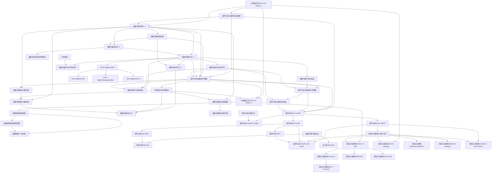

```mermaid
graph TD
1["数学分析/实数构造/整数"] --> 0["朴素集合论/初等数论"]
3["朴素集合论/naive-set-theory-1"] --> 2["朴素集合论/naive-set-theory-2"]
1["数学分析/实数构造/整数"] --> 2["朴素集合论/naive-set-theory-2"]
0["朴素集合论/初等数论"] --> 2["朴素集合论/naive-set-theory-2"]
5["数理逻辑/命题逻辑"] --> 4["数理逻辑/命题逻辑演算"]
5["数理逻辑/命题逻辑"] --> 6["数理逻辑/一阶逻辑"]
4["数理逻辑/命题逻辑演算"] --> 6["数理逻辑/一阶逻辑"]
2["朴素集合论/naive-set-theory-2"] --> 5["数理逻辑/命题逻辑"]
8["抽象代数/群论(一)"] --> 7["抽象代数/群论(置换群)"]
0["朴素集合论/初等数论"] --> 7["抽象代数/群论(置换群)"]
8["抽象代数/群论(一)"] --> 9["抽象代数/群论(二)"]
10["抽象代数/同态映射"] --> 9["抽象代数/群论(二)"]
12["抽象代数/环论(一)"] --> 11["抽象代数/环论(有序环)"]
8["抽象代数/群论(一)"] --> 10["抽象代数/同态映射"]
8["抽象代数/群论(一)"] --> 13["抽象代数/群论(幂运算)"]
1["数学分析/实数构造/整数"] --> 13["抽象代数/群论(幂运算)"]
12["抽象代数/环论(一)"] --> 14["抽象代数/环论(商域)"]
12["抽象代数/环论(一)"] --> 15["抽象代数/环论(幂运算)"]
11["抽象代数/环论(有序环)"] --> 15["抽象代数/环论(幂运算)"]
1["数学分析/实数构造/整数"] --> 15["抽象代数/环论(幂运算)"]
8["抽象代数/群论(一)"] --> 16["抽象代数/群论(循环群)"]
13["抽象代数/群论(幂运算)"] --> 16["抽象代数/群论(循环群)"]
0["朴素集合论/初等数论"] --> 16["抽象代数/群论(循环群)"]
8["抽象代数/群论(一)"] --> 12["抽象代数/环论(一)"]
9["抽象代数/群论(二)"] --> 12["抽象代数/环论(一)"]
18["抽象代数/环论(二)"] --> 17["抽象代数/环论(三)"]
0["朴素集合论/初等数论"] --> 17["抽象代数/环论(三)"]
16["抽象代数/群论(循环群)"] --> 17["抽象代数/环论(三)"]
12["抽象代数/环论(一)"] --> 18["抽象代数/环论(二)"]
10["抽象代数/同态映射"] --> 18["抽象代数/环论(二)"]
9["抽象代数/群论(二)"] --> 19["抽象代数/群论(高等群论)"]
12["抽象代数/环论(一)"] --> 20["抽象代数/环论(多项式环)"]
21["同态映射"] --> 20["抽象代数/环论(多项式环)"]
3["朴素集合论/naive-set-theory-1"] --> 8["抽象代数/群论(一)"]
22["数学分析/实数构造/自然数"] --> 8["抽象代数/群论(一)"]
7["抽象代数/群论(置换群)"] --> 23["抽象代数/群论(群作用)"]
25["数学分析/converge"] --> 24["数学分析/funct-limit"]
27["数学分析/real-number"] --> 26["数学分析/complex-number"]
28["数学分析/向量空间"] --> 26["数学分析/complex-number"]
30["抽象代数/向量空间"] --> 29["数学分析/derivate"]
24["数学分析/funct-limit"] --> 29["数学分析/derivate"]
32["数学分析/metric-space"] --> 31["数学分析/complex-seq-series"]
33["测度论与概率论/拓扑空间"] --> 31["数学分析/complex-seq-series"]
25["数学分析/converge"] --> 31["数学分析/complex-seq-series"]
34["数学分析/series"] --> 31["数学分析/complex-seq-series"]
27["数学分析/real-number"] --> 32["数学分析/metric-space"]
22["数学分析/实数构造/自然数"] --> 1["数学分析/实数构造/整数"]
10["抽象代数/同态映射"] --> 1["数学分析/实数构造/整数"]
8["抽象代数/群论(一)"] --> 1["数学分析/实数构造/整数"]
12["抽象代数/环论(一)"] --> 1["数学分析/实数构造/整数"]
11["抽象代数/环论(有序环)"] --> 1["数学分析/实数构造/整数"]
1["数学分析/实数构造/整数"] --> 35["数学分析/实数构造/有理数"]
14["抽象代数/环论(商域)"] --> 35["数学分析/实数构造/有理数"]
11["抽象代数/环论(有序环)"] --> 35["数学分析/实数构造/有理数"]
3["朴素集合论/naive-set-theory-1"] --> 22["数学分析/实数构造/自然数"]
35["数学分析/实数构造/有理数"] --> 36["数学分析/实数构造/实数"]
11["抽象代数/环论(有序环)"] --> 36["数学分析/实数构造/实数"]
27["数学分析/real-number"] --> 25["数学分析/converge"]
25["数学分析/converge"] --> 34["数学分析/series"]
22["数学分析/实数构造/自然数"] --> 27["数学分析/real-number"]
1["数学分析/实数构造/整数"] --> 27["数学分析/real-number"]
35["数学分析/实数构造/有理数"] --> 27["数学分析/real-number"]
36["数学分析/实数构造/实数"] --> 27["数学分析/real-number"]
30["抽象代数/向量空间"] --> 37["复分析/derivative"]
39["linear-algebra/matrix"] --> 38["linear-algebra/rank"]
12["抽象代数/环论(一)"] --> 39["linear-algebra/matrix"]
39["linear-algebra/matrix"] --> 40["linear-algebra/diagonalization"]
39["linear-algebra/matrix"] --> 41["linear-algebra/norm"]
2["朴素集合论/naive-set-theory-2"] --> 42["测度论与概率论/class-of-sets"]
33["测度论与概率论/拓扑空间"] --> 42["测度论与概率论/class-of-sets"]
44["测度论与概率论/measure"] --> 43["测度论与概率论/L-S-measure"]
3["朴素集合论/naive-set-theory-1"] --> 45["测度论与概率论/order-topology"]
33["测度论与概率论/拓扑空间"] --> 45["测度论与概率论/order-topology"]
42["测度论与概率论/class-of-sets"] --> 46["测度论与概率论/Borel-R"]
33["测度论与概率论/拓扑空间"] --> 47["测度论与概率论/homeomorphism"]
42["测度论与概率论/class-of-sets"] --> 48["测度论与概率论/semi-ring"]
33["测度论与概率论/拓扑空间"] --> 49["测度论与概率论/relative-topology"]
32["数学分析/metric-space"] --> 33["测度论与概率论/拓扑空间"]
42["测度论与概率论/class-of-sets"] --> 44["测度论与概率论/measure"]
32["数学分析/metric-space"] --> 50["测度论与概率论/product-metric-space"]
33["测度论与概率论/拓扑空间"] --> 50["测度论与概率论/product-metric-space"]
```