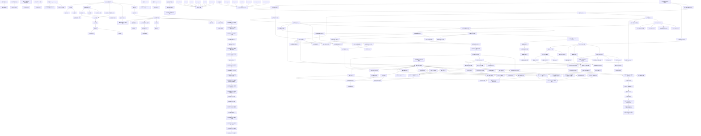

```mermaid
graph TD
1["数理逻辑/一阶逻辑"] --> 0["数理逻辑/一阶逻辑演算"]
2["数理逻辑/命题逻辑演算"] --> 1["数理逻辑/一阶逻辑"]
3["数理逻辑/命题逻辑"] --> 2["数理逻辑/命题逻辑演算"]
5["朴素集合论/naive-set-theory-2"] --> 3["数理逻辑/命题逻辑"]
5["朴素集合论/naive-set-theory-2"] --> 6["点集拓扑/拓扑空间"]
7["朴素集合论/zorn_lemma"] --> 6["点集拓扑/拓扑空间"]
9["点集拓扑/子空间"] --> 8["点集拓扑/连续映射"]
6["点集拓扑/拓扑空间"] --> 9["点集拓扑/子空间"]
12["数学分析/real-number"] --> 11["点集拓扑/度量空间"]
13["点集拓扑/点集拓扑(代理)"] --> 11["点集拓扑/度量空间"]
8["点集拓扑/连续映射"] --> 14["点集拓扑/紧空间"]
11["点集拓扑/度量空间"] --> 15["点集拓扑/product-metric-space"]
14["点集拓扑/紧空间"] --> 13["点集拓扑/点集拓扑(代理)"]
16["点集拓扑/连通空间"] --> 13["点集拓扑/点集拓扑(代理)"]
17["点集拓扑/乘积空间"] --> 13["点集拓扑/点集拓扑(代理)"]
18["点集拓扑/序拓扑"] --> 13["点集拓扑/点集拓扑(代理)"]
8["点集拓扑/连续映射"] --> 16["点集拓扑/连通空间"]
6["点集拓扑/拓扑空间"] --> 17["点集拓扑/乘积空间"]
6["点集拓扑/拓扑空间"] --> 18["点集拓扑/序拓扑"]
20["概率论/高斯分布"] --> 19["概率论/联合高斯"]
23["机器学习/随机过程"] --> 22["概率论/马尔可夫"]
25["抽象代数/对偶空间"] --> 24["概率论/Dirac分布"]
26["抽象代数/函数空间"] --> 24["概率论/Dirac分布"]
28["测度论/积空间sigma代数"] --> 27["概率论/随机过程"]
30["抽象代数/向量空间"] --> 29["抽象代数/代数"]
32["抽象代数/群论(循环群)"] --> 31["抽象代数/环论(有限环)"]
34["抽象代数/环论(一)"] --> 33["抽象代数/环论(二)"]
35["抽象代数/同态映射"] --> 33["抽象代数/环论(二)"]
31["抽象代数/环论(有限环)"] --> 36["抽象代数/环论(杂)"]
37["抽象代数/环论(多项式环)"] --> 36["抽象代数/环论(杂)"]
39["朴素集合论/naive-set-theory-1"] --> 38["抽象代数/二元运算"]
41["抽象代数/群论(二)"] --> 40["抽象代数/群论(杂)"]
32["抽象代数/群论(循环群)"] --> 40["抽象代数/群论(杂)"]
30["抽象代数/向量空间"] --> 25["抽象代数/对偶空间"]
42["抽象代数/拓扑向量空间"] --> 25["抽象代数/对偶空间"]
44["抽象代数/域论(域拓展)"] --> 43["抽象代数/形式导数"]
45["抽象代数/群论(一)"] --> 41["抽象代数/群论(二)"]
35["抽象代数/同态映射"] --> 41["抽象代数/群论(二)"]
46["抽象代数/群论(幂运算)"] --> 32["抽象代数/群论(循环群)"]
47["朴素集合论/初等数论"] --> 32["抽象代数/群论(循环群)"]
46["抽象代数/群论(幂运算)"] --> 48["抽象代数/环论(幂运算)"]
41["抽象代数/群论(二)"] --> 49["抽象代数/群论(群作用)"]
50["抽象代数/群论(置换群)"] --> 49["抽象代数/群论(群作用)"]
30["抽象代数/向量空间"] --> 51["抽象代数/格"]
33["抽象代数/环论(二)"] --> 52["抽象代数/环论(商域)"]
34["抽象代数/环论(一)"] --> 53["抽象代数/abs_field"]
45["抽象代数/群论(一)"] --> 34["抽象代数/环论(一)"]
41["抽象代数/群论(二)"] --> 54["抽象代数/群论(高等群论)"]
56["抽象代数/域论(有限域)"] --> 55["抽象代数/Galois"]
57["数学分析/实数构造/自然数"] --> 45["抽象代数/群论(一)"]
38["抽象代数/二元运算"] --> 45["抽象代数/群论(一)"]
41["抽象代数/群论(二)"] --> 30["抽象代数/向量空间"]
33["抽象代数/环论(二)"] --> 30["抽象代数/向量空间"]
53["抽象代数/abs_field"] --> 30["抽象代数/向量空间"]
58["抽象代数/abs_field|带绝对值的域"] --> 30["抽象代数/向量空间"]
42["抽象代数/拓扑向量空间"] --> 59["抽象代数/抽象导数"]
13["点集拓扑/点集拓扑(代理)"] --> 42["抽象代数/拓扑向量空间"]
34["抽象代数/环论(一)"] --> 61["抽象代数/环论(有序环)"]
33["抽象代数/环论(二)"] --> 37["抽象代数/环论(多项式环)"]
36["抽象代数/环论(杂)"] --> 44["抽象代数/域论(域拓展)"]
30["抽象代数/向量空间"] --> 44["抽象代数/域论(域拓展)"]
43["抽象代数/形式导数"] --> 56["抽象代数/域论(有限域)"]
62["数学分析/实数构造/整数"] --> 46["抽象代数/群论(幂运算)"]
41["抽象代数/群论(二)"] --> 63["抽象代数/群论(群列)"]
38["抽象代数/二元运算"] --> 35["抽象代数/同态映射"]
47["朴素集合论/初等数论"] --> 50["抽象代数/群论(置换群)"]
30["抽象代数/向量空间"] --> 64["抽象代数/内部直和"]
30["抽象代数/向量空间"] --> 26["抽象代数/函数空间"]
42["抽象代数/拓扑向量空间"] --> 26["抽象代数/函数空间"]
8["点集拓扑/连续映射"] --> 66["流形/prepare"]
9["点集拓扑/子空间"] --> 67["流形/smooth-manifold"]
6["点集拓扑/拓扑空间"] --> 69["测度论/class-of-sets"]
71["测度论/S-integral"] --> 70["测度论/符号测度"]
72["测度论/measurable-mapping"] --> 28["测度论/积空间sigma代数"]
69["测度论/class-of-sets"] --> 72["测度论/measurable-mapping"]
69["测度论/class-of-sets"] --> 73["测度论/与R相关的Borel集"]
18["点集拓扑/序拓扑"] --> 73["测度论/与R相关的Borel集"]
72["测度论/measurable-mapping"] --> 74["测度论/measurable-function"]
75["数学分析/converge"] --> 74["测度论/measurable-function"]
74["测度论/measurable-function"] --> 76["测度论/random-variable"]
78["测度论/measure"] --> 77["测度论/L-S-measure"]
69["测度论/class-of-sets"] --> 79["测度论/semi-ring"]
81["测度论/L-integral"] --> 80["测度论/三大积分收敛定理"]
70["测度论/符号测度"] --> 83["测度论/绝对连续与Radon-Nikodým定理"]
69["测度论/class-of-sets"] --> 78["测度论/measure"]
76["测度论/random-variable"] --> 84["测度论/几乎处处收敛和依测度收敛"]
77["测度论/L-S-measure"] --> 85["测度论/L-measure"]
80["测度论/三大积分收敛定理"] --> 71["测度论/S-integral"]
83["测度论/绝对连续与Radon-Nikodým定理"] --> 86["测度论/相互奇异与Lebesgue分解定理"]
84["测度论/几乎处处收敛和依测度收敛"] --> 81["测度论/L-integral"]
86["测度论/相互奇异与Lebesgue分解定理"] --> 87["测度论/分布函数的类型及分解"]
89["机器学习/diffusion-inpainting(1)"] --> 88["机器学习/repaint"]
49["抽象代数/群论(群作用)"] --> 90["机器学习/SE(3)"]
92["机器学习/Dirac分布"] --> 91["机器学习/fourier"]
39["朴素集合论/naive-set-theory-1"] --> 7["朴素集合论/zorn_lemma"]
62["数学分析/实数构造/整数"] --> 47["朴素集合论/初等数论"]
47["朴素集合论/初等数论"] --> 5["朴素集合论/naive-set-theory-2"]
30["抽象代数/向量空间"] --> 95["复分析/derivative"]
30["抽象代数/向量空间"] --> 99["数学分析/有限维赋范线性空间"]
11["点集拓扑/度量空间"] --> 99["数学分析/有限维赋范线性空间"]
29["抽象代数/代数"] --> 100["数学分析/Rn-代数-格"]
51["抽象代数/格"] --> 100["数学分析/Rn-代数-格"]
99["数学分析/有限维赋范线性空间"] --> 100["数学分析/Rn-代数-格"]
102["数学分析/非负级数"] --> 101["数学分析/级数"]
104["数学分析/赋范向量空间上的级数"] --> 103["数学分析/banach代数上的级数"]
29["抽象代数/代数"] --> 103["数学分析/banach代数上的级数"]
105["数学分析/一些标准的级数"] --> 103["数学分析/banach代数上的级数"]
104["数学分析/赋范向量空间上的级数"] --> 103["数学分析/banach代数上的级数"]
106["数学分析/一些标准的级数|指数级数的收敛性"] --> 103["数学分析/banach代数上的级数"]
107["数学分析/一些标准的级数|正弦级数与余弦级数"] --> 103["数学分析/banach代数上的级数"]
109["数学分析/实数次幂"] --> 108["数学分析/实数(代理)"]
101["数学分析/级数"] --> 105["数学分析/一些标准的级数"]
75["数学分析/converge"] --> 110["数学分析/一些标准极限"]
112["数学分析/无穷小"] --> 111["数学分析/derivate"]
12["数学分析/real-number"] --> 75["数学分析/converge"]
110["数学分析/一些标准极限"] --> 109["数学分析/实数次幂"]
75["数学分析/converge"] --> 102["数学分析/非负级数"]
30["抽象代数/向量空间"] --> 113["数学分析/范数"]
115["测度论/Lebesgue-integral"] --> 114["数学分析/复值可测函数的L积分"]
30["抽象代数/向量空间"] --> 112["数学分析/无穷小"]
116["数学分析/funct-limit"] --> 112["数学分析/无穷小"]
30["抽象代数/向量空间"] --> 104["数学分析/赋范向量空间上的级数"]
101["数学分析/级数"] --> 104["数学分析/赋范向量空间上的级数"]
75["数学分析/converge"] --> 116["数学分析/funct-limit"]
12["数学分析/real-number"] --> 118["数学分析/complex-number"]
30["抽象代数/向量空间"] --> 118["数学分析/complex-number"]
119["数学分析/实数构造/广义实数"] --> 12["数学分析/real-number"]
11["点集拓扑/度量空间"] --> 120["数学分析/函数序列"]
121["测度论/Stieltjes_integral"] --> 120["数学分析/函数序列"]
115["测度论/Lebesgue-integral"] --> 122["数学分析/平方可积"]
120["数学分析/函数序列"] --> 123["数学分析/Stone–Weierstrass"]
125["计算机/netbird"] --> 124["计算机/netbird-reverse-proxy"]
127["计算机/Turing-machine"] --> 126["计算机/复杂类"]
131["linear-algebra/matrix"] --> 130["linear-algebra/矩阵乘法"]
131["linear-algebra/matrix"] --> 132["linear-algebra/rank"]
34["抽象代数/环论(一)"] --> 131["linear-algebra/matrix"]
131["linear-algebra/matrix"] --> 134["linear-algebra/diagonalization"]
131["linear-algebra/matrix"] --> 135["linear-algebra/norm"]
137["故事/纯粹理性批判"] --> 136["故事/固执"]
139["故事/经济基础与上层建筑"] --> 138["故事/性别与权利"]
136["故事/固执"] --> 140["故事/改变"]
142["故事/货币代理"] --> 141["故事/1844年经济学哲学手稿"]
143["故事/绝对精神"] --> 141["故事/1844年经济学哲学手稿"]
142["故事/货币代理"] --> 144["故事/金融交易"]
146["故事/作为意志和表象的世界"] --> 145["故事/期望"]
147["故事/安全"] --> 145["故事/期望"]
147["故事/安全"] --> 148["故事/狡猾的小说家"]
137["故事/纯粹理性批判"] --> 149["故事/实践理性批判"]
149["故事/实践理性批判"] --> 147["故事/安全"]
142["故事/货币代理"] --> 139["故事/经济基础与上层建筑"]
144["故事/金融交易"] --> 150["故事/外汇"]
149["故事/实践理性批判"] --> 151["故事/拥有"]
142["故事/货币代理"] --> 152["故事/税"]
152["故事/税"] --> 153["故事/房价"]
155["故事/货币与行政"] --> 154["故事/政治机构图"]
136["故事/固执"] --> 156["故事/变化"]
158["故事/幸福"] --> 157["故事/爱"]
142["故事/货币代理"] --> 159["故事/价格"]
160["故事/货币"] --> 142["故事/货币代理"]
161["故事/资本论/货币或商品流通"] --> 142["故事/货币代理"]
137["故事/纯粹理性批判"] --> 146["故事/作为意志和表象的世界"]
137["故事/纯粹理性批判"] --> 143["故事/绝对精神"]
142["故事/货币代理"] --> 155["故事/货币与行政"]
147["故事/安全"] --> 163["故事/安全与道德"]
138["故事/性别与权利"] --> 164["故事/神圣叙事"]
157["故事/爱"] --> 165["故事/爱与幸福"]
166["故事/劳动"] --> 160["故事/货币"]
157["故事/爱"] --> 167["故事/孩子"]
137["故事/纯粹理性批判"] --> 166["故事/劳动"]
149["故事/实践理性批判"] --> 168["故事/判断力批判"]
145["故事/期望"] --> 158["故事/幸福"]
170["故事/资本论/不变资本和可变资本"] --> 169["故事/资本论/剩余价值率"]
172["故事/资本论/所谓原始积累"] --> 171["故事/资本论/现代殖民理论"]
173["故事/资本论/交换过程"] --> 161["故事/资本论/货币或商品流通"]
175["故事/资本论/剩余价值转化为资本"] --> 174["故事/资本论/资本主义积累的一般规律"]
177["故事/资本论/劳动力的价值或价格转化为工资"] --> 176["故事/资本论/计时工资"]
179["故事/资本论/机器和大工业"] --> 178["故事/资本论/绝对剩余价值和相对剩余价值"]
181["故事/资本论/货币转化为资本"] --> 180["故事/资本论/劳动过程和价值增殖过程"]
180["故事/资本论/劳动过程和价值增殖过程"] --> 170["故事/资本论/不变资本和可变资本"]
183["故事/资本论/相对剩余价值的概念"] --> 182["故事/资本论/协作"]
174["故事/资本论/资本主义积累的一般规律"] --> 172["故事/资本论/所谓原始积累"]
184["故事/资本论/分工和工场手工业"] --> 179["故事/资本论/机器和大工业"]
142["故事/货币代理"] --> 181["故事/资本论/货币转化为资本"]
185["故事/资本论/商品"] --> 173["故事/资本论/交换过程"]
187["故事/资本论/工资的国民差异"] --> 186["故事/资本论/简单再生产"]
176["故事/资本论/计时工资"] --> 188["故事/资本论/计件工资"]
178["故事/资本论/绝对剩余价值和相对剩余价值"] --> 189["故事/资本论/劳动力价格和剩余价值的量的变化"]
186["故事/资本论/简单再生产"] --> 175["故事/资本论/剩余价值转化为资本"]
188["故事/资本论/计件工资"] --> 187["故事/资本论/工资的国民差异"]
182["故事/资本论/协作"] --> 184["故事/资本论/分工和工场手工业"]
190["故事/资本论/剩余价值率的各种公式"] --> 177["故事/资本论/劳动力的价值或价格转化为工资"]
192["故事/资本论/工作日"] --> 191["故事/资本论/剩余价值率和剩余价值量"]
189["故事/资本论/劳动力价格和剩余价值的量的变化"] --> 190["故事/资本论/剩余价值率的各种公式"]
191["故事/资本论/剩余价值率和剩余价值量"] --> 183["故事/资本论/相对剩余价值的概念"]
169["故事/资本论/剩余价值率"] --> 192["故事/资本论/工作日"]
194["Prototype"] --> 193["计算机/ts/类型"]
195["Extensible"] --> 193["计算机/ts/类型"]
196["Get"] --> 193["计算机/ts/类型"]
197["Set"] --> 193["计算机/ts/类型"]
196["Get"] --> 193["计算机/ts/类型"]
197["Set"] --> 193["计算机/ts/类型"]
198["Call"] --> 193["计算机/ts/类型"]
199["Construct"] --> 193["计算机/ts/类型"]
194["Prototype"] --> 193["计算机/ts/类型"]
198["Call"] --> 193["计算机/ts/类型"]
198["Call"] --> 193["计算机/ts/类型"]
199["Construct"] --> 193["计算机/ts/类型"]
194["Prototype"] --> 193["计算机/ts/类型"]
201["数学分析/实数构造/有理数"] --> 200["数学分析/实数构造/实数"]
48["抽象代数/环论(幂运算)"] --> 200["数学分析/实数构造/实数"]
62["数学分析/实数构造/整数"] --> 201["数学分析/实数构造/有理数"]
52["抽象代数/环论(商域)"] --> 201["数学分析/实数构造/有理数"]
200["数学分析/实数构造/实数"] --> 119["数学分析/实数构造/广义实数"]
39["朴素集合论/naive-set-theory-1"] --> 57["数学分析/实数构造/自然数"]
33["抽象代数/环论(二)"] --> 62["数学分析/实数构造/整数"]
61["抽象代数/环论(有序环)"] --> 62["数学分析/实数构造/整数"]
203["原始数据"] --> 202["机器学习/pytorch/torch.utils.data"]
204["batch_size"] --> 202["机器学习/pytorch/torch.utils.data"]
205["drop_last"] --> 202["机器学习/pytorch/torch.utils.data"]
206["shuffle"] --> 202["机器学习/pytorch/torch.utils.data"]
207["sampler"] --> 202["机器学习/pytorch/torch.utils.data"]
208["batch_sampler"] --> 202["机器学习/pytorch/torch.utils.data"]
209["batched data"] --> 202["机器学习/pytorch/torch.utils.data"]
```