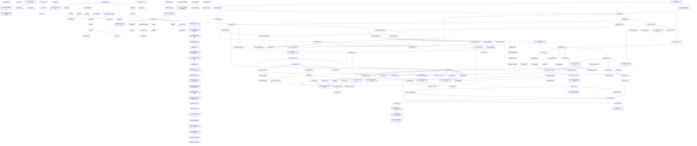

```mermaid
graph TD
1["数理逻辑/一阶逻辑"] --> 0["数理逻辑/一阶逻辑演算"]
2["数理逻辑/命题逻辑演算"] --> 1["数理逻辑/一阶逻辑"]
3["数理逻辑/命题逻辑"] --> 2["数理逻辑/命题逻辑演算"]
4["朴素集合论/naive-set-theory-2"] --> 3["数理逻辑/命题逻辑"]
4["朴素集合论/naive-set-theory-2"] --> 5["点集拓扑/拓扑空间"]
6["朴素集合论/zorn_lemma"] --> 5["点集拓扑/拓扑空间"]
8["点集拓扑/子空间"] --> 7["点集拓扑/连续映射"]
5["点集拓扑/拓扑空间"] --> 8["点集拓扑/子空间"]
10["数学分析/real-number"] --> 9["点集拓扑/度量空间"]
11["点集拓扑/点集拓扑(代理)"] --> 9["点集拓扑/度量空间"]
7["点集拓扑/连续映射"] --> 12["点集拓扑/紧空间"]
9["点集拓扑/度量空间"] --> 13["点集拓扑/product-metric-space"]
12["点集拓扑/紧空间"] --> 11["点集拓扑/点集拓扑(代理)"]
14["点集拓扑/连通空间"] --> 11["点集拓扑/点集拓扑(代理)"]
15["点集拓扑/乘积空间"] --> 11["点集拓扑/点集拓扑(代理)"]
16["点集拓扑/序拓扑"] --> 11["点集拓扑/点集拓扑(代理)"]
7["点集拓扑/连续映射"] --> 14["点集拓扑/连通空间"]
5["点集拓扑/拓扑空间"] --> 15["点集拓扑/乘积空间"]
5["点集拓扑/拓扑空间"] --> 16["点集拓扑/序拓扑"]
18["测度论/测度论代理"] --> 17["概率论/事件或事件类的独立性"]
17["概率论/事件或事件类的独立性"] --> 19["概率论/随机变量或随机变量族的独立性"]
21["抽象代数/群论(群作用)"] --> 20["抽象代数/群表示"]
22["抽象代数/向量空间(内部直和)"] --> 20["抽象代数/群表示"]
24["抽象代数/向量空间"] --> 23["抽象代数/代数"]
26["抽象代数/群论(循环群)"] --> 25["抽象代数/环论(有限环)"]
28["抽象代数/环论(一)"] --> 27["抽象代数/环论(二)"]
29["抽象代数/同态映射"] --> 27["抽象代数/环论(二)"]
25["抽象代数/环论(有限环)"] --> 30["抽象代数/环论(杂)"]
31["抽象代数/环论(多项式环)"] --> 30["抽象代数/环论(杂)"]
33["朴素集合论/naive-set-theory-1"] --> 32["抽象代数/二元运算"]
35["抽象代数/群论(二)"] --> 34["抽象代数/群论(杂)"]
26["抽象代数/群论(循环群)"] --> 34["抽象代数/群论(杂)"]
24["抽象代数/向量空间"] --> 36["抽象代数/对偶空间"]
37["抽象代数/拓扑向量空间"] --> 36["抽象代数/对偶空间"]
39["抽象代数/域论(域拓展)"] --> 38["抽象代数/形式导数"]
40["抽象代数/群论(一)"] --> 35["抽象代数/群论(二)"]
29["抽象代数/同态映射"] --> 35["抽象代数/群论(二)"]
41["抽象代数/群论(幂运算)"] --> 26["抽象代数/群论(循环群)"]
42["朴素集合论/初等数论"] --> 26["抽象代数/群论(循环群)"]
41["抽象代数/群论(幂运算)"] --> 43["抽象代数/环论(幂运算)"]
35["抽象代数/群论(二)"] --> 21["抽象代数/群论(群作用)"]
44["抽象代数/群论(置换群)"] --> 21["抽象代数/群论(群作用)"]
24["抽象代数/向量空间"] --> 45["抽象代数/格"]
27["抽象代数/环论(二)"] --> 46["抽象代数/环论(商域)"]
40["抽象代数/群论(一)"] --> 28["抽象代数/环论(一)"]
35["抽象代数/群论(二)"] --> 47["抽象代数/群论(高等群论)"]
49["抽象代数/域论(有限域)"] --> 48["抽象代数/Galois"]
50["数学分析/实数构造/自然数"] --> 40["抽象代数/群论(一)"]
32["抽象代数/二元运算"] --> 40["抽象代数/群论(一)"]
51["抽象代数/向量空间(商空间)"] --> 22["抽象代数/向量空间(内部直和)"]
35["抽象代数/群论(二)"] --> 24["抽象代数/向量空间"]
27["抽象代数/环论(二)"] --> 24["抽象代数/向量空间"]
52["抽象代数/域论(带绝对值的域)"] --> 24["抽象代数/向量空间"]
37["抽象代数/拓扑向量空间"] --> 53["抽象代数/抽象导数"]
11["点集拓扑/点集拓扑(代理)"] --> 37["抽象代数/拓扑向量空间"]
28["抽象代数/环论(一)"] --> 54["抽象代数/环论(有序环)"]
28["抽象代数/环论(一)"] --> 52["抽象代数/域论(带绝对值的域)"]
27["抽象代数/环论(二)"] --> 31["抽象代数/环论(多项式环)"]
30["抽象代数/环论(杂)"] --> 39["抽象代数/域论(域拓展)"]
24["抽象代数/向量空间"] --> 39["抽象代数/域论(域拓展)"]
38["抽象代数/形式导数"] --> 49["抽象代数/域论(有限域)"]
55["数学分析/实数构造/整数"] --> 41["抽象代数/群论(幂运算)"]
24["抽象代数/向量空间"] --> 51["抽象代数/向量空间(商空间)"]
35["抽象代数/群论(二)"] --> 56["抽象代数/群论(群列)"]
32["抽象代数/二元运算"] --> 29["抽象代数/同态映射"]
42["朴素集合论/初等数论"] --> 44["抽象代数/群论(置换群)"]
24["抽象代数/向量空间"] --> 57["抽象代数/函数空间"]
37["抽象代数/拓扑向量空间"] --> 57["抽象代数/函数空间"]
59["范畴论/范畴"] --> 58["范畴论/直和与直积"]
7["点集拓扑/连续映射"] --> 60["流形/prepare"]
8["点集拓扑/子空间"] --> 61["流形/smooth-manifold"]
5["点集拓扑/拓扑空间"] --> 62["测度论/class-of-sets"]
64["测度论/S-integral"] --> 63["测度论/符号测度"]
66["测度论/measurable-mapping"] --> 65["测度论/积空间sigma代数"]
62["测度论/class-of-sets"] --> 66["测度论/measurable-mapping"]
62["测度论/class-of-sets"] --> 67["测度论/与R相关的Borel集"]
16["点集拓扑/序拓扑"] --> 67["测度论/与R相关的Borel集"]
66["测度论/measurable-mapping"] --> 68["测度论/measurable-function"]
69["数学分析/converge"] --> 68["测度论/measurable-function"]
67["测度论/与R相关的Borel集"] --> 68["测度论/measurable-function"]
71["测度论/measure"] --> 70["测度论/L-S-measure"]
72["测度论/semi-ring"] --> 70["测度论/L-S-measure"]
68["测度论/measurable-function"] --> 73["测度论/random-element"]
71["测度论/measure"] --> 73["测度论/random-element"]
62["测度论/class-of-sets"] --> 72["测度论/semi-ring"]
75["测度论/L-integral"] --> 74["测度论/三大积分收敛定理"]
63["测度论/符号测度"] --> 76["测度论/绝对连续与Radon-Nikodým定理"]
62["测度论/class-of-sets"] --> 71["测度论/measure"]
73["测度论/random-element"] --> 77["测度论/几乎处处收敛和依测度收敛"]
70["测度论/L-S-measure"] --> 78["测度论/L-measure"]
74["测度论/三大积分收敛定理"] --> 64["测度论/S-integral"]
78["测度论/L-measure"] --> 64["测度论/S-integral"]
76["测度论/绝对连续与Radon-Nikodým定理"] --> 79["测度论/相互奇异与Lebesgue分解定理"]
77["测度论/几乎处处收敛和依测度收敛"] --> 75["测度论/L-integral"]
79["测度论/相互奇异与Lebesgue分解定理"] --> 80["测度论/分布函数的类型及分解"]
82["机器学习/diffusion-inpainting(1)"] --> 81["机器学习/repaint"]
21["抽象代数/群论(群作用)"] --> 83["机器学习/SE(3)"]
85["机器学习/Dirac分布"] --> 84["机器学习/fourier"]
33["朴素集合论/naive-set-theory-1"] --> 6["朴素集合论/zorn_lemma"]
55["数学分析/实数构造/整数"] --> 42["朴素集合论/初等数论"]
42["朴素集合论/初等数论"] --> 4["朴素集合论/naive-set-theory-2"]
24["抽象代数/向量空间"] --> 86["复分析/derivative"]
24["抽象代数/向量空间"] --> 87["数学分析/有限维赋范线性空间"]
9["点集拓扑/度量空间"] --> 87["数学分析/有限维赋范线性空间"]
23["抽象代数/代数"] --> 88["数学分析/Rn-代数-格"]
45["抽象代数/格"] --> 88["数学分析/Rn-代数-格"]
87["数学分析/有限维赋范线性空间"] --> 88["数学分析/Rn-代数-格"]
90["数学分析/非负级数"] --> 89["数学分析/级数"]
92["数学分析/赋范向量空间上的级数"] --> 91["数学分析/banach代数上的级数"]
23["抽象代数/代数"] --> 91["数学分析/banach代数上的级数"]
93["数学分析/一些标准的级数"] --> 91["数学分析/banach代数上的级数"]
95["数学分析/实数次幂"] --> 94["数学分析/实数(代理)"]
89["数学分析/级数"] --> 93["数学分析/一些标准的级数"]
69["数学分析/converge"] --> 96["数学分析/一些标准极限"]
98["数学分析/无穷小"] --> 97["数学分析/derivate"]
10["数学分析/real-number"] --> 69["数学分析/converge"]
96["数学分析/一些标准极限"] --> 95["数学分析/实数次幂"]
69["数学分析/converge"] --> 90["数学分析/非负级数"]
24["抽象代数/向量空间"] --> 99["数学分析/范数"]
75["测度论/L-integral"] --> 100["数学分析/复值可测函数的L积分"]
24["抽象代数/向量空间"] --> 98["数学分析/无穷小"]
101["数学分析/funct-limit"] --> 98["数学分析/无穷小"]
24["抽象代数/向量空间"] --> 92["数学分析/赋范向量空间上的级数"]
89["数学分析/级数"] --> 92["数学分析/赋范向量空间上的级数"]
69["数学分析/converge"] --> 101["数学分析/funct-limit"]
10["数学分析/real-number"] --> 102["数学分析/complex-number"]
24["抽象代数/向量空间"] --> 102["数学分析/complex-number"]
103["数学分析/实数构造/广义实数"] --> 10["数学分析/real-number"]
9["点集拓扑/度量空间"] --> 104["数学分析/函数序列"]
64["测度论/S-integral"] --> 104["数学分析/函数序列"]
75["测度论/L-integral"] --> 105["数学分析/平方可积"]
104["数学分析/函数序列"] --> 106["数学分析/Stone–Weierstrass"]
108["计算机/netbird"] --> 107["计算机/netbird-reverse-proxy"]
110["计算机/Turing-machine"] --> 109["计算机/复杂类"]
112["linear-algebra/matrix"] --> 111["linear-algebra/矩阵乘法"]
112["linear-algebra/matrix"] --> 113["linear-algebra/rank"]
28["抽象代数/环论(一)"] --> 112["linear-algebra/matrix"]
112["linear-algebra/matrix"] --> 114["linear-algebra/diagonalization"]
112["linear-algebra/matrix"] --> 115["linear-algebra/norm"]
117["故事/纯粹理性批判"] --> 116["故事/固执"]
119["故事/经济基础与上层建筑"] --> 118["故事/性别与权利"]
116["故事/固执"] --> 120["故事/改变"]
122["故事/货币代理"] --> 121["故事/1844年经济学哲学手稿"]
123["故事/绝对精神"] --> 121["故事/1844年经济学哲学手稿"]
122["故事/货币代理"] --> 124["故事/金融交易"]
126["故事/作为意志和表象的世界"] --> 125["故事/期望"]
127["故事/安全"] --> 125["故事/期望"]
127["故事/安全"] --> 128["故事/狡猾的小说家"]
117["故事/纯粹理性批判"] --> 129["故事/实践理性批判"]
129["故事/实践理性批判"] --> 127["故事/安全"]
122["故事/货币代理"] --> 119["故事/经济基础与上层建筑"]
124["故事/金融交易"] --> 130["故事/外汇"]
129["故事/实践理性批判"] --> 131["故事/拥有"]
122["故事/货币代理"] --> 132["故事/税"]
132["故事/税"] --> 133["故事/房价"]
135["故事/货币与行政"] --> 134["故事/政治机构图"]
116["故事/固执"] --> 136["故事/变化"]
138["故事/幸福"] --> 137["故事/爱"]
122["故事/货币代理"] --> 139["故事/价格"]
140["故事/货币"] --> 122["故事/货币代理"]
141["故事/资本论/货币或商品流通"] --> 122["故事/货币代理"]
117["故事/纯粹理性批判"] --> 126["故事/作为意志和表象的世界"]
117["故事/纯粹理性批判"] --> 123["故事/绝对精神"]
122["故事/货币代理"] --> 135["故事/货币与行政"]
127["故事/安全"] --> 142["故事/安全与道德"]
118["故事/性别与权利"] --> 143["故事/神圣叙事"]
137["故事/爱"] --> 144["故事/爱与幸福"]
145["故事/劳动"] --> 140["故事/货币"]
137["故事/爱"] --> 146["故事/孩子"]
117["故事/纯粹理性批判"] --> 145["故事/劳动"]
129["故事/实践理性批判"] --> 147["故事/判断力批判"]
125["故事/期望"] --> 138["故事/幸福"]
149["故事/资本论/不变资本和可变资本"] --> 148["故事/资本论/剩余价值率"]
151["故事/资本论/所谓原始积累"] --> 150["故事/资本论/现代殖民理论"]
152["故事/资本论/交换过程"] --> 141["故事/资本论/货币或商品流通"]
154["故事/资本论/剩余价值转化为资本"] --> 153["故事/资本论/资本主义积累的一般规律"]
156["故事/资本论/劳动力的价值或价格转化为工资"] --> 155["故事/资本论/计时工资"]
158["故事/资本论/机器和大工业"] --> 157["故事/资本论/绝对剩余价值和相对剩余价值"]
160["故事/资本论/货币转化为资本"] --> 159["故事/资本论/劳动过程和价值增殖过程"]
159["故事/资本论/劳动过程和价值增殖过程"] --> 149["故事/资本论/不变资本和可变资本"]
162["故事/资本论/相对剩余价值的概念"] --> 161["故事/资本论/协作"]
153["故事/资本论/资本主义积累的一般规律"] --> 151["故事/资本论/所谓原始积累"]
163["故事/资本论/分工和工场手工业"] --> 158["故事/资本论/机器和大工业"]
122["故事/货币代理"] --> 160["故事/资本论/货币转化为资本"]
164["故事/资本论/商品"] --> 152["故事/资本论/交换过程"]
166["故事/资本论/工资的国民差异"] --> 165["故事/资本论/简单再生产"]
155["故事/资本论/计时工资"] --> 167["故事/资本论/计件工资"]
157["故事/资本论/绝对剩余价值和相对剩余价值"] --> 168["故事/资本论/劳动力价格和剩余价值的量的变化"]
165["故事/资本论/简单再生产"] --> 154["故事/资本论/剩余价值转化为资本"]
167["故事/资本论/计件工资"] --> 166["故事/资本论/工资的国民差异"]
161["故事/资本论/协作"] --> 163["故事/资本论/分工和工场手工业"]
169["故事/资本论/剩余价值率的各种公式"] --> 156["故事/资本论/劳动力的价值或价格转化为工资"]
171["故事/资本论/工作日"] --> 170["故事/资本论/剩余价值率和剩余价值量"]
168["故事/资本论/劳动力价格和剩余价值的量的变化"] --> 169["故事/资本论/剩余价值率的各种公式"]
170["故事/资本论/剩余价值率和剩余价值量"] --> 162["故事/资本论/相对剩余价值的概念"]
148["故事/资本论/剩余价值率"] --> 171["故事/资本论/工作日"]
173["数学分析/实数构造/有理数"] --> 172["数学分析/实数构造/实数"]
43["抽象代数/环论(幂运算)"] --> 172["数学分析/实数构造/实数"]
55["数学分析/实数构造/整数"] --> 173["数学分析/实数构造/有理数"]
46["抽象代数/环论(商域)"] --> 173["数学分析/实数构造/有理数"]
172["数学分析/实数构造/实数"] --> 103["数学分析/实数构造/广义实数"]
33["朴素集合论/naive-set-theory-1"] --> 50["数学分析/实数构造/自然数"]
27["抽象代数/环论(二)"] --> 55["数学分析/实数构造/整数"]
54["抽象代数/环论(有序环)"] --> 55["数学分析/实数构造/整数"]
175["机器学习/diffusion/扩散分类"] --> 174["机器学习/diffusion/离散分布的离散时间扩散"]
177["概率论/高斯分布"] --> 176["杂/概率论/联合高斯"]
179["概率论/随机过程"] --> 178["杂/概率论/马尔可夫"]
36["抽象代数/对偶空间"] --> 180["杂/概率论/Dirac分布"]
57["抽象代数/函数空间"] --> 180["杂/概率论/Dirac分布"]
65["测度论/积空间sigma代数"] --> 181["杂/概率论/随机过程"]
```