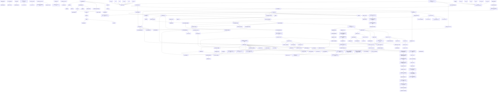

```mermaid
graph TD
1["数理逻辑/一阶逻辑"] --> 0["数理逻辑/一阶逻辑演算"]
2["数理逻辑/命题逻辑演算"] --> 1["数理逻辑/一阶逻辑"]
3["数理逻辑/命题逻辑"] --> 2["数理逻辑/命题逻辑演算"]
5["朴素集合论/naive-set-theory-2"] --> 3["数理逻辑/命题逻辑"]
5["朴素集合论/naive-set-theory-2"] --> 6["点集拓扑/拓扑空间"]
7["朴素集合论/zorn_lemma"] --> 6["点集拓扑/拓扑空间"]
9["点集拓扑/子空间"] --> 8["点集拓扑/连续映射"]
6["点集拓扑/拓扑空间"] --> 9["点集拓扑/子空间"]
12["数学分析/real-number"] --> 11["点集拓扑/度量空间"]
13["点集拓扑/点集拓扑(代理)"] --> 11["点集拓扑/度量空间"]
8["点集拓扑/连续映射"] --> 14["点集拓扑/紧空间"]
11["点集拓扑/度量空间"] --> 15["点集拓扑/product-metric-space"]
14["点集拓扑/紧空间"] --> 13["点集拓扑/点集拓扑(代理)"]
16["点集拓扑/连通空间"] --> 13["点集拓扑/点集拓扑(代理)"]
17["点集拓扑/乘积空间"] --> 13["点集拓扑/点集拓扑(代理)"]
18["点集拓扑/序拓扑"] --> 13["点集拓扑/点集拓扑(代理)"]
8["点集拓扑/连续映射"] --> 16["点集拓扑/连通空间"]
6["点集拓扑/拓扑空间"] --> 17["点集拓扑/乘积空间"]
6["点集拓扑/拓扑空间"] --> 18["点集拓扑/序拓扑"]
20["概率论/高斯分布"] --> 19["概率论/联合高斯"]
23["机器学习/随机过程"] --> 22["概率论/马尔可夫"]
25["抽象代数/对偶空间"] --> 24["概率论/Dirac分布"]
26["抽象代数/函数空间"] --> 24["概率论/Dirac分布"]
28["测度论/积空间sigma代数"] --> 27["概率论/随机过程"]
30["抽象代数/群论(群作用)"] --> 29["抽象代数/群表示"]
31["抽象代数/向量空间(内部直和)"] --> 29["抽象代数/群表示"]
33["抽象代数/向量空间"] --> 32["抽象代数/代数"]
35["抽象代数/群论(循环群)"] --> 34["抽象代数/环论(有限环)"]
37["抽象代数/环论(一)"] --> 36["抽象代数/环论(二)"]
38["抽象代数/同态映射"] --> 36["抽象代数/环论(二)"]
34["抽象代数/环论(有限环)"] --> 39["抽象代数/环论(杂)"]
40["抽象代数/环论(多项式环)"] --> 39["抽象代数/环论(杂)"]
42["朴素集合论/naive-set-theory-1"] --> 41["抽象代数/二元运算"]
44["抽象代数/群论(二)"] --> 43["抽象代数/群论(杂)"]
35["抽象代数/群论(循环群)"] --> 43["抽象代数/群论(杂)"]
33["抽象代数/向量空间"] --> 25["抽象代数/对偶空间"]
45["抽象代数/拓扑向量空间"] --> 25["抽象代数/对偶空间"]
47["抽象代数/域论(域拓展)"] --> 46["抽象代数/形式导数"]
48["抽象代数/群论(一)"] --> 44["抽象代数/群论(二)"]
38["抽象代数/同态映射"] --> 44["抽象代数/群论(二)"]
49["抽象代数/群论(幂运算)"] --> 35["抽象代数/群论(循环群)"]
50["朴素集合论/初等数论"] --> 35["抽象代数/群论(循环群)"]
49["抽象代数/群论(幂运算)"] --> 51["抽象代数/环论(幂运算)"]
44["抽象代数/群论(二)"] --> 30["抽象代数/群论(群作用)"]
52["抽象代数/群论(置换群)"] --> 30["抽象代数/群论(群作用)"]
33["抽象代数/向量空间"] --> 53["抽象代数/格"]
36["抽象代数/环论(二)"] --> 54["抽象代数/环论(商域)"]
37["抽象代数/环论(一)"] --> 55["抽象代数/abs_field"]
48["抽象代数/群论(一)"] --> 37["抽象代数/环论(一)"]
44["抽象代数/群论(二)"] --> 56["抽象代数/群论(高等群论)"]
58["抽象代数/域论(有限域)"] --> 57["抽象代数/Galois"]
59["数学分析/实数构造/自然数"] --> 48["抽象代数/群论(一)"]
41["抽象代数/二元运算"] --> 48["抽象代数/群论(一)"]
60["抽象代数/向量空间(商空间)"] --> 31["抽象代数/向量空间(内部直和)"]
60["抽象代数/向量空间(商空间)"] --> 31["抽象代数/向量空间(内部直和)"]
44["抽象代数/群论(二)"] --> 33["抽象代数/向量空间"]
36["抽象代数/环论(二)"] --> 33["抽象代数/向量空间"]
55["抽象代数/abs_field"] --> 33["抽象代数/向量空间"]
61["抽象代数/abs_field|带绝对值的域"] --> 33["抽象代数/向量空间"]
45["抽象代数/拓扑向量空间"] --> 62["抽象代数/抽象导数"]
13["点集拓扑/点集拓扑(代理)"] --> 45["抽象代数/拓扑向量空间"]
37["抽象代数/环论(一)"] --> 64["抽象代数/环论(有序环)"]
36["抽象代数/环论(二)"] --> 40["抽象代数/环论(多项式环)"]
39["抽象代数/环论(杂)"] --> 47["抽象代数/域论(域拓展)"]
33["抽象代数/向量空间"] --> 47["抽象代数/域论(域拓展)"]
46["抽象代数/形式导数"] --> 58["抽象代数/域论(有限域)"]
65["数学分析/实数构造/整数"] --> 49["抽象代数/群论(幂运算)"]
33["抽象代数/向量空间"] --> 60["抽象代数/向量空间(商空间)"]
33["抽象代数/向量空间"] --> 60["抽象代数/向量空间(商空间)"]
33["抽象代数/向量空间"] --> 60["抽象代数/向量空间(商空间)"]
33["抽象代数/向量空间"] --> 60["抽象代数/向量空间(商空间)"]
33["抽象代数/向量空间"] --> 60["抽象代数/向量空间(商空间)"]
44["抽象代数/群论(二)"] --> 66["抽象代数/群论(群列)"]
41["抽象代数/二元运算"] --> 38["抽象代数/同态映射"]
50["朴素集合论/初等数论"] --> 52["抽象代数/群论(置换群)"]
33["抽象代数/向量空间"] --> 26["抽象代数/函数空间"]
45["抽象代数/拓扑向量空间"] --> 26["抽象代数/函数空间"]
69["范畴论/范畴"] --> 68["范畴论/直和与直积"]
8["点集拓扑/连续映射"] --> 71["流形/prepare"]
9["点集拓扑/子空间"] --> 72["流形/smooth-manifold"]
6["点集拓扑/拓扑空间"] --> 74["测度论/class-of-sets"]
76["测度论/S-integral"] --> 75["测度论/符号测度"]
77["测度论/measurable-mapping"] --> 28["测度论/积空间sigma代数"]
74["测度论/class-of-sets"] --> 77["测度论/measurable-mapping"]
74["测度论/class-of-sets"] --> 78["测度论/与R相关的Borel集"]
18["点集拓扑/序拓扑"] --> 78["测度论/与R相关的Borel集"]
77["测度论/measurable-mapping"] --> 79["测度论/measurable-function"]
80["数学分析/converge"] --> 79["测度论/measurable-function"]
79["测度论/measurable-function"] --> 81["测度论/random-variable"]
83["测度论/measure"] --> 82["测度论/L-S-measure"]
74["测度论/class-of-sets"] --> 84["测度论/semi-ring"]
86["测度论/L-integral"] --> 85["测度论/三大积分收敛定理"]
75["测度论/符号测度"] --> 88["测度论/绝对连续与Radon-Nikodým定理"]
74["测度论/class-of-sets"] --> 83["测度论/measure"]
81["测度论/random-variable"] --> 89["测度论/几乎处处收敛和依测度收敛"]
82["测度论/L-S-measure"] --> 90["测度论/L-measure"]
85["测度论/三大积分收敛定理"] --> 76["测度论/S-integral"]
88["测度论/绝对连续与Radon-Nikodým定理"] --> 91["测度论/相互奇异与Lebesgue分解定理"]
89["测度论/几乎处处收敛和依测度收敛"] --> 86["测度论/L-integral"]
91["测度论/相互奇异与Lebesgue分解定理"] --> 92["测度论/分布函数的类型及分解"]
94["机器学习/diffusion-inpainting(1)"] --> 93["机器学习/repaint"]
30["抽象代数/群论(群作用)"] --> 95["机器学习/SE(3)"]
97["机器学习/Dirac分布"] --> 96["机器学习/fourier"]
42["朴素集合论/naive-set-theory-1"] --> 7["朴素集合论/zorn_lemma"]
65["数学分析/实数构造/整数"] --> 50["朴素集合论/初等数论"]
50["朴素集合论/初等数论"] --> 5["朴素集合论/naive-set-theory-2"]
33["抽象代数/向量空间"] --> 100["复分析/derivative"]
33["抽象代数/向量空间"] --> 103["数学分析/有限维赋范线性空间"]
11["点集拓扑/度量空间"] --> 103["数学分析/有限维赋范线性空间"]
32["抽象代数/代数"] --> 104["数学分析/Rn-代数-格"]
53["抽象代数/格"] --> 104["数学分析/Rn-代数-格"]
103["数学分析/有限维赋范线性空间"] --> 104["数学分析/Rn-代数-格"]
106["数学分析/非负级数"] --> 105["数学分析/级数"]
108["数学分析/赋范向量空间上的级数"] --> 107["数学分析/banach代数上的级数"]
32["抽象代数/代数"] --> 107["数学分析/banach代数上的级数"]
109["数学分析/一些标准的级数"] --> 107["数学分析/banach代数上的级数"]
108["数学分析/赋范向量空间上的级数"] --> 107["数学分析/banach代数上的级数"]
110["数学分析/一些标准的级数|指数级数的收敛性"] --> 107["数学分析/banach代数上的级数"]
111["数学分析/一些标准的级数|正弦级数与余弦级数"] --> 107["数学分析/banach代数上的级数"]
113["数学分析/实数次幂"] --> 112["数学分析/实数(代理)"]
105["数学分析/级数"] --> 109["数学分析/一些标准的级数"]
80["数学分析/converge"] --> 114["数学分析/一些标准极限"]
116["数学分析/无穷小"] --> 115["数学分析/derivate"]
12["数学分析/real-number"] --> 80["数学分析/converge"]
114["数学分析/一些标准极限"] --> 113["数学分析/实数次幂"]
80["数学分析/converge"] --> 106["数学分析/非负级数"]
33["抽象代数/向量空间"] --> 117["数学分析/范数"]
119["测度论/Lebesgue-integral"] --> 118["数学分析/复值可测函数的L积分"]
33["抽象代数/向量空间"] --> 116["数学分析/无穷小"]
120["数学分析/funct-limit"] --> 116["数学分析/无穷小"]
33["抽象代数/向量空间"] --> 108["数学分析/赋范向量空间上的级数"]
105["数学分析/级数"] --> 108["数学分析/赋范向量空间上的级数"]
80["数学分析/converge"] --> 120["数学分析/funct-limit"]
12["数学分析/real-number"] --> 122["数学分析/complex-number"]
33["抽象代数/向量空间"] --> 122["数学分析/complex-number"]
123["数学分析/实数构造/广义实数"] --> 12["数学分析/real-number"]
11["点集拓扑/度量空间"] --> 124["数学分析/函数序列"]
125["测度论/Stieltjes_integral"] --> 124["数学分析/函数序列"]
119["测度论/Lebesgue-integral"] --> 126["数学分析/平方可积"]
124["数学分析/函数序列"] --> 127["数学分析/Stone–Weierstrass"]
129["计算机/netbird"] --> 128["计算机/netbird-reverse-proxy"]
131["计算机/Turing-machine"] --> 130["计算机/复杂类"]
135["linear-algebra/matrix"] --> 134["linear-algebra/矩阵乘法"]
135["linear-algebra/matrix"] --> 136["linear-algebra/rank"]
37["抽象代数/环论(一)"] --> 135["linear-algebra/matrix"]
135["linear-algebra/matrix"] --> 138["linear-algebra/diagonalization"]
135["linear-algebra/matrix"] --> 139["linear-algebra/norm"]
141["故事/纯粹理性批判"] --> 140["故事/固执"]
143["故事/经济基础与上层建筑"] --> 142["故事/性别与权利"]
140["故事/固执"] --> 144["故事/改变"]
146["故事/货币代理"] --> 145["故事/1844年经济学哲学手稿"]
147["故事/绝对精神"] --> 145["故事/1844年经济学哲学手稿"]
146["故事/货币代理"] --> 148["故事/金融交易"]
150["故事/作为意志和表象的世界"] --> 149["故事/期望"]
151["故事/安全"] --> 149["故事/期望"]
151["故事/安全"] --> 152["故事/狡猾的小说家"]
141["故事/纯粹理性批判"] --> 153["故事/实践理性批判"]
153["故事/实践理性批判"] --> 151["故事/安全"]
146["故事/货币代理"] --> 143["故事/经济基础与上层建筑"]
148["故事/金融交易"] --> 154["故事/外汇"]
153["故事/实践理性批判"] --> 155["故事/拥有"]
146["故事/货币代理"] --> 156["故事/税"]
156["故事/税"] --> 157["故事/房价"]
159["故事/货币与行政"] --> 158["故事/政治机构图"]
140["故事/固执"] --> 160["故事/变化"]
162["故事/幸福"] --> 161["故事/爱"]
146["故事/货币代理"] --> 163["故事/价格"]
164["故事/货币"] --> 146["故事/货币代理"]
165["故事/资本论/货币或商品流通"] --> 146["故事/货币代理"]
141["故事/纯粹理性批判"] --> 150["故事/作为意志和表象的世界"]
141["故事/纯粹理性批判"] --> 147["故事/绝对精神"]
146["故事/货币代理"] --> 159["故事/货币与行政"]
151["故事/安全"] --> 167["故事/安全与道德"]
142["故事/性别与权利"] --> 168["故事/神圣叙事"]
161["故事/爱"] --> 169["故事/爱与幸福"]
170["故事/劳动"] --> 164["故事/货币"]
161["故事/爱"] --> 171["故事/孩子"]
141["故事/纯粹理性批判"] --> 170["故事/劳动"]
153["故事/实践理性批判"] --> 172["故事/判断力批判"]
149["故事/期望"] --> 162["故事/幸福"]
174["故事/资本论/不变资本和可变资本"] --> 173["故事/资本论/剩余价值率"]
176["故事/资本论/所谓原始积累"] --> 175["故事/资本论/现代殖民理论"]
177["故事/资本论/交换过程"] --> 165["故事/资本论/货币或商品流通"]
179["故事/资本论/剩余价值转化为资本"] --> 178["故事/资本论/资本主义积累的一般规律"]
181["故事/资本论/劳动力的价值或价格转化为工资"] --> 180["故事/资本论/计时工资"]
183["故事/资本论/机器和大工业"] --> 182["故事/资本论/绝对剩余价值和相对剩余价值"]
185["故事/资本论/货币转化为资本"] --> 184["故事/资本论/劳动过程和价值增殖过程"]
184["故事/资本论/劳动过程和价值增殖过程"] --> 174["故事/资本论/不变资本和可变资本"]
187["故事/资本论/相对剩余价值的概念"] --> 186["故事/资本论/协作"]
178["故事/资本论/资本主义积累的一般规律"] --> 176["故事/资本论/所谓原始积累"]
188["故事/资本论/分工和工场手工业"] --> 183["故事/资本论/机器和大工业"]
146["故事/货币代理"] --> 185["故事/资本论/货币转化为资本"]
189["故事/资本论/商品"] --> 177["故事/资本论/交换过程"]
191["故事/资本论/工资的国民差异"] --> 190["故事/资本论/简单再生产"]
180["故事/资本论/计时工资"] --> 192["故事/资本论/计件工资"]
182["故事/资本论/绝对剩余价值和相对剩余价值"] --> 193["故事/资本论/劳动力价格和剩余价值的量的变化"]
190["故事/资本论/简单再生产"] --> 179["故事/资本论/剩余价值转化为资本"]
192["故事/资本论/计件工资"] --> 191["故事/资本论/工资的国民差异"]
186["故事/资本论/协作"] --> 188["故事/资本论/分工和工场手工业"]
194["故事/资本论/剩余价值率的各种公式"] --> 181["故事/资本论/劳动力的价值或价格转化为工资"]
196["故事/资本论/工作日"] --> 195["故事/资本论/剩余价值率和剩余价值量"]
193["故事/资本论/劳动力价格和剩余价值的量的变化"] --> 194["故事/资本论/剩余价值率的各种公式"]
195["故事/资本论/剩余价值率和剩余价值量"] --> 187["故事/资本论/相对剩余价值的概念"]
173["故事/资本论/剩余价值率"] --> 196["故事/资本论/工作日"]
198["Prototype"] --> 197["计算机/ts/类型"]
199["Extensible"] --> 197["计算机/ts/类型"]
200["Get"] --> 197["计算机/ts/类型"]
201["Set"] --> 197["计算机/ts/类型"]
200["Get"] --> 197["计算机/ts/类型"]
201["Set"] --> 197["计算机/ts/类型"]
202["Call"] --> 197["计算机/ts/类型"]
203["Construct"] --> 197["计算机/ts/类型"]
198["Prototype"] --> 197["计算机/ts/类型"]
202["Call"] --> 197["计算机/ts/类型"]
202["Call"] --> 197["计算机/ts/类型"]
203["Construct"] --> 197["计算机/ts/类型"]
198["Prototype"] --> 197["计算机/ts/类型"]
205["数学分析/实数构造/有理数"] --> 204["数学分析/实数构造/实数"]
51["抽象代数/环论(幂运算)"] --> 204["数学分析/实数构造/实数"]
65["数学分析/实数构造/整数"] --> 205["数学分析/实数构造/有理数"]
54["抽象代数/环论(商域)"] --> 205["数学分析/实数构造/有理数"]
204["数学分析/实数构造/实数"] --> 123["数学分析/实数构造/广义实数"]
42["朴素集合论/naive-set-theory-1"] --> 59["数学分析/实数构造/自然数"]
36["抽象代数/环论(二)"] --> 65["数学分析/实数构造/整数"]
64["抽象代数/环论(有序环)"] --> 65["数学分析/实数构造/整数"]
207["原始数据"] --> 206["机器学习/pytorch/torch.utils.data"]
208["batch_size"] --> 206["机器学习/pytorch/torch.utils.data"]
209["drop_last"] --> 206["机器学习/pytorch/torch.utils.data"]
210["shuffle"] --> 206["机器学习/pytorch/torch.utils.data"]
211["sampler"] --> 206["机器学习/pytorch/torch.utils.data"]
212["batch_sampler"] --> 206["机器学习/pytorch/torch.utils.data"]
213["batched data"] --> 206["机器学习/pytorch/torch.utils.data"]
```