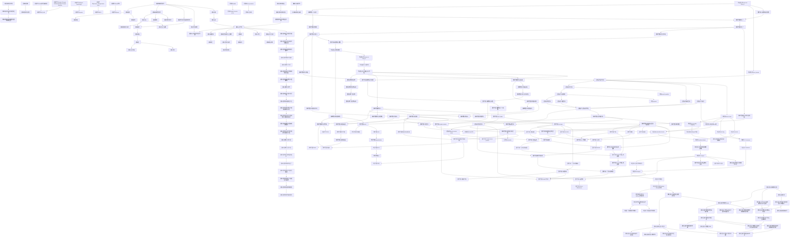

```mermaid
graph TD
1["数理逻辑/一阶逻辑"] --> 0["数理逻辑/一阶逻辑演算"]
2["数理逻辑/命题逻辑演算"] --> 1["数理逻辑/一阶逻辑"]
3["数理逻辑/命题逻辑"] --> 2["数理逻辑/命题逻辑演算"]
4["朴素集合论/朴素集合论(代理)"] --> 3["数理逻辑/命题逻辑"]
4["朴素集合论/朴素集合论(代理)"] --> 5["点集拓扑/拓扑空间"]
6["朴素集合论/zorn_lemma"] --> 5["点集拓扑/拓扑空间"]
8["点集拓扑/子空间"] --> 7["点集拓扑/连续映射"]
5["点集拓扑/拓扑空间"] --> 8["点集拓扑/子空间"]
10["数学分析/real-number"] --> 9["点集拓扑/度量空间"]
11["点集拓扑/点集拓扑(代理)"] --> 9["点集拓扑/度量空间"]
7["点集拓扑/连续映射"] --> 12["点集拓扑/紧空间"]
9["点集拓扑/度量空间"] --> 13["点集拓扑/product-metric-space"]
12["点集拓扑/紧空间"] --> 11["点集拓扑/点集拓扑(代理)"]
14["点集拓扑/连通空间"] --> 11["点集拓扑/点集拓扑(代理)"]
15["点集拓扑/乘积空间"] --> 11["点集拓扑/点集拓扑(代理)"]
16["点集拓扑/序拓扑"] --> 11["点集拓扑/点集拓扑(代理)"]
7["点集拓扑/连续映射"] --> 14["点集拓扑/连通空间"]
5["点集拓扑/拓扑空间"] --> 15["点集拓扑/乘积空间"]
5["点集拓扑/拓扑空间"] --> 16["点集拓扑/序拓扑"]
18["测度论/测度论代理"] --> 17["概率论/事件或事件类的独立性"]
17["概率论/事件或事件类的独立性"] --> 19["概率论/随机变量或随机变量族的独立性"]
21["抽象代数/群论(群作用)"] --> 20["抽象代数/群表示"]
22["抽象代数/向量空间(内部直和)"] --> 20["抽象代数/群表示"]
24["抽象代数/向量空间(赋范向量空间)"] --> 23["抽象代数/代数"]
26["抽象代数/群论(循环群)"] --> 25["抽象代数/环论(有限环)"]
28["抽象代数/环论(一)"] --> 27["抽象代数/环论(二)"]
29["抽象代数/同态映射"] --> 27["抽象代数/环论(二)"]
24["抽象代数/向量空间(赋范向量空间)"] --> 30["抽象代数/向量空间(内积空间)"]
31["数学分析/complex-number"] --> 30["抽象代数/向量空间(内积空间)"]
25["抽象代数/环论(有限环)"] --> 32["抽象代数/环论(杂)"]
33["抽象代数/环论(多项式环)"] --> 32["抽象代数/环论(杂)"]
35["朴素集合论/naive-set-theory-1"] --> 34["抽象代数/二元运算"]
37["抽象代数/群论(二)"] --> 36["抽象代数/群论(杂)"]
26["抽象代数/群论(循环群)"] --> 36["抽象代数/群论(杂)"]
39["抽象代数/向量空间"] --> 38["抽象代数/对偶空间"]
40["抽象代数/拓扑向量空间"] --> 38["抽象代数/对偶空间"]
42["抽象代数/域论(域拓展)"] --> 41["抽象代数/形式导数"]
4["朴素集合论/朴素集合论(代理)"] --> 37["抽象代数/群论(二)"]
43["抽象代数/群论(幂运算)"] --> 26["抽象代数/群论(循环群)"]
43["抽象代数/群论(幂运算)"] --> 44["抽象代数/环论(幂运算)"]
37["抽象代数/群论(二)"] --> 21["抽象代数/群论(群作用)"]
45["抽象代数/群论(置换群)"] --> 21["抽象代数/群论(群作用)"]
24["抽象代数/向量空间(赋范向量空间)"] --> 46["抽象代数/格"]
27["抽象代数/环论(二)"] --> 47["抽象代数/环论(商域)"]
48["抽象代数/群论(一)"] --> 28["抽象代数/环论(一)"]
44["抽象代数/环论(幂运算)"] --> 49["抽象代数/环论(二项式定理)"]
37["抽象代数/群论(二)"] --> 50["抽象代数/群论(高等群论)"]
52["抽象代数/域论(有限域)"] --> 51["抽象代数/Galois"]
53["数学分析/实数构造/自然数"] --> 48["抽象代数/群论(一)"]
34["抽象代数/二元运算"] --> 48["抽象代数/群论(一)"]
54["抽象代数/向量空间(商空间)"] --> 22["抽象代数/向量空间(内部直和)"]
30["抽象代数/向量空间(内积空间)"] --> 22["抽象代数/向量空间(内部直和)"]
37["抽象代数/群论(二)"] --> 39["抽象代数/向量空间"]
40["抽象代数/拓扑向量空间"] --> 55["抽象代数/抽象导数"]
11["点集拓扑/点集拓扑(代理)"] --> 40["抽象代数/拓扑向量空间"]
28["抽象代数/环论(一)"] --> 56["抽象代数/环论(有序环)"]
28["抽象代数/环论(一)"] --> 57["抽象代数/域论(带绝对值的域)"]
39["抽象代数/向量空间"] --> 24["抽象代数/向量空间(赋范向量空间)"]
57["抽象代数/域论(带绝对值的域)"] --> 24["抽象代数/向量空间(赋范向量空间)"]
27["抽象代数/环论(二)"] --> 33["抽象代数/环论(多项式环)"]
32["抽象代数/环论(杂)"] --> 42["抽象代数/域论(域拓展)"]
39["抽象代数/向量空间"] --> 42["抽象代数/域论(域拓展)"]
41["抽象代数/形式导数"] --> 52["抽象代数/域论(有限域)"]
4["朴素集合论/朴素集合论(代理)"] --> 43["抽象代数/群论(幂运算)"]
39["抽象代数/向量空间"] --> 54["抽象代数/向量空间(商空间)"]
37["抽象代数/群论(二)"] --> 58["抽象代数/群论(群列)"]
34["抽象代数/二元运算"] --> 29["抽象代数/同态映射"]
59["朴素集合论/初等数论"] --> 45["抽象代数/群论(置换群)"]
39["抽象代数/向量空间"] --> 60["抽象代数/函数空间"]
40["抽象代数/拓扑向量空间"] --> 60["抽象代数/函数空间"]
62["范畴论/范畴"] --> 61["范畴论/直和与直积"]
7["点集拓扑/连续映射"] --> 63["流形/prepare"]
8["点集拓扑/子空间"] --> 64["流形/smooth-manifold"]
66["测度论/分布函数的类型及分解"] --> 65["测度论/一维离散分布的例子"]
5["点集拓扑/拓扑空间"] --> 67["测度论/class-of-sets"]
69["测度论/S-integral"] --> 68["测度论/符号测度"]
71["测度论/measurable-mapping"] --> 70["测度论/积空间sigma代数"]
66["测度论/分布函数的类型及分解"] --> 72["测度论/一维连续分布的例子"]
67["测度论/class-of-sets"] --> 71["测度论/measurable-mapping"]
67["测度论/class-of-sets"] --> 73["测度论/与R相关的Borel集"]
16["点集拓扑/序拓扑"] --> 73["测度论/与R相关的Borel集"]
71["测度论/measurable-mapping"] --> 74["测度论/measurable-function"]
75["数学分析/converge"] --> 74["测度论/measurable-function"]
73["测度论/与R相关的Borel集"] --> 74["测度论/measurable-function"]
77["测度论/measure"] --> 76["测度论/L-S-measure"]
78["测度论/semi-ring"] --> 76["测度论/L-S-measure"]
74["测度论/measurable-function"] --> 79["测度论/random-element"]
77["测度论/measure"] --> 79["测度论/random-element"]
67["测度论/class-of-sets"] --> 78["测度论/semi-ring"]
81["测度论/L-integral"] --> 80["测度论/三大积分收敛定理"]
68["测度论/符号测度"] --> 82["测度论/绝对连续与Radon-Nikodým定理"]
67["测度论/class-of-sets"] --> 77["测度论/measure"]
79["测度论/random-element"] --> 83["测度论/几乎处处收敛和依测度收敛"]
76["测度论/L-S-measure"] --> 84["测度论/L-measure"]
80["测度论/三大积分收敛定理"] --> 69["测度论/S-integral"]
84["测度论/L-measure"] --> 69["测度论/S-integral"]
82["测度论/绝对连续与Radon-Nikodým定理"] --> 85["测度论/相互奇异与Lebesgue分解定理"]
83["测度论/几乎处处收敛和依测度收敛"] --> 81["测度论/L-integral"]
85["测度论/相互奇异与Lebesgue分解定理"] --> 66["测度论/分布函数的类型及分解"]
87["线性代数/svd"] --> 86["线性代数/伪逆"]
22["抽象代数/向量空间(内部直和)"] --> 86["线性代数/伪逆"]
89["线性代数/matrix"] --> 88["线性代数/矩阵乘法"]
89["线性代数/matrix"] --> 90["线性代数/rank"]
39["抽象代数/向量空间"] --> 89["线性代数/matrix"]
45["抽象代数/群论(置换群)"] --> 89["线性代数/matrix"]
90["线性代数/rank"] --> 91["线性代数/diagonalization"]
92["线性代数/norm"] --> 87["线性代数/svd"]
91["线性代数/diagonalization"] --> 92["线性代数/norm"]
94["机器学习/VAE|变分自编码器"] --> 93["机器学习/VQ-VAE"]
95["机器学习/Straight-Through-Estimator|Straight-Through Estimator"] --> 93["机器学习/VQ-VAE"]
97["机器学习/diffusion-inpainting(1)"] --> 96["机器学习/repaint"]
21["抽象代数/群论(群作用)"] --> 98["机器学习/SE(3)"]
100["机器学习/posterior_mean|posterior mean"] --> 99["机器学习/DPS"]
102["机器学习/Dirac分布"] --> 101["机器学习/fourier"]
35["朴素集合论/naive-set-theory-1"] --> 6["朴素集合论/zorn_lemma"]
103["数学分析/实数构造/整数"] --> 59["朴素集合论/初等数论"]
105["朴素集合论/naive-set-theory-2"] --> 104["朴素集合论/计数原理"]
59["朴素集合论/初等数论"] --> 105["朴素集合论/naive-set-theory-2"]
104["朴素集合论/计数原理"] --> 4["朴素集合论/朴素集合论(代理)"]
30["抽象代数/向量空间(内积空间)"] --> 106["复分析/derivative"]
24["抽象代数/向量空间(赋范向量空间)"] --> 107["数学分析/有限维赋范线性空间"]
9["点集拓扑/度量空间"] --> 107["数学分析/有限维赋范线性空间"]
23["抽象代数/代数"] --> 108["数学分析/Rn-代数-格"]
46["抽象代数/格"] --> 108["数学分析/Rn-代数-格"]
107["数学分析/有限维赋范线性空间"] --> 108["数学分析/Rn-代数-格"]
110["数学分析/非负级数"] --> 109["数学分析/级数"]
112["数学分析/derivate"] --> 111["数学分析/微分中值定理"]
9["点集拓扑/度量空间"] --> 111["数学分析/微分中值定理"]
114["数学分析/赋范向量空间上的级数"] --> 113["数学分析/banach代数上的级数"]
23["抽象代数/代数"] --> 113["数学分析/banach代数上的级数"]
115["数学分析/一些标准的级数"] --> 113["数学分析/banach代数上的级数"]
117["数学分析/实数次幂"] --> 116["数学分析/实数(代理)"]
109["数学分析/级数"] --> 115["数学分析/一些标准的级数"]
113["数学分析/banach代数上的级数"] --> 118["数学分析/banach代数上的指数"]
30["抽象代数/向量空间(内积空间)"] --> 119["数学分析/complex-inner-product"]
13["点集拓扑/product-metric-space"] --> 119["数学分析/complex-inner-product"]
117["数学分析/实数次幂"] --> 120["数学分析/holder不等式"]
121["数学分析/一些标准的导数"] --> 120["数学分析/holder不等式"]
31["数学分析/complex-number"] --> 120["数学分析/holder不等式"]
81["测度论/L-integral"] --> 120["数学分析/holder不等式"]
111["数学分析/微分中值定理"] --> 121["数学分析/一些标准的导数"]
118["数学分析/banach代数上的指数"] --> 121["数学分析/一些标准的导数"]
123["数学分析/funct-limit"] --> 122["数学分析/连续函数"]
13["点集拓扑/product-metric-space"] --> 122["数学分析/连续函数"]
124["数学分析/无穷小"] --> 112["数学分析/derivate"]
10["数学分析/real-number"] --> 75["数学分析/converge"]
125["数学分析/一些标准的极限"] --> 117["数学分析/实数次幂"]
75["数学分析/converge"] --> 110["数学分析/非负级数"]
24["抽象代数/向量空间(赋范向量空间)"] --> 126["数学分析/范数"]
81["测度论/L-integral"] --> 127["数学分析/复值可测函数的L积分"]
24["抽象代数/向量空间(赋范向量空间)"] --> 124["数学分析/无穷小"]
123["数学分析/funct-limit"] --> 124["数学分析/无穷小"]
24["抽象代数/向量空间(赋范向量空间)"] --> 114["数学分析/赋范向量空间上的级数"]
109["数学分析/级数"] --> 114["数学分析/赋范向量空间上的级数"]
75["数学分析/converge"] --> 123["数学分析/funct-limit"]
128["数学分析/实数构造/实数"] --> 31["数学分析/complex-number"]
75["数学分析/converge"] --> 125["数学分析/一些标准的极限"]
129["数学分析/实数构造/广义实数"] --> 10["数学分析/real-number"]
9["点集拓扑/度量空间"] --> 130["数学分析/函数序列"]
69["测度论/S-integral"] --> 130["数学分析/函数序列"]
81["测度论/L-integral"] --> 131["数学分析/平方可积"]
130["数学分析/函数序列"] --> 132["数学分析/Stone–Weierstrass"]
134["计算机/netbird"] --> 133["计算机/netbird-reverse-proxy"]
136["计算机/Turing-machine"] --> 135["计算机/复杂类"]
138["故事/纯粹理性批判"] --> 137["故事/固执"]
140["故事/经济基础与上层建筑"] --> 139["故事/性别与权利"]
137["故事/固执"] --> 141["故事/改变"]
143["故事/货币代理"] --> 142["故事/1844年经济学哲学手稿"]
144["故事/绝对精神"] --> 142["故事/1844年经济学哲学手稿"]
143["故事/货币代理"] --> 145["故事/金融交易"]
147["故事/作为意志和表象的世界"] --> 146["故事/期望"]
148["故事/安全"] --> 146["故事/期望"]
148["故事/安全"] --> 149["故事/狡猾的小说家"]
151["故事/货币与行政"] --> 150["故事/政治机构"]
138["故事/纯粹理性批判"] --> 152["故事/实践理性批判"]
152["故事/实践理性批判"] --> 148["故事/安全"]
143["故事/货币代理"] --> 140["故事/经济基础与上层建筑"]
145["故事/金融交易"] --> 153["故事/外汇"]
152["故事/实践理性批判"] --> 154["故事/拥有"]
143["故事/货币代理"] --> 155["故事/税"]
155["故事/税"] --> 156["故事/房价"]
137["故事/固执"] --> 157["故事/变化"]
159["故事/幸福"] --> 158["故事/爱"]
143["故事/货币代理"] --> 160["故事/价格"]
161["故事/货币"] --> 143["故事/货币代理"]
162["故事/资本论/货币或商品流通"] --> 143["故事/货币代理"]
138["故事/纯粹理性批判"] --> 147["故事/作为意志和表象的世界"]
138["故事/纯粹理性批判"] --> 144["故事/绝对精神"]
143["故事/货币代理"] --> 151["故事/货币与行政"]
148["故事/安全"] --> 163["故事/安全与道德"]
139["故事/性别与权利"] --> 164["故事/神圣叙事"]
158["故事/爱"] --> 165["故事/爱与幸福"]
166["故事/劳动"] --> 161["故事/货币"]
158["故事/爱"] --> 167["故事/孩子"]
138["故事/纯粹理性批判"] --> 166["故事/劳动"]
152["故事/实践理性批判"] --> 168["故事/判断力批判"]
146["故事/期望"] --> 159["故事/幸福"]
170["故事/资本论/不变资本和可变资本"] --> 169["故事/资本论/剩余价值率"]
172["故事/资本论/所谓原始积累"] --> 171["故事/资本论/现代殖民理论"]
173["故事/资本论/交换过程"] --> 162["故事/资本论/货币或商品流通"]
175["故事/资本论/剩余价值转化为资本"] --> 174["故事/资本论/资本主义积累的一般规律"]
177["故事/资本论/劳动力的价值或价格转化为工资"] --> 176["故事/资本论/计时工资"]
179["故事/资本论/机器和大工业"] --> 178["故事/资本论/绝对剩余价值和相对剩余价值"]
181["故事/资本论/货币转化为资本"] --> 180["故事/资本论/劳动过程和价值增殖过程"]
180["故事/资本论/劳动过程和价值增殖过程"] --> 170["故事/资本论/不变资本和可变资本"]
183["故事/资本论/相对剩余价值的概念"] --> 182["故事/资本论/协作"]
174["故事/资本论/资本主义积累的一般规律"] --> 172["故事/资本论/所谓原始积累"]
184["故事/资本论/分工和工场手工业"] --> 179["故事/资本论/机器和大工业"]
143["故事/货币代理"] --> 181["故事/资本论/货币转化为资本"]
185["故事/资本论/商品"] --> 173["故事/资本论/交换过程"]
187["故事/资本论/工资的国民差异"] --> 186["故事/资本论/简单再生产"]
176["故事/资本论/计时工资"] --> 188["故事/资本论/计件工资"]
178["故事/资本论/绝对剩余价值和相对剩余价值"] --> 189["故事/资本论/劳动力价格和剩余价值的量的变化"]
186["故事/资本论/简单再生产"] --> 175["故事/资本论/剩余价值转化为资本"]
188["故事/资本论/计件工资"] --> 187["故事/资本论/工资的国民差异"]
182["故事/资本论/协作"] --> 184["故事/资本论/分工和工场手工业"]
190["故事/资本论/剩余价值率的各种公式"] --> 177["故事/资本论/劳动力的价值或价格转化为工资"]
192["故事/资本论/工作日"] --> 191["故事/资本论/剩余价值率和剩余价值量"]
189["故事/资本论/劳动力价格和剩余价值的量的变化"] --> 190["故事/资本论/剩余价值率的各种公式"]
191["故事/资本论/剩余价值率和剩余价值量"] --> 183["故事/资本论/相对剩余价值的概念"]
169["故事/资本论/剩余价值率"] --> 192["故事/资本论/工作日"]
193["数学分析/实数构造/有理数"] --> 128["数学分析/实数构造/实数"]
49["抽象代数/环论(二项式定理)"] --> 128["数学分析/实数构造/实数"]
47["抽象代数/环论(商域)"] --> 193["数学分析/实数构造/有理数"]
4["朴素集合论/朴素集合论(代理)"] --> 193["数学分析/实数构造/有理数"]
128["数学分析/实数构造/实数"] --> 129["数学分析/实数构造/广义实数"]
35["朴素集合论/naive-set-theory-1"] --> 53["数学分析/实数构造/自然数"]
27["抽象代数/环论(二)"] --> 103["数学分析/实数构造/整数"]
56["抽象代数/环论(有序环)"] --> 103["数学分析/实数构造/整数"]
195["随机过程/流匹配/流匹配"] --> 194["随机过程/流匹配/损失指导流匹配"]
195["随机过程/流匹配/流匹配"] --> 196["随机过程/流匹配/理论补充"]
195["随机过程/流匹配/流匹配"] --> 197["随机过程/流匹配/条件流匹配与整流流"]
199["随机过程/扩散模型/连续状态/连续时间扩散"] --> 198["随机过程/流匹配/扩散与流匹配"]
195["随机过程/流匹配/流匹配"] --> 198["随机过程/流匹配/扩散与流匹配"]
200["随机过程/生成模型/生成模型导论"] --> 195["随机过程/流匹配/流匹配"]
202["随机过程/扩散模型/连续状态/离散时间扩散"] --> 201["随机过程/扩散模型/实现约定"]
203["随机过程/扩散模型/EDM"] --> 201["随机过程/扩散模型/实现约定"]
205["随机过程/扩散模型/index"] --> 204["随机过程/扩散模型/线性高斯扩散"]
207["随机过程/扩散模型/分数匹配"] --> 206["随机过程/扩散模型/条件扩散"]
204["随机过程/扩散模型/线性高斯扩散"] --> 207["随机过程/扩散模型/分数匹配"]
208["随机过程/基础/随机过程"] --> 205["随机过程/扩散模型/index"]
200["随机过程/生成模型/生成模型导论"] --> 205["随机过程/扩散模型/index"]
207["随机过程/扩散模型/分数匹配"] --> 203["随机过程/扩散模型/EDM"]
208["随机过程/基础/随机过程"] --> 209["随机过程/马尔可夫过程/离散时间马尔可夫链"]
209["随机过程/马尔可夫过程/离散时间马尔可夫链"] --> 210["随机过程/马尔可夫过程/平稳分布与遍历性"]
70["测度论/积空间sigma代数"] --> 211["随机过程/基础/随机过程基本概念"]
213["随机过程/布朗运动与随机微积分/布朗运动"] --> 212["随机过程/基础/伊藤积分"]
214["随机过程/鞅/鞅"] --> 213["随机过程/布朗运动与随机微积分/布朗运动"]
208["随机过程/基础/随机过程"] --> 214["随机过程/鞅/鞅"]
82["测度论/绝对连续与Radon-Nikodým定理"] --> 200["随机过程/生成模型/生成模型导论"]
81["测度论/L-integral"] --> 215["随机过程/生成模型/常用数学工具"]
209["随机过程/马尔可夫过程/离散时间马尔可夫链"] --> 216["随机过程/扩散过程/概率演化方程"]
213["随机过程/布朗运动与随机微积分/布朗运动"] --> 216["随机过程/扩散过程/概率演化方程"]
216["随机过程/扩散过程/概率演化方程"] --> 217["随机过程/扩散过程/时间反演与概率流"]
207["随机过程/扩散模型/分数匹配"] --> 199["随机过程/扩散模型/连续状态/连续时间扩散"]
217["随机过程/扩散过程/时间反演与概率流"] --> 199["随机过程/扩散模型/连续状态/连续时间扩散"]
207["随机过程/扩散模型/分数匹配"] --> 202["随机过程/扩散模型/连续状态/离散时间扩散"]
205["随机过程/扩散模型/index"] --> 218["随机过程/扩散模型/离散状态/离散时间扩散"]
209["随机过程/马尔可夫过程/离散时间马尔可夫链"] --> 218["随机过程/扩散模型/离散状态/离散时间扩散"]
220["概率论/高斯分布"] --> 219["杂/概率论/联合高斯"]
38["抽象代数/对偶空间"] --> 221["杂/概率论/Dirac分布"]
60["抽象代数/函数空间"] --> 221["杂/概率论/Dirac分布"]
```