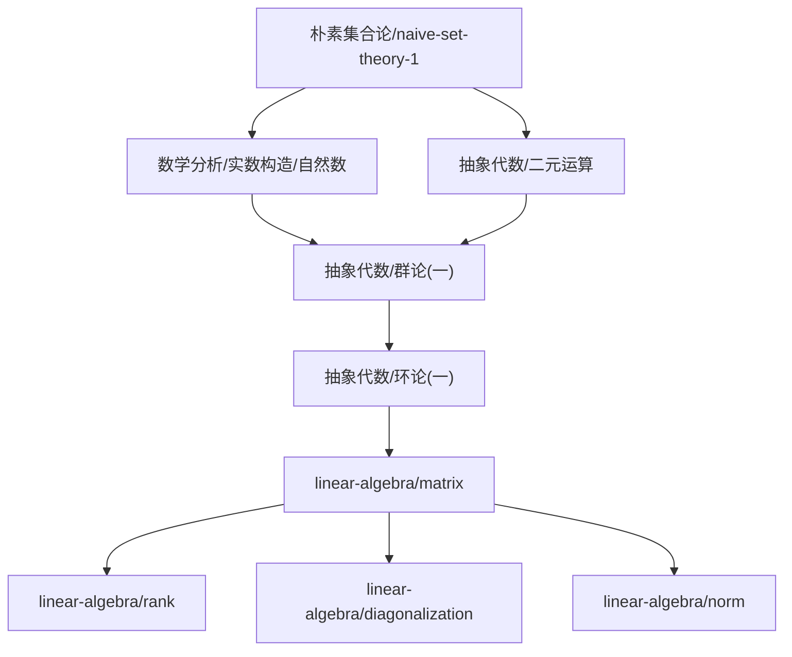

```mermaid
graph TD
1["linear-algebra/matrix"] --> 0["linear-algebra/rank"]
3["抽象代数/环论(一)"] --> 1["linear-algebra/matrix"]
1["linear-algebra/matrix"] --> 4["linear-algebra/diagonalization"]
1["linear-algebra/matrix"] --> 5["linear-algebra/norm"]
6["抽象代数/群论(一)"] --> 3["抽象代数/环论(一)"]
7["数学分析/实数构造/自然数"] --> 6["抽象代数/群论(一)"]
8["抽象代数/二元运算"] --> 6["抽象代数/群论(一)"]
9["朴素集合论/naive-set-theory-1"] --> 7["数学分析/实数构造/自然数"]
9["朴素集合论/naive-set-theory-1"] --> 8["抽象代数/二元运算"]
```
