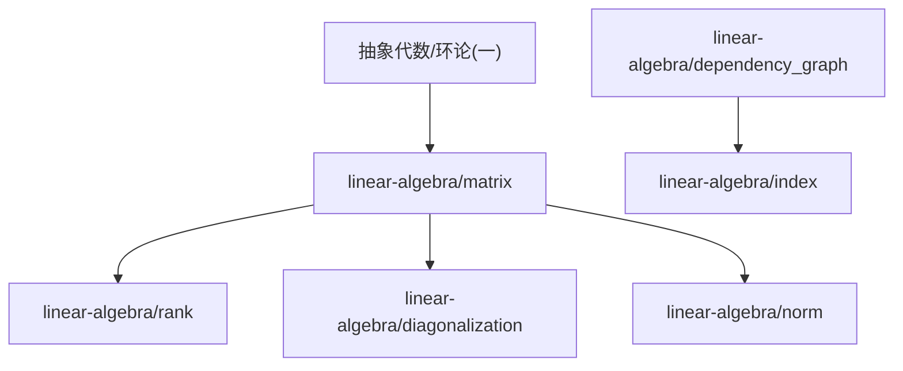

```mermaid
graph TD
1["linear-algebra/matrix"] --> 0["linear-algebra/rank"]
2["抽象代数/环论(一)"] --> 1["linear-algebra/matrix"]
1["linear-algebra/matrix"] --> 3["linear-algebra/diagonalization"]
5["linear-algebra/dependency_graph"] --> 4["linear-algebra/index"]
1["linear-algebra/matrix"] --> 6["linear-algebra/norm"]
```