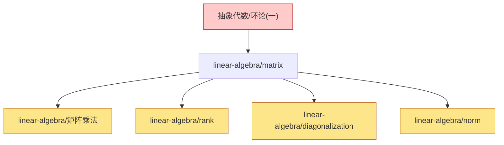

```mermaid
graph TD
1["linear-algebra/matrix"] --> 0["linear-algebra/矩阵乘法"]
1["linear-algebra/matrix"] --> 2["linear-algebra/rank"]
4["抽象代数/环论(一)"] --> 1["linear-algebra/matrix"]
1["linear-algebra/matrix"] --> 5["linear-algebra/diagonalization"]
1["linear-algebra/matrix"] --> 6["linear-algebra/norm"]
classDef leaf fill:#fde68a,stroke:#b45309
class 0,2,5,6 leaf
classDef root fill:#bfdbfe,stroke:#1d4ed8
class 3 root
classDef externalRoot fill:#fecaca,stroke:#b91c1c
class 4 externalRoot
```