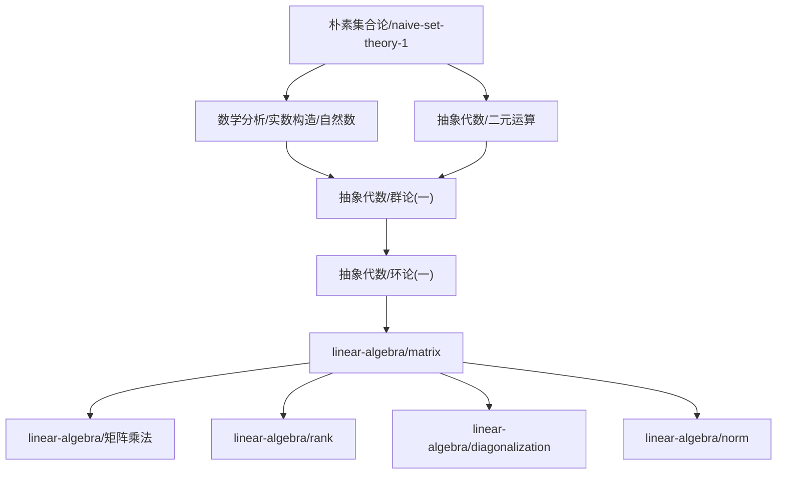

```mermaid
graph TD
1["linear-algebra/matrix"] --> 0["linear-algebra/矩阵乘法"]
1["linear-algebra/matrix"] --> 2["linear-algebra/rank"]
4["抽象代数/环论(一)"] --> 1["linear-algebra/matrix"]
1["linear-algebra/matrix"] --> 5["linear-algebra/diagonalization"]
1["linear-algebra/matrix"] --> 6["linear-algebra/norm"]
7["抽象代数/群论(一)"] --> 4["抽象代数/环论(一)"]
8["数学分析/实数构造/自然数"] --> 7["抽象代数/群论(一)"]
9["抽象代数/二元运算"] --> 7["抽象代数/群论(一)"]
10["朴素集合论/naive-set-theory-1"] --> 8["数学分析/实数构造/自然数"]
10["朴素集合论/naive-set-theory-1"] --> 9["抽象代数/二元运算"]
```