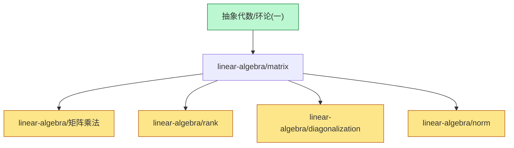

```mermaid
graph TD
1["linear-algebra/matrix"] --> 0["linear-algebra/矩阵乘法"]
1["linear-algebra/matrix"] --> 2["linear-algebra/rank"]
3["抽象代数/环论(一)"] --> 1["linear-algebra/matrix"]
1["linear-algebra/matrix"] --> 4["linear-algebra/diagonalization"]
1["linear-algebra/matrix"] --> 5["linear-algebra/norm"]
classDef leaf fill:#fde68a,stroke:#b45309
class 0,2,4,5 leaf
classDef foundationRoot fill:#bbf7d0,stroke:#15803d
class 3 foundationRoot
```