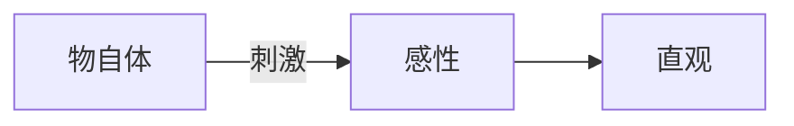

## 定义

### 普遍与必然

普遍：命题的适用范围（无例外）

必然：命题的真值模态（不可能为假）

### 先天与后天

先天判断：不依赖于经验

举例：

- 一切变化都有其原因

后天判断：依赖于经验

举例：

- 这个玫瑰是红色的

### 分析与综合

分析判断：谓语蕴含在主语中，无需经验验证，具有逻辑必然性但不扩展知识。分析判断都为先天判断。

举例：

- 这个红苹果是红的
- 三角形有三个角

综合判断：谓语不蕴含在主语中，谓词提供主词之外的新信息，扩展知识但无必然性，后天判断都为综合判断。

举例：

- 这个红苹果是甜的
- 这个程序是用C语言编写的

### 先天综合判断

先天综合判断：既扩展知识，又具有普遍必然性，不依赖经验却适用于经验世界。

- 两点之间线段最短
- 三角形内角和为180度

### 物自体->感性->直观

物自体：独立于人类认知形式而存在的实在本身。它不可被直接认识，只能被思维。

感性：感性是主体（人）通过感官被动接受外部刺激并形成直观的能力。

感性内部有先天直观形式(时间和空间)，也称作纯直观。感性接受物自体的刺激得到未定型的质料，将质料放到纯直观(形式)中得到直观。

## 性质
