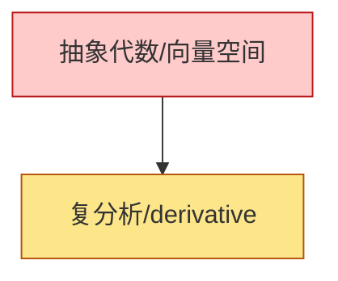

```mermaid
graph TD
1["抽象代数/向量空间"] --> 0["复分析/derivative"]
classDef leaf fill:#fde68a,stroke:#b45309
class 0 leaf
classDef root fill:#bfdbfe,stroke:#1d4ed8
class 2 root
classDef externalRoot fill:#fecaca,stroke:#b91c1c
class 1 externalRoot
```