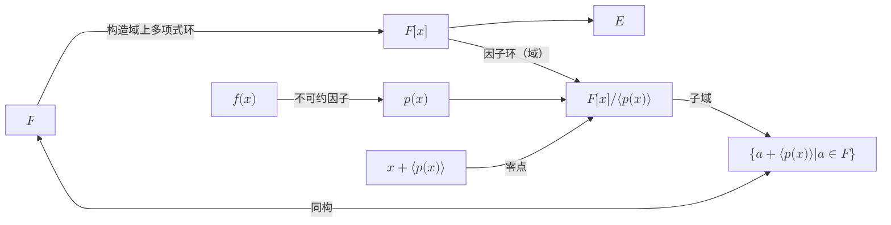
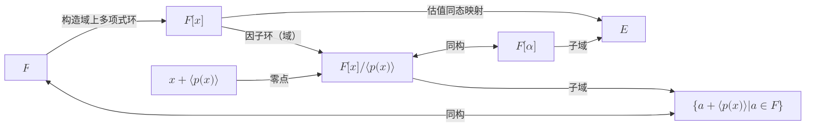

## 前置

- [[抽象代数/域论(域拓展)]]

## 定义

- Let $E$ be a field. An **automorphism** of $E$ is a isomorphism of $E$ onto itself.
- If $E$ and $K$ are both field extensions of a field $F$ and $\sigma : E \rightarrow K$ is a field isomorphism, then an element $\alpha \in E$ is **fixed** by $\sigma$ if $\sigma (\alpha) = \alpha$. An element $\alpha \in E$ is **fixed** by a collection of isomorphisms if $\alpha$ is fixed by every isomorphism in the collection. A subset $L$ of $E$ is **fixed** by a collection of isomorphisms if every $\alpha \in L$ is fixed by the collection. Often write **remains fixed** instead of simply **fixed**.
- Let $F \leq K$ be a field extension. The set $G(K/F)$ is the set of all automorphisms of the field $K$ that fix every element of the field $F$.
- Let $E$ be an algebraic extension of the field $F$. Two elements $\alpha$ and $\beta$ in $E$ are conjugates over $F$, if both have the same minimal polynomial over $F$. That is,$\text{irr}(\alpha, F) = \text{irr}(\beta, F)$.

## 性质

1. Let $E$ be a field. Then the set of all automorphisms of $E$ is a group under composition.
2. Let $\sigma$ be an automorphism of the field $E$. Then the set $E_\sigma$ of all the elements $a \in E$ that remain fixed by $\sigma$ forms a subfield of $E$.
3. Let $\{ \sigma_i | i \in I \}$ be a collection of automorphisms of a field $E$. Then the set $E_{\{\sigma_i\}}$ , of all $a \in E$ that remain fixed by every $\sigma_i$, for $i \in I$, is a subfield of $E$. 因为域的任意交集还是域。
4. Let $E$ be a field and let $F$ be a subfield of $E$. Then the set $G(E/F)$ of all automorphisms that fix all the elements of $F$ is a subgroup of the automorphism group of $E$. Furthermore, $F$ is a subfield of $E_{G(E/F)}$.
5. **(The Conjugation Isomorphism)** Let $F$ be a field, $K$ an extension field of $F$, and $\alpha, \beta ∈ K$ algebraic over $F$ with $deg(\alpha, F) = n$. The map $\psi_{\alpha,\beta} : F(\alpha) → F(\beta)$ defined by $\psi_{\alpha,\beta} (c_0 + c_1 \alpha + c_2 \alpha^2 + \cdots + c_{n-1} \alpha^{n-1} ) = c_0 + c_1 \beta + c_2 \beta^2 + \cdots + c_{n-1} \beta^{n-1} $, for $c_i ∈ F$, is an isomorphism of $F(\alpha)$ onto $F(\beta)$ if and only if $\alpha$ and $\beta$ are conjugate over $F$.

## 关系图

### Kronecker 定理

设$F$为一个域，$E$为$F$的扩域，$f(x)$为$F[x]$上的一个非常量多项式，$\alpha \in E$为$F$的代数元, $p(x)$为$f(x)$的不可约因子。

下图对任意的一个不可约多项式都成立。特别的对于$f(x)$的不可约因子也成立

### 单扩域

设$F$为一个域，$E$为$F$的扩域，$\alpha \in E$为$F$的代数元, $p(x):=\text{irr}(\alpha, F)$为$\alpha$的不可约多项式。$\phi(x):F[x]\mapsto E$为估值环同态映射，$F[\alpha]$为$\phi$的像（即$F$的单扩域）

