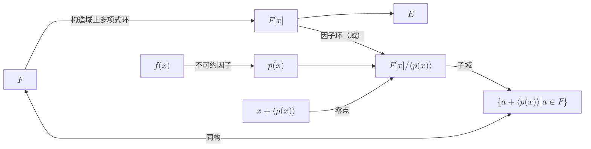
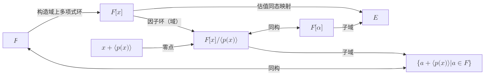

本节只讨论有限分裂域（finite splitting field）

## 1. 前置

- [[抽象代数/域论(域拓展)]]
- [[抽象代数/域论(有限域)]]

## 2. 定义

- Let $E$ be a field. An **automorphism** of $E$ is a isomorphism of $E$ onto itself.
- If $E$ and $K$ are both field extensions of a field $F$ and $\sigma : E \rightarrow K$ is a field isomorphism, then an element $\alpha \in E$ is **fixed** by $\sigma$ if $\sigma (\alpha) = \alpha$. An element $\alpha \in E$ is **fixed** by a collection of isomorphisms if $\alpha$ is fixed by every isomorphism in the collection. A subset $L$ of $E$ is **fixed** by a collection of isomorphisms if every $\alpha \in L$ is fixed by the collection. Often write **remains fixed** instead of simply **fixed**.
- Let $F \leq K$ be a field extension. The set $G(K/F)$ is the set of all automorphisms of the field $K$ that fix every element of the field $F$.
- Let $E$ be an algebraic extension of the field $F$. Two elements $\alpha$ and $\beta$ in $E$ are **conjugates over $F$**, if both have the same minimal polynomial over $F$. That is,$\text{irr}(\alpha, F) = \text{irr}(\beta, F)$.
- **分裂域**：Let $F$ be a field and $P = \{f_1 (x), f_2 (x), \cdots, f_s (x)\}$ be a finite set of polynomials in $F[x]$. An extension field $K$ of $F$ is a splitting field of $P$ over $F$ if every polynomial $f_k (x) \in P$ factors into linear factors in $K[x]$ and for any intermediate field $E$, $F \leq E < K$, at least one polynomial $f_j (x) \in P$ does not factor into linear factors in $E[x]$. A field $K$ is a splitting field for $F$ if $E$ is a **splitting field** for some finite set of polynomials.
- Let $\sigma : F \rightarrow F$ be a field isomorphism; then $\sigma_x : F[x] \rightarrow F [x]$, defined by $\sigma_x(a_0 + a_1x + \cdots + a_n x^n ) = \sigma (a_0 ) + \sigma (a_1 )x + \cdots + \sigma (a_n )x^n$, is the **polynomial extension** of $\sigma$.
- Let $E$ be an extension field of $F$. A polynomial $f(x) \in F[x]$ **splits** in $E$ if it factors into linear factors in $E[x]$.
- Let $f(x) \in F[x]$, and let $\alpha$ be a zero of $f(x)$ in a splitting field $E$ over $F$. If $\nu$ is the largest positive integer such that $(x - \alpha)^\nu$ is a factor of $f(x)$ in $E[x]$, then $\alpha$ is a zero of $f(x)$ with **multiplicity** $\nu$. 且$\nu$与分裂域的选择无关。
- An irreducible polynomial $f(x) \in F[x]$ of degree $n$ is **separable** if in the splitting field $K$ of $f(x)$ over $F$, $f(x)$ has $n$ distinct zeros. An element $\alpha$ in an extension field of $F$ is **separable** if $\text{irr}(\alpha, F)$ is a separable polynomial. A field extension $F \leq E$ is **separable** if every $\alpha \in E$ is separable over $F$. If every finite extension of a field $F$ is separable, then $F$ is **perfect**.
 

## 3. 性质

1. Let $E$ be a field. Then the set of all automorphisms of $E$ is a group under composition.
2. Let $\sigma$ be an automorphism of the field $E$. Then the set $E_\sigma$ of all the elements $a \in E$ that remain fixed by $\sigma$ forms a subfield of $E$.
3. Let $\{ \sigma_i | i \in I \}$ be a collection of automorphisms of a field $E$. Then the set $E_{\{\sigma_i\}}$ , of all $a \in E$ that remain fixed by every $\sigma_i$, for $i \in I$, is a subfield of $E$. 因为域的任意交集还是域。
4. Let $E$ be a field and let $F$ be a subfield of $E$. Then the set $G(E/F)$ of all automorphisms that fix all the elements of $F$ is a subgroup of the automorphism group of $E$. Furthermore, $F$ is a subfield of $E_{G(E/F)}$.
5. **(The Conjugation Isomorphism)** Let $F$ be a field, $K$ an extension field of $F$, and $\alpha, \beta ∈ K$ algebraic over $F$ with $deg(\alpha, F) = n$. The map $\psi_{\alpha,\beta} : F(\alpha) → F(\beta)$ defined by $\psi_{\alpha,\beta} (c_0 + c_1 \alpha + c_2 \alpha^2 + \cdots + c_{n-1} \alpha^{n-1} ) = c_0 + c_1 \beta + c_2 \beta^2 + \cdots + c_{n-1} \beta^{n-1} $, for $c_i ∈ F$, is an isomorphism of $F(\alpha)$ onto $F(\beta)$ if and only if $\alpha$ and $\beta$ are conjugate over $F$.
6. Let $K$ be a field extension of $F$ with $\alpha \in K$ algebraic over $F$. Suppose that $\psi$ is an isomorphism of $F(\alpha)$ onto a subfield of $K$, with the property that every element of $F$ is fixed by $\psi$. Then $\psi$ maps $\alpha$ to a conjugate over $F$ of $\alpha$. Conversely, if $\beta \in K$ is conjugate over $F$ with $\alpha$, then there is a unique isomorphism $\psi_{\alpha,\beta}$ mapping $F(\alpha)$ onto a subfield of $K$ with the properties that each $a \in F$ is fixed by $\sigma$ and $\sigma (\alpha) = \beta$.
7. Let $f(x) \in F[x]$. If $a, b \in F$ and $f(a + bi) = 0$, then $f(a - bi) = 0$.
8. Let $F$ be a field and $P = \{f_1 (x), f_2 (x), \cdots, f_s (x)\}$ a finite set of polynomials in $F[x]$. Then there is a splitting field $K$ of $P$ over $F$. Furthermore $K$ is a finite extension of $F$.
9. if $\sigma : F \mapsto F$ is an isomorphism, then $\sigma_x : F[x] \mapsto F [x]$ is also an isomorphism.
10. Let $K = F(\alpha)$, where $\alpha$ is algebraic over $F$, and let $\sigma : F \mapsto F'$ be a field isomorphism. If $K$ is an extension field of $F$ and $\beta \in K$ is a zero of $\sigma_x (\text{irr}(\alpha, F))$, then there is a unique isomorphism $\varphi : F(\alpha) \mapsto F'(\beta)$ with $\sigma (a) = \varphi(a)$ for all $a \in F$ and $\varphi(\alpha) = \beta$.
11. (**Isomorphism Extension Theorem**) Let $K = F(\alpha_1, \alpha_2 , \cdots, \alpha_{n})$ be a finite extension field of $F$, and let $\sigma : F \mapsto F$ be a field isomorphism. If $K$ contains a splitting field of $P = \{\sigma_x (\text{irr}(\alpha_k , F)) | 1 \leq k \leq n\}$ over $F$ , then $\sigma$ can be extended to an isomorphism $\tau$ mapping $K$ onto a subfield of $K'$
12. Let $F$ be a field, $P = \{f_1 , f_2, \cdots, f_s \} \subseteq F[x]$ a finite set of polynomials, and both $K$ and $K'$ splitting fields of $P$ over $F$. Then there is an isomorphism $\sigma : K \rightarrow K'$ , which is the identity map on $F$.
13. Let $E$ be a finite extension of the field $F$. Then $E$ is the splitting field of some finite set of polynomials in $F[x]$ if and only if for every field extension $K$ over $E$ and for every isomorphism $\sigma$ that fixes all the elements of $F$ and maps $E$ onto a subfield of $K$, $\sigma$ is an automorphism of $E$.
14. If $K$ is a finite splitting field over $F$ and $K$ contains one zero of an irreducible polynomial $f(x) \in F[x]$, then $f(x)$ splits in $K[x]$.
15. Let $F \leq E \leq K$ be fields with $K$ a finite splitting field over $F$. Then $E$ is a splitting field over $F$ if and only if every isomorphism $\sigma$ that fixes $F$ and maps $E$ to a subfield of $K$ is an automorphism of $E$.
16. Let $f(x)$ be an irreducible polynomial of degree $n$ with coefficients in a field $F$ of characteristic zero. Then $f(x)$ contains $n$ distinct zeros in the splitting field for $f(x)$ over $F$.
17. Let $F$ be a finite field of characteristic $p$. Any irreducible polynomial $f(x) \in F[x]$ has $k = \text{deg}(f(x))$ distinct zeros in its splitting field.
18. Every field of characteristic $0$ is perfect and every finite field is perfect.
19. Let $K$ be a separable extension of the field $F$ and $E$ an intermediate field. Then both the extensions $K$ over $E$ and $E$ over $F$ are separable.

## 4. 关系图

### 4.1. Kronecker 定理

设$F$为一个域，$E$为$F$的扩域，$f(x)$为$F[x]$上的一个非常量多项式，$\alpha \in E$为$F$的代数元, $p(x)$为$f(x)$的不可约因子。

下图对任意的一个不可约多项式都成立。特别的对于$f(x)$的不可约因子也成立

### 4.2. 单扩域(单拓域)

设$F$为一个域，$E$为$F$的扩域，$\alpha \in E$为$F$的代数元, $p(x):=\text{irr}(\alpha, F)$为$\alpha$的不可约多项式。$\phi(x):F[x]\mapsto E$为估值环同态映射，$F[\alpha]$为$\phi$的像（即$F$的单扩域）

