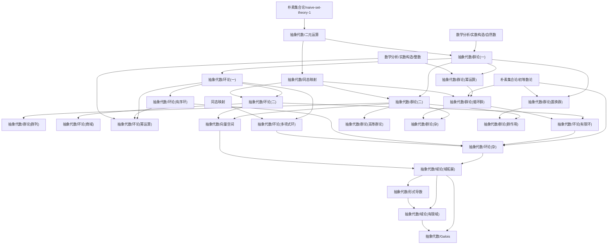

```mermaid
graph TD
1["抽象代数/群论(二)"] --> 0["抽象代数/群论(群列)"]
3["抽象代数/群论(一)"] --> 2["抽象代数/群论(置换群)"]
4["朴素集合论/初等数论"] --> 2["抽象代数/群论(置换群)"]
3["抽象代数/群论(一)"] --> 1["抽象代数/群论(二)"]
5["抽象代数/同态映射"] --> 1["抽象代数/群论(二)"]
7["抽象代数/环论(一)"] --> 6["抽象代数/环论(有序环)"]
8["抽象代数/二元运算"] --> 5["抽象代数/同态映射"]
3["抽象代数/群论(一)"] --> 9["抽象代数/群论(幂运算)"]
10["数学分析/实数构造/整数"] --> 9["抽象代数/群论(幂运算)"]
12["抽象代数/环论(二)"] --> 11["抽象代数/环论(商域)"]
7["抽象代数/环论(一)"] --> 13["抽象代数/环论(幂运算)"]
6["抽象代数/环论(有序环)"] --> 13["抽象代数/环论(幂运算)"]
10["数学分析/实数构造/整数"] --> 13["抽象代数/环论(幂运算)"]
9["抽象代数/群论(幂运算)"] --> 14["抽象代数/群论(循环群)"]
4["朴素集合论/初等数论"] --> 14["抽象代数/群论(循环群)"]
5["抽象代数/同态映射"] --> 14["抽象代数/群论(循环群)"]
4["朴素集合论/初等数论"] --> 15["抽象代数/环论(杂)"]
16["抽象代数/环论(有限环)"] --> 15["抽象代数/环论(杂)"]
6["抽象代数/环论(有序环)"] --> 15["抽象代数/环论(杂)"]
17["抽象代数/环论(多项式环)"] --> 15["抽象代数/环论(杂)"]
12["抽象代数/环论(二)"] --> 16["抽象代数/环论(有限环)"]
14["抽象代数/群论(循环群)"] --> 16["抽象代数/环论(有限环)"]
3["抽象代数/群论(一)"] --> 7["抽象代数/环论(一)"]
19["抽象代数/域论(域拓展)"] --> 18["抽象代数/形式导数"]
1["抽象代数/群论(二)"] --> 20["抽象代数/向量空间"]
12["抽象代数/环论(二)"] --> 20["抽象代数/向量空间"]
7["抽象代数/环论(一)"] --> 12["抽象代数/环论(二)"]
5["抽象代数/同态映射"] --> 12["抽象代数/环论(二)"]
19["抽象代数/域论(域拓展)"] --> 21["抽象代数/Galois"]
22["抽象代数/域论(有限域)"] --> 21["抽象代数/Galois"]
1["抽象代数/群论(二)"] --> 23["抽象代数/群论(高等群论)"]
1["抽象代数/群论(二)"] --> 24["抽象代数/群论(杂)"]
14["抽象代数/群论(循环群)"] --> 24["抽象代数/群论(杂)"]
7["抽象代数/环论(一)"] --> 17["抽象代数/环论(多项式环)"]
25["同态映射"] --> 17["抽象代数/环论(多项式环)"]
15["抽象代数/环论(杂)"] --> 19["抽象代数/域论(域拓展)"]
20["抽象代数/向量空间"] --> 19["抽象代数/域论(域拓展)"]
26["朴素集合论/naive-set-theory-1"] --> 8["抽象代数/二元运算"]
27["数学分析/实数构造/自然数"] --> 3["抽象代数/群论(一)"]
8["抽象代数/二元运算"] --> 3["抽象代数/群论(一)"]
1["抽象代数/群论(二)"] --> 28["抽象代数/群论(群作用)"]
2["抽象代数/群论(置换群)"] --> 28["抽象代数/群论(群作用)"]
19["抽象代数/域论(域拓展)"] --> 22["抽象代数/域论(有限域)"]
18["抽象代数/形式导数"] --> 22["抽象代数/域论(有限域)"]
```