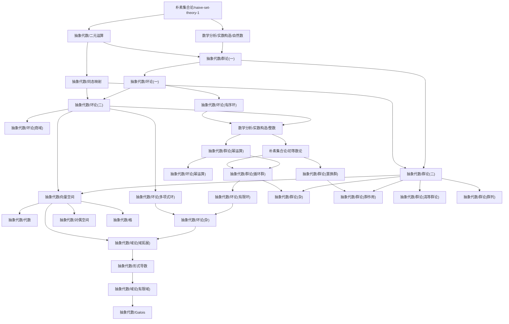

```mermaid
graph TD
1["抽象代数/向量空间"] --> 0["抽象代数/代数"]
3["抽象代数/群论(循环群)"] --> 2["抽象代数/环论(有限环)"]
5["抽象代数/环论(一)"] --> 4["抽象代数/环论(二)"]
6["抽象代数/同态映射"] --> 4["抽象代数/环论(二)"]
2["抽象代数/环论(有限环)"] --> 7["抽象代数/环论(杂)"]
8["抽象代数/环论(多项式环)"] --> 7["抽象代数/环论(杂)"]
10["朴素集合论/naive-set-theory-1"] --> 9["抽象代数/二元运算"]
12["抽象代数/群论(二)"] --> 11["抽象代数/群论(杂)"]
3["抽象代数/群论(循环群)"] --> 11["抽象代数/群论(杂)"]
1["抽象代数/向量空间"] --> 13["抽象代数/对偶空间"]
15["抽象代数/域论(域拓展)"] --> 14["抽象代数/形式导数"]
16["抽象代数/群论(一)"] --> 12["抽象代数/群论(二)"]
6["抽象代数/同态映射"] --> 12["抽象代数/群论(二)"]
17["抽象代数/群论(幂运算)"] --> 3["抽象代数/群论(循环群)"]
18["朴素集合论/初等数论"] --> 3["抽象代数/群论(循环群)"]
17["抽象代数/群论(幂运算)"] --> 19["抽象代数/环论(幂运算)"]
12["抽象代数/群论(二)"] --> 20["抽象代数/群论(群作用)"]
21["抽象代数/群论(置换群)"] --> 20["抽象代数/群论(群作用)"]
1["抽象代数/向量空间"] --> 22["抽象代数/格"]
4["抽象代数/环论(二)"] --> 23["抽象代数/环论(商域)"]
16["抽象代数/群论(一)"] --> 5["抽象代数/环论(一)"]
12["抽象代数/群论(二)"] --> 24["抽象代数/群论(高等群论)"]
26["抽象代数/域论(有限域)"] --> 25["抽象代数/Galois"]
27["数学分析/实数构造/自然数"] --> 16["抽象代数/群论(一)"]
9["抽象代数/二元运算"] --> 16["抽象代数/群论(一)"]
12["抽象代数/群论(二)"] --> 1["抽象代数/向量空间"]
4["抽象代数/环论(二)"] --> 1["抽象代数/向量空间"]
5["抽象代数/环论(一)"] --> 29["抽象代数/环论(有序环)"]
4["抽象代数/环论(二)"] --> 8["抽象代数/环论(多项式环)"]
7["抽象代数/环论(杂)"] --> 15["抽象代数/域论(域拓展)"]
1["抽象代数/向量空间"] --> 15["抽象代数/域论(域拓展)"]
14["抽象代数/形式导数"] --> 26["抽象代数/域论(有限域)"]
30["数学分析/实数构造/整数"] --> 17["抽象代数/群论(幂运算)"]
12["抽象代数/群论(二)"] --> 31["抽象代数/群论(群列)"]
9["抽象代数/二元运算"] --> 6["抽象代数/同态映射"]
18["朴素集合论/初等数论"] --> 21["抽象代数/群论(置换群)"]
30["数学分析/实数构造/整数"] --> 18["朴素集合论/初等数论"]
4["抽象代数/环论(二)"] --> 30["数学分析/实数构造/整数"]
29["抽象代数/环论(有序环)"] --> 30["数学分析/实数构造/整数"]
10["朴素集合论/naive-set-theory-1"] --> 27["数学分析/实数构造/自然数"]
```
