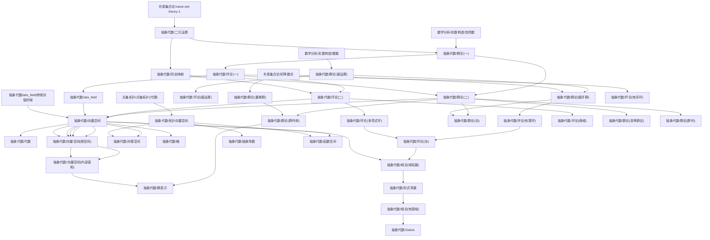

```mermaid
graph TD
1["抽象代数/群论(群作用)"] --> 0["抽象代数/群表示"]
2["抽象代数/向量空间(内部直和)"] --> 0["抽象代数/群表示"]
4["抽象代数/向量空间"] --> 3["抽象代数/代数"]
6["抽象代数/群论(循环群)"] --> 5["抽象代数/环论(有限环)"]
8["抽象代数/环论(一)"] --> 7["抽象代数/环论(二)"]
9["抽象代数/同态映射"] --> 7["抽象代数/环论(二)"]
5["抽象代数/环论(有限环)"] --> 10["抽象代数/环论(杂)"]
11["抽象代数/环论(多项式环)"] --> 10["抽象代数/环论(杂)"]
13["朴素集合论/naive-set-theory-1"] --> 12["抽象代数/二元运算"]
15["抽象代数/群论(二)"] --> 14["抽象代数/群论(杂)"]
6["抽象代数/群论(循环群)"] --> 14["抽象代数/群论(杂)"]
4["抽象代数/向量空间"] --> 16["抽象代数/对偶空间"]
17["抽象代数/拓扑向量空间"] --> 16["抽象代数/对偶空间"]
19["抽象代数/域论(域拓展)"] --> 18["抽象代数/形式导数"]
20["抽象代数/群论(一)"] --> 15["抽象代数/群论(二)"]
9["抽象代数/同态映射"] --> 15["抽象代数/群论(二)"]
21["抽象代数/群论(幂运算)"] --> 6["抽象代数/群论(循环群)"]
22["朴素集合论/初等数论"] --> 6["抽象代数/群论(循环群)"]
21["抽象代数/群论(幂运算)"] --> 23["抽象代数/环论(幂运算)"]
15["抽象代数/群论(二)"] --> 1["抽象代数/群论(群作用)"]
24["抽象代数/群论(置换群)"] --> 1["抽象代数/群论(群作用)"]
4["抽象代数/向量空间"] --> 25["抽象代数/格"]
7["抽象代数/环论(二)"] --> 26["抽象代数/环论(商域)"]
8["抽象代数/环论(一)"] --> 27["抽象代数/abs_field"]
20["抽象代数/群论(一)"] --> 8["抽象代数/环论(一)"]
15["抽象代数/群论(二)"] --> 28["抽象代数/群论(高等群论)"]
30["抽象代数/域论(有限域)"] --> 29["抽象代数/Galois"]
31["数学分析/实数构造/自然数"] --> 20["抽象代数/群论(一)"]
12["抽象代数/二元运算"] --> 20["抽象代数/群论(一)"]
32["抽象代数/向量空间(商空间)"] --> 2["抽象代数/向量空间(内部直和)"]
32["抽象代数/向量空间(商空间)"] --> 2["抽象代数/向量空间(内部直和)"]
15["抽象代数/群论(二)"] --> 4["抽象代数/向量空间"]
7["抽象代数/环论(二)"] --> 4["抽象代数/向量空间"]
27["抽象代数/abs_field"] --> 4["抽象代数/向量空间"]
33["抽象代数/abs_field|带绝对值的域"] --> 4["抽象代数/向量空间"]
17["抽象代数/拓扑向量空间"] --> 34["抽象代数/抽象导数"]
35["点集拓扑/点集拓扑(代理)"] --> 17["抽象代数/拓扑向量空间"]
8["抽象代数/环论(一)"] --> 37["抽象代数/环论(有序环)"]
7["抽象代数/环论(二)"] --> 11["抽象代数/环论(多项式环)"]
10["抽象代数/环论(杂)"] --> 19["抽象代数/域论(域拓展)"]
4["抽象代数/向量空间"] --> 19["抽象代数/域论(域拓展)"]
18["抽象代数/形式导数"] --> 30["抽象代数/域论(有限域)"]
38["数学分析/实数构造/整数"] --> 21["抽象代数/群论(幂运算)"]
4["抽象代数/向量空间"] --> 32["抽象代数/向量空间(商空间)"]
4["抽象代数/向量空间"] --> 32["抽象代数/向量空间(商空间)"]
4["抽象代数/向量空间"] --> 32["抽象代数/向量空间(商空间)"]
4["抽象代数/向量空间"] --> 32["抽象代数/向量空间(商空间)"]
4["抽象代数/向量空间"] --> 32["抽象代数/向量空间(商空间)"]
15["抽象代数/群论(二)"] --> 39["抽象代数/群论(群列)"]
12["抽象代数/二元运算"] --> 9["抽象代数/同态映射"]
22["朴素集合论/初等数论"] --> 24["抽象代数/群论(置换群)"]
4["抽象代数/向量空间"] --> 40["抽象代数/函数空间"]
17["抽象代数/拓扑向量空间"] --> 40["抽象代数/函数空间"]
```