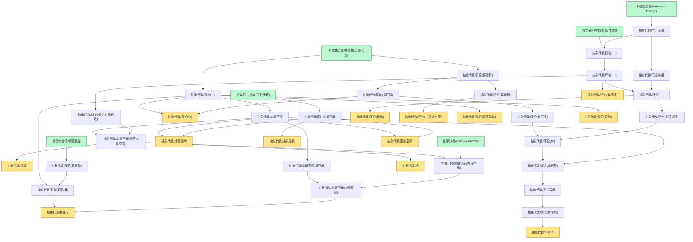

```mermaid
graph TD
1["抽象代数/群论(群作用)"] --> 0["抽象代数/群表示"]
2["抽象代数/向量空间(内部直和)"] --> 0["抽象代数/群表示"]
4["抽象代数/向量空间(赋范向量空间)"] --> 3["抽象代数/代数"]
6["抽象代数/群论(循环群)"] --> 5["抽象代数/环论(有限环)"]
8["抽象代数/环论(一)"] --> 7["抽象代数/环论(二)"]
9["抽象代数/同态映射"] --> 7["抽象代数/环论(二)"]
4["抽象代数/向量空间(赋范向量空间)"] --> 10["抽象代数/向量空间(内积空间)"]
11["数学分析/complex-number"] --> 10["抽象代数/向量空间(内积空间)"]
5["抽象代数/环论(有限环)"] --> 12["抽象代数/环论(杂)"]
13["抽象代数/环论(多项式环)"] --> 12["抽象代数/环论(杂)"]
15["朴素集合论/naive-set-theory-1"] --> 14["抽象代数/二元运算"]
17["抽象代数/群论(二)"] --> 16["抽象代数/群论(杂)"]
6["抽象代数/群论(循环群)"] --> 16["抽象代数/群论(杂)"]
19["抽象代数/向量空间"] --> 18["抽象代数/对偶空间"]
20["抽象代数/拓扑向量空间"] --> 18["抽象代数/对偶空间"]
22["抽象代数/域论(域拓展)"] --> 21["抽象代数/形式导数"]
23["朴素集合论/朴素集合论(代理)"] --> 17["抽象代数/群论(二)"]
24["抽象代数/群论(幂运算)"] --> 6["抽象代数/群论(循环群)"]
24["抽象代数/群论(幂运算)"] --> 25["抽象代数/环论(幂运算)"]
17["抽象代数/群论(二)"] --> 1["抽象代数/群论(群作用)"]
26["抽象代数/群论(置换群)"] --> 1["抽象代数/群论(群作用)"]
4["抽象代数/向量空间(赋范向量空间)"] --> 27["抽象代数/格"]
7["抽象代数/环论(二)"] --> 28["抽象代数/环论(商域)"]
29["抽象代数/群论(一)"] --> 8["抽象代数/环论(一)"]
25["抽象代数/环论(幂运算)"] --> 30["抽象代数/环论(二项式定理)"]
17["抽象代数/群论(二)"] --> 31["抽象代数/群论(高等群论)"]
33["抽象代数/域论(有限域)"] --> 32["抽象代数/Galois"]
34["数学分析/实数构造/自然数"] --> 29["抽象代数/群论(一)"]
14["抽象代数/二元运算"] --> 29["抽象代数/群论(一)"]
35["抽象代数/向量空间(商空间)"] --> 2["抽象代数/向量空间(内部直和)"]
10["抽象代数/向量空间(内积空间)"] --> 2["抽象代数/向量空间(内部直和)"]
17["抽象代数/群论(二)"] --> 19["抽象代数/向量空间"]
20["抽象代数/拓扑向量空间"] --> 36["抽象代数/抽象导数"]
37["点集拓扑/点集拓扑(代理)"] --> 20["抽象代数/拓扑向量空间"]
8["抽象代数/环论(一)"] --> 38["抽象代数/环论(有序环)"]
8["抽象代数/环论(一)"] --> 39["抽象代数/域论(带绝对值的域)"]
19["抽象代数/向量空间"] --> 4["抽象代数/向量空间(赋范向量空间)"]
39["抽象代数/域论(带绝对值的域)"] --> 4["抽象代数/向量空间(赋范向量空间)"]
7["抽象代数/环论(二)"] --> 13["抽象代数/环论(多项式环)"]
12["抽象代数/环论(杂)"] --> 22["抽象代数/域论(域拓展)"]
19["抽象代数/向量空间"] --> 22["抽象代数/域论(域拓展)"]
21["抽象代数/形式导数"] --> 33["抽象代数/域论(有限域)"]
23["朴素集合论/朴素集合论(代理)"] --> 24["抽象代数/群论(幂运算)"]
19["抽象代数/向量空间"] --> 35["抽象代数/向量空间(商空间)"]
17["抽象代数/群论(二)"] --> 40["抽象代数/群论(群列)"]
14["抽象代数/二元运算"] --> 9["抽象代数/同态映射"]
41["朴素集合论/初等数论"] --> 26["抽象代数/群论(置换群)"]
19["抽象代数/向量空间"] --> 42["抽象代数/函数空间"]
20["抽象代数/拓扑向量空间"] --> 42["抽象代数/函数空间"]
classDef leaf fill:#fde68a,stroke:#b45309
class 0,3,16,18,27,28,30,31,32,36,38,40,42 leaf
classDef foundationRoot fill:#bbf7d0,stroke:#15803d
class 11,15,23,34,37,41 foundationRoot
```