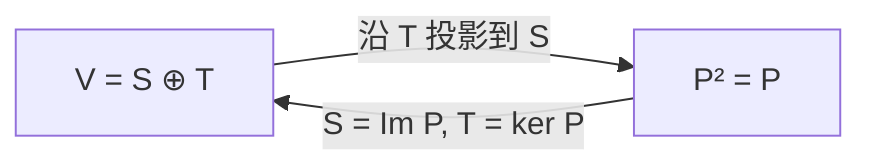

- [1. 前置](#1-前置)
- [2. 记号](#2-记号)
- [3. 子空间的和与直和](#3-子空间的和与直和)
	- [3.1. 和与交](#31-和与交)
	- [3.2. 分解的唯一性](#32-分解的唯一性)
- [4. 沿补空间的投影](#4-沿补空间的投影)
	- [4.1. 定义](#41-定义)
	- [4.2. 线性性](#42-线性性)
	- [4.3. 像与核](#43-像与核)
	- [4.4. 幂等性](#44-幂等性)
	- [4.5. 互补投影](#45-互补投影)
- [5. 投影与内部直和](#5-投影与内部直和)
	- [5.1. 从直和到幂等算子](#51-从直和到幂等算子)
- [6. 正交投影](#6-正交投影)
	- [6.1. 正交补与正交直和](#61-正交补与正交直和)
	- [6.2. 自伴性](#62-自伴性)

## 1. 前置

- [[抽象代数/向量空间]]

## 2. 记号

设 $V$ 是域 $F$ 上的向量空间。子空间记作 $S,T\le V$。恒等算子记作 $\operatorname{Id}_V$，线性映射 $P:V\to V$ 的像与核分别记作 $\operatorname{Im}P$ 与 $\ker P$。

本文先在一般向量空间中讨论直和与（斜）投影，再在内积空间中讨论正交投影。

## 3. 子空间的和与直和

### 3.1. 和与交

设 $S,T\le V$。它们的**和**与**交**分别为

$$
S+T:=\{s+t:s\in S,\ t\in T\},
\qquad
S\cap T:=\{v\in V:v\in S\text{ 且 }v\in T\}.
$$

二者都是 $V$ 的子空间。$S+T$ 是包含 $S$ 与 $T$ 的最小子空间。

> 证明
>
> 先看交。$0\in S$ 且 $0\in T$，故 $0\in S\cap T$。若 $x,y\in S\cap T$，则 $x,y\in S$ 且 $x,y\in T$。$S,T$ 都是子空间，所以对任意 $\alpha,\beta\in F$，
>
> $$
> \alpha x+\beta y\in S,
> \qquad
> \alpha x+\beta y\in T,
> $$
>
> 从而 $\alpha x+\beta y\in S\cap T$。故 $S\cap T\le V$。
>
> 再看和。$0=0+0\in S+T$。若 $s+t,\,s'+t'\in S+T$，则
>
> $$
> \alpha(s+t)+\beta(s'+t')=(\alpha s+\beta s')+(\alpha t+\beta t')\in S+T,
> $$
>
> 因为 $\alpha s+\beta s'\in S$、$\alpha t+\beta t'\in T$。故 $S+T\le V$。
>
> 最后看最小性。对任意 $s\in S$、$t\in T$，有 $s=s+0$、$t=0+t$，故 $S\subseteq S+T$ 且 $T\subseteq S+T$。若 $W\le V$ 也满足 $S\subseteq W$ 且 $T\subseteq W$，则对任意 $s+t\in S+T$ 都有 $s,t\in W$，从而 $s+t\in W$。因此 $S+T\subseteq W$。也就是说，$S+T$ 含于每一个同时包含 $S$ 与 $T$ 的子空间，它是其中最小的。

若还满足

$$
S+T=V,
\qquad
S\cap T=\{0\},
$$

则称 $V$ 是 $S$ 与 $T$ 的**内部直和**，记作

$$
V=S\oplus T.
$$

此时称 $T$ 是 $S$ 的一个**代数补**（complement），也称 $S$ 与 $T$ 互为补空间。

### 3.2. 分解的唯一性

下列三条彼此等价。

1. $V=S\oplus T$。
2. $V=S+T$ 且 $S\cap T=\{0\}$。
3. 任意 $v\in V$ 都可以**唯一**地写成 $v=s+t$，其中 $s\in S$、$t\in T$。

> 证明
>
> $(1)\iff(2)$ 就是定义。
>
> $(2)\Rightarrow(3)$：存在性来自 $V=S+T$。若 $v=s+t=s'+t'$，则 $s-s'=t'-t\in S\cap T=\{0\}$，故 $s=s'$、$t=t'$。
>
> $(3)\Rightarrow(2)$：先证集合相等 $V=S+T$，即两边互相包含。
>
> - $S+T\subseteq V$：因为 $S,T\le V$，对任意 $s\in S$、$t\in T$ 都有 $s,t\in V$，而 $V$ 对加法封闭，故 $s+t\in V$。
> - $V\subseteq S+T$：由 (3) 的存在性，任意 $v\in V$ 都可写成 $v=s+t$，其中 $s\in S$、$t\in T$，故 $v\in S+T$。
>
> 因此 $V=S+T$。剩下要证 $S\cap T=\{0\}$。取 $x\in S\cap T$。由于 $x\in S$、$0\in T$，可以把 $x$ 写成
>
> $$
> x=x+0,\qquad x\in S,\ 0\in T.
> $$
>
> 由于 $0\in S$、$x\in T$，又可以把同一个 $x$ 写成
>
> $$
> x=0+x,\qquad 0\in S,\ x\in T.
> $$
>
> 这是 $x$ 的两种 $S+T$ 分解。由 (3) 的唯一性，两种写法的 $S$ 分量必须相同，也就是 $x=0$。因此 $S\cap T\subseteq\{0\}$。反过来 $0$ 当然属于交，故 $S\cap T=\{0\}$。

## 4. 沿补空间的投影

### 4.1. 定义

给定直和分解 $V=S\oplus T$，对任意 $v\in V$，设其唯一分解为

$$
v=s+t,\qquad s\in S,\ t\in T.
$$

定义

$$
P_S(v):=s.
$$

称 $P_S:V\to V$ 为**沿 $T$ 投影到 $S$** 的投影算子。同理 $P_T(v):=t$ 是沿 $S$ 投影到 $T$ 的投影。

### 4.2. 线性性

设 $v=s+t$、$w=s'+t'$。则

$$
\alpha v+\beta w=(\alpha s+\beta s')+(\alpha t+\beta t'),
$$

其中 $\alpha s+\beta s'\in S$、$\alpha t+\beta t'\in T$。由分解唯一性，

$$
P_S(\alpha v+\beta w)=\alpha s+\beta s'=\alpha P_S(v)+\beta P_S(w).
$$

故 $P_S$ 是线性映射。

### 4.3. 像与核

$$
\operatorname{Im}P_S=S,
\qquad
\ker P_S=T.
$$

同理 $\operatorname{Im}P_T=T$、$\ker P_T=S$。

> 证明
>
> 对任意 $s\in S$，有 $s=s+0$，故 $P_S(s)=s$。因此 $S\subseteq\operatorname{Im}P_S$。反之 $P_S(v)$ 按定义落在 $S$ 中，故 $\operatorname{Im}P_S\subseteq S$。
>
> $P_S(v)=0$ 当且仅当分解中的 $S$ 分量为 $0$，即 $v\in T$。故 $\ker P_S=T$。

### 4.4. 幂等性

若 $v=s+t$，则 $P_S(v)=s\in S$，从而

$$
P_S^2(v)=P_S(s)=s=P_S(v).
$$

所以

$$
P_S^2=P_S.
$$

同理 $P_T^2=P_T$。满足 $P^2=P$ 的线性算子称为**幂等算子**，也称为（代数）投影算子。

### 4.5. 互补投影

由 $v=s+t=P_S(v)+P_T(v)$ 立即得到

$$
P_S+P_T=\operatorname{Id}_V,
$$

因此 $P_T=\operatorname{Id}_V-P_S$。

再由 $\operatorname{Im}P_T=T=\ker P_S$ 可知

$$
P_SP_T=0,
\qquad
P_TP_S=0.
$$

因为 $P_T(v)\in T=\ker P_S$，故 $P_S(P_T(v))=0$；另一侧同理。

这四条合在一起：

$$
P_S+P_T=\operatorname{Id}_V,
\qquad
P_S^2=P_S,
\qquad
P_T^2=P_T,
\qquad
P_SP_T=P_TP_S=0.
$$

## 5. 投影与内部直和

### 5.1. 从直和到幂等算子

设 $P:V\to V$ 满足 $P^2=P$。令

$$
S:=\operatorname{Im}P,
\qquad
T:=\ker P.
$$

则 $V=S\oplus T$，且 $P$ 恰是沿 $T$ 投影到 $S$ 的投影。

> 证明
>
> 任意 $v\in V$ 可写成
>
> $$
> v=Pv+(v-Pv).
> $$
>
> 第一项 $Pv\in\operatorname{Im}P=S$。第二项落在核中：
>
> $$
> P(v-Pv)=Pv-P^2v=Pv-Pv=0,
> $$
>
> 故 $v-Pv\in\ker P=T$。于是 $V=S+T$。
>
> 若 $x\in S\cap T$，则存在 $w$ 使 $x=Pw$，同时又有 $Px=0$。因此
>
> $$
> x=Pw=P^2w=P(Pw)=Px=0.
> $$
>
> 故 $S\cap T=\{0\}$，即 $V=S\oplus T$。
>
> 在这个分解下，$v$ 的 $S$ 分量恰好是 $Pv$，所以 $P$ 就是沿 $T$ 投影到 $S$ 的投影。

因此：

> **投影映射 = 幂等线性映射**

## 6. 正交投影

### 6.1. 正交补与正交直和

现设 $V$ 是内积空间，$S\le V$。正交补

$$
S^\perp:=\{v\in V:\langle v,s\rangle=0\ \forall s\in S\}
$$

仍是子空间，且总有 $S\cap S^\perp=\{0\}$。

若进一步有 $V=S+S^\perp$，则

$$
V=S\oplus S^\perp
$$

是**正交直和分解**。此时沿 $S^\perp$ 投影到 $S$ 的算子记作 $P_S$，称为到 $S$ 的**正交投影**。相应的互补投影是 $P_{S^\perp}=\operatorname{Id}_V-P_S$。

### 6.2. 自伴性

正交投影不仅幂等，还是自伴的。

设 $v=s+t$、$w=s'+t'$，其中 $s,s'\in S$，$t,t'\in S^\perp$。则

$$
\langle P_Sv,w\rangle=\langle s,s'+t'\rangle=\langle s,s'\rangle=\langle s+t,s'\rangle=\langle v,P_Sw\rangle.
$$

故 $P_S^*=P_S$。同理 $P_{S^\perp}^*=P_{S^\perp}$。

反之，若 $P^2=P$ 且 $P^*=P$，则 $P$ 必是到 $S:=\operatorname{Im}P$ 的正交投影。

> 证明
>
> $P^2=P$ 已经给出 $V=\operatorname{Im}P\oplus\ker P$。记 $S:=\operatorname{Im}P$，只需再证 $\ker P=S^\perp$，这样补空间就是正交补，$P$ 就是沿 $S^\perp$ 投影到 $S$ 的正交投影。
>
> **第一步：** 任意向量 $v\in V$ 为零，当且仅当它与整个空间正交：
>
> $$
> v=0\iff\langle v,y\rangle=0, \forall y\in V
> $$
>
> 也就是 $V^\perp=\{0\}$。一边：$v=0$ 时 $\langle 0,y\rangle=0$。另一边：若对一切 $y$ 有 $\langle v,y\rangle=0$，取 $y=v$，正定性给出 $\langle v,v\rangle=0$，故 $v=0$。
>
> 把 $v$ 换成 $Px$，即得 $x\in\ker P$ 当且仅当对一切 $y$ 有 $\langle Px,y\rangle=0$。
>
> **第二步：** 用伴随把上式改写到 $x$ 一侧。由伴随的定义，
>
> $$
> \langle Px,y\rangle=\langle x,P^*y\rangle.
> $$
>
> 因此 $x\in\ker P$ 当且仅当对一切 $y\in V$ 有 $\langle x,P^*y\rangle=0$。而 $\{P^*y:y\in V\}$ 恰好是 $\operatorname{Im}P^*$，再按正交补的定义，
>
> $$
> (\operatorname{Im}P^*)^\perp=\{v\in V:\langle v,w\rangle=0\ \forall w\in\operatorname{Im}P^*\}.
> $$
>
> 故 $x\in\ker P$ 当且仅当 $x\in(\operatorname{Im}P^*)^\perp$，即
>
> $$
> \ker P=(\operatorname{Im}P^*)^\perp.
> $$
>
> **第三步：** 加上自伴性。$P^*=P$ 给出 $\operatorname{Im}P^*=\operatorname{Im}P=S$，因此
>
> $$
> \ker P=S^\perp.
> $$
>
> 于是 $V=S\oplus S^\perp$，且 $P$ 正是沿 $S^\perp$ 投影到 $S$ 的投影。

总结：

$$
\text{一般投影}\iff P^2=P,
\qquad
\text{正交投影}\iff P^2=P\text{ 且 }P^*=P.
$$