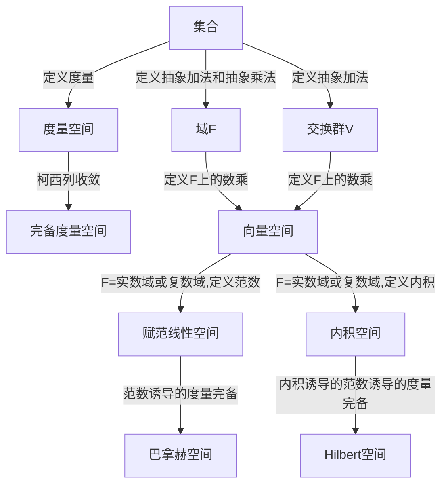

- [1. 前置](#1-前置)
- [2. Vector Space](#2-vector-space)
  - [2.1. Properties of Vector Space](#21-properties-of-vector-space)
- [3. 度量空间](#3-度量空间)
- [4. 赋范线性空间](#4-赋范线性空间)
  - [4.1. 赋范线性空间的性质](#41-赋范线性空间的性质)
- [5. 内积空间](#5-内积空间)
  - [5.1. 内积空间的性质](#51-内积空间的性质)
  - [5.2. Riesz 表示定理 (有限维情形)](#52-riesz-表示定理-有限维情形)
    - [5.2.2. 证明](#522-证明)
- [6. Hilbert 空间](#6-hilbert-空间)
  - [6.1. Hilbert 空间的性质](#61-hilbert-空间的性质)

## 1. 前置

- [[抽象代数/群论(二)]]
- [[抽象代数/环论(二)]]

## 2. Vector Space

$F$ is a field, $V$ is a commutative group
Define scalar multiplication

$$
\sigma: F \times V \rightarrow V
$$

Denote $a \sigma v$ as $av$

If $\sigma$ satisfies the following conditions, then $V$ is a **vector space** over $F$, or a linear space.

- $(a+b)v = av + bv$
- $a(bv) = (ab)v$
- $a(u+v) = au + av$
- $1v = v$

$S=\{v_i|i \in I\}$ is **linearly independent** if: $\forall k \in \mathbb{N}, \forall B = \{v_i \in S: i\in [k] \wedge (\forall i,j\in [k], i\not=j \Rightarrow v_i \not= v_j)\}, \sum_{i=1}^k \alpha_i v_i = 0 \Rightarrow \forall i \in [k], \alpha_i = 0$

If any vector in $V$ can be expressed as a linear combination of a finite subset of $S\subseteq V$, then $V$ is **generated by $S$**. If $S$ is linearly independent, then $S$ is a **basis** of $V$. If $S$ is a finite set, then $V$ is a **finite-dimensional vector space**.

For $U\subseteq V$, if $\sigma$ restricted on $U$ still satisfies the definition of vector space, i.e., $\sigma:<F,U> \rightarrow U$, then $U$ is a **subspace** of $V$.

For $V$ and $V'$, if $L:V \rightarrow V'$ satisfies $L(av+bw)=aL(v)+bL(w)$ for all $a,b \in F$ and all $v,w \in V$, then $L$ is a **linear map**. If $V=V'$, then $L$ is a **linear transformation**.

Let $V$ and $V'$ be vector spaces over the same field $F$. A map $\phi: V \to V'$ is an **isomorphism** if $\phi$ is a one-to-one map, $\phi[V] = V'$, and furthermore

$$\phi(a\alpha + b\beta) = a\phi(\alpha) + b\phi(\beta)$$

for all $\alpha, \beta \in V$ and all $a \in F$.

The eigenvector $v\not=0$ and eigenvalue $\lambda$ of a linear transformation $L:V \to V$:

$$
\exists v\not=0, L(v)=\lambda v \iff \exists v\not=0, (L-\lambda I)(v)=0 \iff \text{Ker}(L-\lambda I) \neq \{0\}
$$

### 2.1. Properties of Vector Space

1. $0v=0$
2. $a0=0$
3. $(-a)v = -(av) = a(-v)$
4. $v_1,v_2,...,v_n \in V$线性无关$\iff$ 不存在$v_i$能被其余向量线性表出
5. $v_1,v_2,...,v_n \in V$线性无关$\iff$ $i\in[n],v_i$不能被其前面的向量线性表出
6. 若有限集$S$生成了$V$,则存在$U\subseteq S$使得 $U$ 是 $V$ 的基。所一有限维向量空间有有限基
7. 若$V$是一个有限维向量空间，$S\subseteq V$为线性无关的有限集合，则 $S$可以扩充为$V$的基。且$r \leq n$,$r=|S|$ ,$n$ 为 $V$ 的基的基数
8. 有限维向量空间的所有基的基数相同，因此把基的基数称为向量空间的维数，记作$\dim(V)$
9. 子空间的交仍然是子空间
10. 由集合 $S$ 里的有限个元素的线性组合得到的集合是 V 的一个子空间
11. 在同一个域 $F$ 上的向量空间的直和仍是 $F$ 上的向量空间
12. 对于任意一个域$F$,$F^n$是$F$上的向量空间，且$\dim(F^n)=n$
13. $B$ 是有限维向量空间的基 $\iff$ $V$ 中的任意向量都可以被 $B$ 中的元素唯一线性表出
14. 任意有限维向量空间$<F,V>$ (在群意义上)都同构于 $<F,F^n>$
15. 线性映射 $L:V\rightarrow V'$ 的核是 $V$ 的子空间，像$L(V)$是$V'$的子空间。若$V$是有限维的，则$\dim(V)=\dim(\text{Ker}(L))+\dim(\text{Im}(L))$,其中$\text{Im}(L)=L(V)$
16. 线性映射的线性组合仍然是线性映射
17. 一个线性变换的不同特征值的特征向量是线性无关的
18. 若$V$是有限维的，则一个线性变换$\phi:V\rightarrow V$最多有$n=\dim(V)$个不同的特征值
19. 向量空间$V$上的所有可逆的线性变换在复合映射下构成一个群，被称作 **一般线性群（General linear group）**，记作$GL(V)$

## 3. 度量空间

在集合$X$上定义一个函数$d:X \times X \rightarrow R+$,满足以下条件，则称$d$为$X$上的度量，$(X,d)$为度量空间。

- 正定性：$d(x,y) \geq 0$, and $d(x,y)=0 \iff x=y$
- 对称性：$d(x,y)=d(y,x)$
- 三角不等式：$d(x,y) \leq d(x,z)+d(z,y)$

## 4. 赋范线性空间

$F=\mathbb{R}$或$\mathbb{C}$，$\langle F,V \rangle$是域$F$上的向量空间$V$，$||.||:V \rightarrow R^*$,满足以下条件，则称$||.||$为$V$上的范数，$(V,||.||)$为赋范线性空间。

- non-negativity: $||v|| \geq 0$
- positive definiteness: $||v||=0 \iff v=0$
- absolute homogeneity: $||av||=|a|||v||$
- triangle inequality: $||v+w|| \leq ||v||+||w||$

如果$V$上的范数诱导的度量是完备的，则称$V$是巴拿赫(Banach)空间。

### 4.1. 赋范线性空间的性质

1. 范数可以诱导度量$d(v,w)=||v-w||$
2. 赋范线性空间都是度量空间

## 5. 内积空间

$F$ 为$\mathbb{R}$或$\mathbb{C}$，$V$是 $F$ 上的向量空间，$\langle .,. \rangle:V \times V \rightarrow F$，满足以下条件，则称$\langle .,. \rangle$为$V$上的内积，$(V,\langle .,. \rangle)$为内积空间。

- 共轭对称：$\langle v,w \rangle = \overline{\langle w,v \rangle}$
- 正定性：$\langle v,v \rangle \geq 0$ and $\langle v,v \rangle = 0 \iff v=0$
- 线性性：$\langle av+bw,z \rangle = a\langle v,z \rangle + b\langle w,z \rangle$

内积空间空间$V$的子空间$U$的正交补$U^{\perp}=\{v \in V | \forall u \in U, \langle v,u \rangle = 0\}$是$V$的子空间

正交投影：$V$是内积空间，$U$是$V$的子空间，$v \in V$，若$v=u+w$，其中$u \in U$，$w \in U^{\perp}$，则称$u$为$v$在$U$上的正交投影。

- 若线性变换$T$可逆，且满足$\langle T(v_1), T(v_2) \rangle = \langle v_1, v_2 \rangle, \forall v_1,v_2 \in V$, 则称$T$为**酉变换**（unitary transformation）
- 所有的酉变换在复合运算下构成一个群，被称为**酉群**（unitary group），记作$U(V)$
- $SU:=\{T \in U(V) | \det T=1\}$是$U(V)$ 的子群，被称为特殊酉群 (Special Unitary Group)。

### 5.1. 内积空间的性质

1. 正交投影若存在则唯一
2. 内积可以诱导范数$||v||=\sqrt{\langle v,v \rangle}$
3. 内积空间可以诱导赋范线性空间
4. 内积空间可以诱导度量空间
5. 有限维内积空间可以通过施密特正交化得到正交基。
6. 内积空间中，柯西-施瓦茨不等式：$|\langle v,w \rangle| \leq ||v|| \cdot ||w||$, 可通过正交分解来证明。
7. 正交 $\Rightarrow$ 线性无关

在内积空间上，内积$\xrightarrow{induce}$范数$\xrightarrow{induce}$度量

针对你笔记中关于**内积空间**和**有限维空间**的脉络，我为你重述并严谨化 **Riesz 表示定理（有限维情形）**。

在引入域 $F$（实数域 $\mathbb{R}$ 或复数域 $\mathbb{C}$）后，该定理建立了“线性泛函”与“向量”之间的一一对应关系，是连接代数对偶与几何结构的桥梁。

### 5.2. Riesz 表示定理 (有限维情形)

设 $V$ 是域 $F$（$\mathbb{R}$ 或 $\mathbb{C}$）上的有限维**内积空间**。对于 $V$ 上的任何线性泛函 $L: V \to F$，存在唯一的向量 $v \in V$，使得对于所有的 $h \in V$，都有：
$$L(h) = \langle h, v \rangle$$

#### 5.2.2. 证明

存在性：
设 $\dim(V) = n$，根据[性质](#property5)，通过施密特正交化可得 $V$ 的一组**标准正交基** $(e_1, e_2, \dots, e_n)$，满足 $\langle e_i, e_j \rangle = \delta_{ij}$。
对于任何向量 $h \in V$，它可以表示为：
$$h = \sum_{j=1}^n \langle h, e_j \rangle e_j$$
由于 $L$ 是线性映射，由其线性性质可得：
$$L(h) = L\left( \sum_{j=1}^n \langle h, e_j \rangle e_j \right) = \sum_{j=1}^n \langle h, e_j \rangle L(e_j)$$
为了构造 $v$，利用内积的共轭线性性质 $\langle h, \sum a_j e_j \rangle = \sum \overline{a_j} \langle h, e_j \rangle$，我们令：
$$v := \sum_{j=1}^n \overline{L(e_j)} e_j$$
**验证：**
$$\langle h, v \rangle = \langle h, \sum_{j=1}^n \overline{L(e_j)} e_j \rangle = \sum_{j=1}^n \overline{\overline{L(e_j)}} \langle h, e_j \rangle = \sum_{j=1}^n L(e_j) \langle h, e_j \rangle = L(h)$$
存在性得证。

唯一性：
假设存在 $v_1, v_2 \in V$ 满足对于所有 $h \in V$：
$$L(h) = \langle h, v_1 \rangle = \langle h, v_2 \rangle$$
由此推导：
$$\langle h, v_1 - v_2 \rangle = 0, \quad \forall h \in V$$
取特定的向量 $h = v_1 - v_2$，根据内积的**正定性**：
$$\langle v_1 - v_2, v_1 - v_2 \rangle = \|v_1 - v_2\|^2 = 0 \iff v_1 - v_2 = 0$$
即 $v_1 = v_2$。唯一性得证。

## 6. Hilbert 空间

完备内积空间为 Hilbert 空间。

#### 6.1. Hilbert 空间的性质

1. Hilbert 的投影存在。
