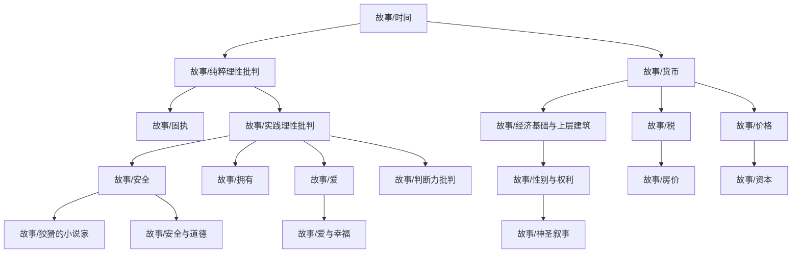

```mermaid
graph TD
1["故事/纯粹理性批判"] --> 0["故事/固执"]
3["故事/经济基础与上层建筑"] --> 2["故事/性别与权利"]
5["故事/价格"] --> 4["故事/资本"]
7["故事/安全"] --> 6["故事/狡猾的小说家"]
1["故事/纯粹理性批判"] --> 8["故事/实践理性批判"]
9["故事/时间"] --> 1["故事/纯粹理性批判"]
8["故事/实践理性批判"] --> 7["故事/安全"]
10["故事/货币"] --> 3["故事/经济基础与上层建筑"]
8["故事/实践理性批判"] --> 11["故事/拥有"]
10["故事/货币"] --> 12["故事/税"]
12["故事/税"] --> 13["故事/房价"]
8["故事/实践理性批判"] --> 14["故事/爱"]
10["故事/货币"] --> 5["故事/价格"]
7["故事/安全"] --> 16["故事/安全与道德"]
2["故事/性别与权利"] --> 17["故事/神圣叙事"]
14["故事/爱"] --> 18["故事/爱与幸福"]
9["故事/时间"] --> 10["故事/货币"]
8["故事/实践理性批判"] --> 19["故事/判断力批判"]
```
