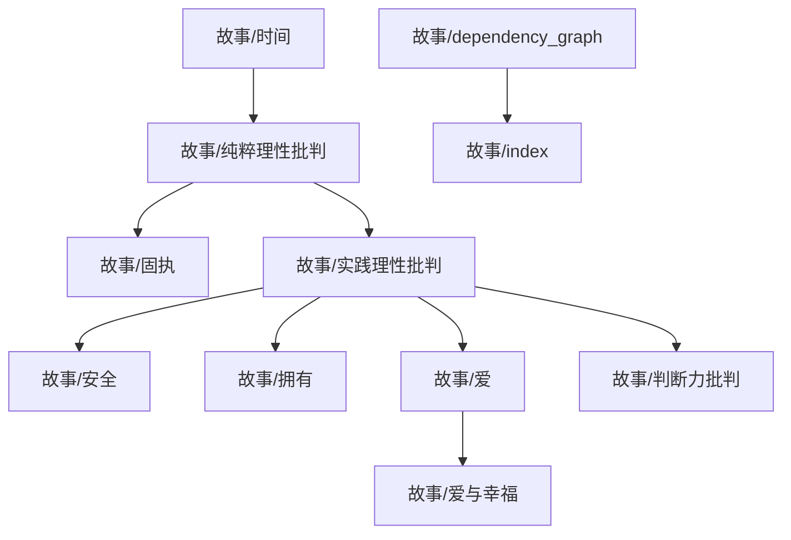

```mermaid
graph TD
1["故事/纯粹理性批判"] --> 0["故事/固执"]
1["故事/纯粹理性批判"] --> 2["故事/实践理性批判"]
3["故事/时间"] --> 1["故事/纯粹理性批判"]
2["故事/实践理性批判"] --> 4["故事/安全"]
2["故事/实践理性批判"] --> 5["故事/拥有"]
2["故事/实践理性批判"] --> 6["故事/爱"]
8["故事/dependency_graph"] --> 7["故事/index"]
6["故事/爱"] --> 9["故事/爱与幸福"]
2["故事/实践理性批判"] --> 10["故事/判断力批判"]
```