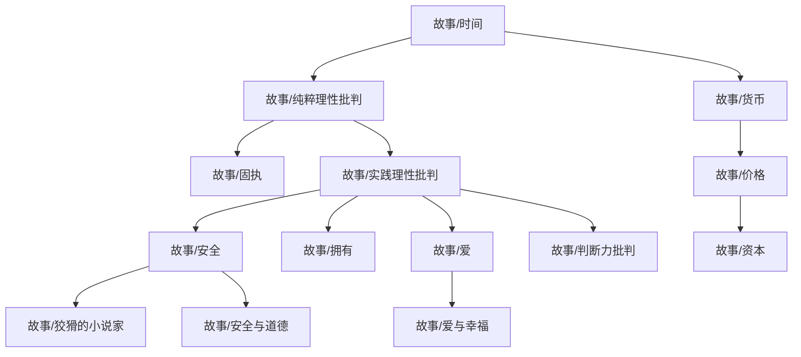

```mermaid
graph TD
1["故事/纯粹理性批判"] --> 0["故事/固执"]
3["故事/价格"] --> 2["故事/资本"]
5["故事/安全"] --> 4["故事/狡猾的小说家"]
1["故事/纯粹理性批判"] --> 6["故事/实践理性批判"]
7["故事/时间"] --> 1["故事/纯粹理性批判"]
6["故事/实践理性批判"] --> 5["故事/安全"]
6["故事/实践理性批判"] --> 8["故事/拥有"]
6["故事/实践理性批判"] --> 9["故事/爱"]
10["故事/货币"] --> 3["故事/价格"]
5["故事/安全"] --> 12["故事/安全与道德"]
9["故事/爱"] --> 13["故事/爱与幸福"]
7["故事/时间"] --> 10["故事/货币"]
6["故事/实践理性批判"] --> 14["故事/判断力批判"]
```
