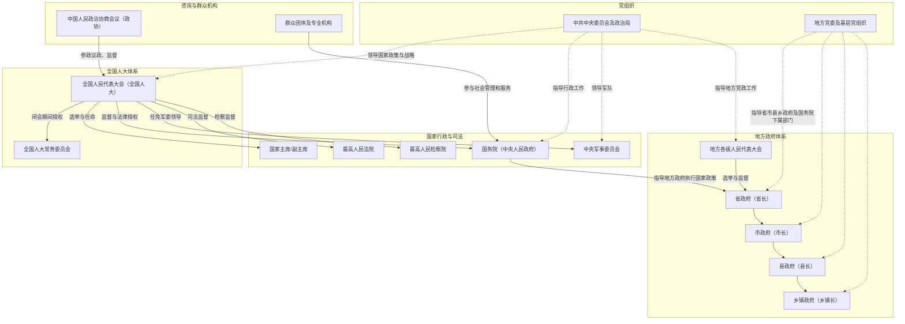

## 前置

- [[故事/货币与行政]]

## 1. 结构图

## 2. 两会

- 全国两会
  - **组成**：
    1. 全国人民代表大会（全国人大）会议
    2. 中国人民政治协商会议全国委员会（全国政协）会议

  - **时间**：每年 **3月初** 基本同期召开
  - **简称**：因同期举行，合称为“全国两会”

- 地方两会
  - **组成**：
    1.  地方各级人民代表大会会议
    2.  中国人民政治协商会议地方委员会会议

  - **时间**：每年 **年初** 基本同期召开
  - **性质**：
    - “地方两会”是对所有地方“两会”的总称，不专指某一个地方
    - 必须在**同一行政区划、同级**的人大会议与政协会议基本同期举行

- 地方人大分级
  1. **县级以上的地方人大**
     - 省、自治区、直辖市人民代表大会
     - 自治州人民代表大会
     - 设区的市（地级市）人民代表大会
     - 县、自治县、不设区的市（县级市）、市辖区人民代表大会

  2. **乡级地方人大**
     - 乡、民族乡、镇人民代表大会

- 地方政协分级
  - **省、自治区、直辖市委员会**
  - **自治州、设区的市、县、自治县、不设区的市、市辖区委员会**

    > - 在乡、民族乡、镇**没有设立政协委员会**，所以不存在乡级“两会”。
    > - “两会”一词必须用于**同行政区划、同级且同期举行的人大与政协会议**。

## 3. 全会

- “全会”含义
  - **全会** = **全体会议**
  - 意味着**中央委员会全体成员（含候补委员）参加**，是党内最高决策层集中讨论重大问题的会议形式

- “几中”含义
  - “几中”中的“几”表示**届次中的第几次会议**
  - 例如：
    - **一中全会**：中央委员会当届第一次全体会议
    - **二中全会**：中央委员会当届第二次全体会议
    - **三中全会**：中央委员会当届第三次全体会议
    - ……依次类推

> 每届中央委员会任期通常五年，每年或几年召开若干次全会，每次全会都有编号。

- 总结公式

  > **“第X届中央委员会 + 第N次全体会议” = X届N中全会**
  - “届”确定**中央委员会的任期**
  - “中”确定**该届委员会的第几次全体会议**
  - “全会”强调**全体委员参加**，是决策权威机构的会议形式
