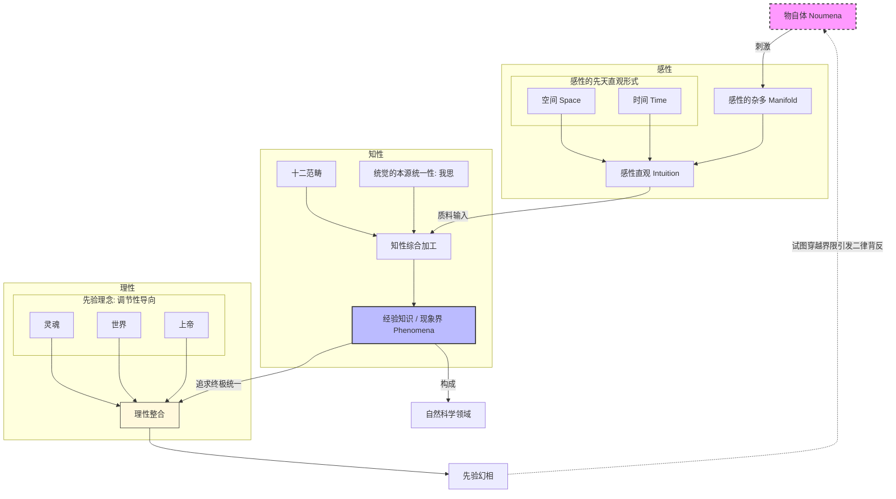

- [1. 前置](#1-前置)
- [2. 总揽图](#2-总揽图)
- [3. 前置知识](#3-前置知识)
  - [3.1. 定义](#31-定义)
  - [3.2. 性质](#32-性质)
- [4. 先验感性论](#4-先验感性论)
- [5. 先验逻辑论](#5-先验逻辑论)
- [6. 先验辩证论](#6-先验辩证论)

## 1. 前置

- [[故事/时间]]

## 2. 总揽图



## 3. 前置知识

### 3.1. 定义

- **普遍**：命题的适用范围（无例外）
- **必然**：命题的真值模态（不可能为假）
- **先天判断**：不依赖于经验
  - 举例：一切变化都有其原因
- **后天判断**：依赖于经验
  - 举例：这个玫瑰是红色的
- **分析判断**：谓语蕴含在主语中，无需经验验证，具有逻辑必然性但不扩展知识。分析判断都为先天判断。
  - 举例：
    - 这个红苹果是红的
    - 三角形有三个角
- **综合判断**：谓语不蕴含在主语中，谓词提供主词之外的新信息，扩展知识但无必然性，后天判断都为综合判断。
  - 举例：
    - 这个红苹果是甜的
    - 这个程序是用C语言编写的

- **先天综合判断**：既扩展知识，又具有普遍必然性，不依赖经验却适用于经验世界。
  - 举例：
    - 两点之间线段最短
    - 三角形内角和为180度
- **先验(transcendental)**：使经验成为可能的条件。先验不是判断类型，所以它不是“先天判断”或“后天判断”，也不是分析或综合判断。它指的是经验和知识能够成立的条件，也就是让判断可以成立的认知结构或框架。

### 3.2. 性质

$$判断=先天判断\biguplus 后天判断$$

$$判断=分析判断\biguplus 综合判断$$

$$后天判断 \subseteq 综合判断$$

$$分析判断 \subseteq 先天判断$$

## 4. 先验感性论

- **物自体**：独立于人类认知形式而存在的实在本身。它不可被直接认识，只能被思维。
- **感性**：感性是主体（人）通过感官被动接受外部刺激并形成直观的能力。
  - 感性的**先天直观形式**(纯直观):
    - 时间(内感官形式)
    - 空间(外感官形式)
  - 感性接受物自体的刺激得到未定型的质料，将质料放到纯直观(形式)中得到直观。

时间和空间不是物自体本身的属性，而是人的感性的先天直观形式。

```
谦虚一点，不要认为你能洞察“物自体”的本质；
你所谓的本质，只不过是物自体在你的“现象界”中所呈现的性质。
```

```
这种谦虚体现在：“现象界”与“物自体”之间并不一定是“恒等映射”。
这样总是可以使我们有更大的思想空间。
即使假设我们真是“天神下凡”，也不过是将“现象界”与“物自体”之间的映射限定为恒等映射。
```

```
甚至物自体也是人类认识事物的先验幻觉。
考虑一个拥有若干性质的物体，
我们会产生一种无法克制的幻觉，即这些性质一定被某个物自体所统一。
```

## 5. 先验逻辑论

- **知性**：人类心灵中主动的、规则赋予的认知能力，负责将感性提供的杂多材料综合为统一的经验知识。

所有的知识都是判断

```
{判断} = {主语} {谓语}
```

每一个判断一定有量，质，关系，模态

- **量**：对主语的量的分类
  - 单称的：苏格拉底会死
  - 特称的：有些人会死
  - 全称的：所有人都会死
- **质**：对谓语的质的分类
  - 肯定的：苏格拉底是会死的
  - 否定的：苏格拉底不是会死的
  - 无限的(形式上肯定， 内容上否定)：苏格拉底是不会死的
- **关系**:
  - 定言的: 苏格拉底是会死的
  - 假言的: 如果今天下鱼，那么苏格拉底会死
  - 选言的: 苏格拉底要么会死，要么不会死
- **模态**：
  - 必然的：苏格拉底必然会死
  - 或然的：苏格拉底可能会死
  - 实然的：苏格拉底会死

知性的判断形式对应着十二个**先天范畴**。

| 类别     | 逻辑判断形式                       | 对应的知性范畴                           | 认知功能简述                                                                     |
| :------- | :--------------------------------- | :--------------------------------------- | :------------------------------------------------------------------------------- |
| **量**   | **全称** <br>**特称** <br>**单称** | **全体性**<br>**复多性** <br>**单一性**  | 决定对象的数量属性：是将对象视为一个整体、其中的一部分还是单个个体。             |
| **质**   | **肯定**<br>**否定**<br>**无限**   | **实在性** <br>**否定性** <br>**限制性** | 决定对象的内容属性：对象是否存在（实），是否不存在（无），或是在特定范围内存在。 |
| **关系** | **定言**<br>**假言** <br>**选言**  | **实体性** <br>**因果性**<br>**协同性**  | 决定对象间的逻辑联结。例如，假言判断（如果A则B）是因果范畴的逻辑基础。           |
| **模态** | **或然**<br>**实然**<br>**必然**   | **可能性**<br>**现实性**<br>**必然性**   | 不改变对象内容，仅描述对象与我们的认知能力（思维、直观）之间的关联强度。         |

```
之所以你能感知到“因果”，不是因为物自体本身有因果，
而是因为你的知性自带“因果范畴”，并强行套在了现象上。
```

## 6. 先验辩证论

- **理性**是人类心智中追求无条件、终极统一与系统化知识的能力，用以超越经验的零散现象，指导知性构建知识体系。
- **二律背反**是理性在超越经验范围追求“绝对无条件”时，提出关于世界整体（如时间、空间、因果、物自体）命题的对立论证，结果每一方都可以以理性论证证明，但两者相互矛盾，显示出理性在超经验问题上的必然冲突。
- **先验幻相**是理性在追求“无条件的绝对统一”时产生的认知错觉，它把理念当作经验对象或存在实体，试图超越经验范围去认识物自体，从而引发逻辑矛盾或二律背反。

理性不直接面对感性直观，它试图将知性获得的所有零散知识整合成一个绝对完整的体系。这种渴望对应着三个理念：

1. **灵魂**：主观世界的绝对统一。
2. **世界**：客观世界的绝对统一。
3. **上帝**：所有存在可能性的绝对统一。

> - **非构成性**：这些理念不产生任何关于对象的知识（我们不能证明灵魂或上帝存在）。
> - **调节性**：它们像指南针，引导知性不断追求更系统的规律，防止知识停留在孤立的碎片状态。

```
科学的边界在现象界。
```

---

| 物自体与理念的区别 | 物自体                               | 理性理念（灵魂/世界/上帝）           |
| ------------------ | ------------------------------------ | ------------------------------------ |
| 是否经验对象       | ❌ 不是，独立于认知                  | ❌ 不是，纯粹理念                    |
| 是否可知           | ❌ 不可直接认识                      | ❌ 不能证明存在，只能调节认知        |
| 功能               | 提供现象界存在的基底                 | 调节知性，指导知识体系构建           |
| 与现象界关系       | 现象是物自体通过感性、知性呈现的形式 | 理念引导知性整合现象，但不产生新现象 |

---

| 二律背反举例          | 正题                             | 反题                       |
| --------------------- | -------------------------------- | -------------------------- |
| **宇宙的有限/无限**   | 世界在时间和空间上有限           | 世界在时间和空间上无限     |
| **物质的可分/不可分** | 一切物体可分                     | 存在不可分的原子           |
| **自由与因果**        | 一切事件严格遵循因果律           | 人类有自由意志             |
| **上帝的存在**        | 世界必须有一个必然存在者（上帝） | 没有必然存在者（世界自足） |
