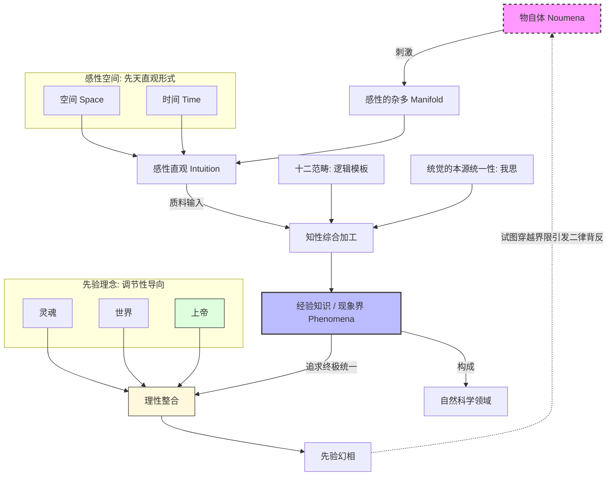

- [1. 前置](#1-前置)
- [2. 总揽图](#2-总揽图)
- [3. 前置知识](#3-前置知识)
  - [3.1. 普遍与必然](#31-普遍与必然)
  - [3.2. 先天与后天](#32-先天与后天)
  - [3.3. 分析与综合](#33-分析与综合)
  - [3.4. 先天综合判断](#34-先天综合判断)
  - [3.5. 先验(transcendental，超验)](#35-先验transcendental超验)
  - [3.6. 总结](#36-总结)
- [4. 先验感性论](#4-先验感性论)
- [5. 先验逻辑论](#5-先验逻辑论)
- [6. 先验辩证论 (Transcendental Dialectic)](#6-先验辩证论-transcendental-dialectic)
  - [6.1. 理性理念 (Transcendental Ideas)](#61-理性理念-transcendental-ideas)


## 1. 前置

- [[故事/时间]]

## 2. 总揽图

## 3. 前置知识

### 3.1. 普遍与必然

普遍：命题的适用范围（无例外）

必然：命题的真值模态（不可能为假）

### 3.2. 先天与后天

先天判断：不依赖于经验

举例：

- 一切变化都有其原因

后天判断：依赖于经验

举例：

- 这个玫瑰是红色的

### 3.3. 分析与综合

分析判断：谓语蕴含在主语中，无需经验验证，具有逻辑必然性但不扩展知识。分析判断都为先天判断。

举例：

- 这个红苹果是红的
- 三角形有三个角

综合判断：谓语不蕴含在主语中，谓词提供主词之外的新信息，扩展知识但无必然性，后天判断都为综合判断。

举例：

- 这个红苹果是甜的
- 这个程序是用C语言编写的

### 3.4. 先天综合判断

先天综合判断：既扩展知识，又具有普遍必然性，不依赖经验却适用于经验世界。

- 两点之间线段最短
- 三角形内角和为180度

### 3.5. 先验(transcendental，超验)

先验：使经验成为可能的条件

### 3.6. 总结

$$判断=先天判断\biguplus 后天判断$$

$$判断=分析判断\biguplus 综合判断$$

$$后天判断 \subseteq 综合判断$$

$$分析判断 \subseteq 先天判断$$

## 4. 先验感性论

物自体：独立于人类认知形式而存在的实在本身。它不可被直接认识，只能被思维。

感性：感性是主体（人）通过感官被动接受外部刺激并形成直观的能力。

感性的先天直观形式(纯直观):

- 时间(内感官形式)
- 空间(外感官形式)

感性接受物自体的刺激得到未定型的质料，将质料放到纯直观(形式)中得到直观。

时间和空间不是物自体本身的属性，而是人的感性的先天直观形式。

```
谦虚一点，不要认为你能洞察“物自体”的本质；
你所谈论的本质，仅仅是物自体在你的“现象界”中所呈现的性质。

这种谦虚体现在：我们必须承认，在“现象界”与“物自体”之间，
我们并不拥有建立“恒等映射”的特权。
```

```
甚至物自体也是人类认识事物的先验幻觉。

考虑一个红红的、甜甜的、脆脆的苹果
我们会产生一种无法克制的幻觉，即这些属性一定被某个物自体所统一。
```

## 5. 先验逻辑论

知性：人类心灵中主动的、规则赋予的认知能力，负责将感性提供的杂多材料综合为统一的经验知识。

所有的知识都是判断

```
{判断} = {主语} {谓语}
```

每一个判断一定有量，质，关系，模态

- 量：对主语的量的分类
  - 单称的：苏格拉底会死
  - 特称的：有些人会死
  - 全称的：所有人都会死
- 质：对谓语的质的分类
  - 肯定的：苏格拉底是会死的
  - 否定的：苏格拉底不是会死的
  - 无限的(形式上肯定， 内容上否定)：苏格拉底是不会死的
- 关系:
  - 定言的: 苏格拉底是会死的
  - 假言的: 如果今天下鱼，那么苏格拉底会死
  - 选言的: 苏格拉底要么会死，要么不会死
- 模态：
  - 必然的：苏格拉底必然会死
  - 或然的：苏格拉底可能会死
  - 实然的：苏格拉底会死


知性的判断形式对应着十二个先天范畴。

| 类别 (Class)           | 逻辑判断形式 (Judgments)                                                    | 对应的知性范畴 (Categories)                                                                                       | 认知功能简述                                                                     |
| :--------------------- | :-------------------------------------------------------------------------- | :---------------------------------------------------------------------------------------------------------------- | :------------------------------------------------------------------------------- |
| **1. 量 (Quantity)**   | **全称** (Universal)<br>**特称** (Particular)<br>**单称** (Singular)        | **全体性** (Totality)<br>**复多性** (Plurality)<br>**单一性** (Unity)                                             | 决定对象的数量属性：是将对象视为一个整体、其中的一部分还是单个个体。             |
| **2. 质 (Quality)**    | **肯定** (Affirmative)<br>**否定** (Negative)<br>**无限** (Infinite)        | **实在性** (Reality)<br>**否定性** (Negation)<br>**限制性** (Limitation)                                          | 决定对象的内容属性：对象是否存在（实），是否不存在（无），或是在特定范围内存在。 |
| **3. 关系 (Relation)** | **定言** (Categorical)<br>**假言** (Hypothetical)<br>**选言** (Disjunctive) | **实体与偶性** (Inherence/Subsistence)<br>**因果性** (Causality/Dependence)<br>**协同性** (Community/Reciprocity) | **核心**：决定对象间的逻辑联结。例如，假言判断（如果A则B）是因果范畴的逻辑基础。 |
| **4. 模态 (Modality)** | **或然** (Problematic)<br>**实然** (Assertoric)<br>**必然** (Apodeictic)    | **可能性** (Possibility)<br>**现实性** (Existence)<br>**必然性** (Necessity)                                      | 不改变对象内容，仅描述对象与我们的认知能力（思维、直观）之间的关联强度。         |

```
之所以你能感知到“因果”，不是因为物自体本身有因果，
而是因为你的知性自带“因果范畴”，并强行套在了现象上。
```

## 6. 先验辩证论 (Transcendental Dialectic)

知性处理经验，而理性 (Reason) 则处理知性。理性是人类认知的最高统帅，它天生有一种冲动：追求“无条件者”和“终极的统一”。

### 6.1. 理性理念 (Transcendental Ideas)

理性不直接面对感性直观，它试图将知性获得的所有零散知识整合成一个绝对完整的体系。这种渴望产生了三个理念：
1. **灵魂**：主观世界的绝对统一。
2. **世界**：客观世界的绝对统一。
3. **上帝**：所有存在可能性的绝对统一。

> - **非构成性**：这些理念不产生任何关于对象的知识（我们不能证明灵魂或上帝存在）。
> - **调节性**：它们像指南针，引导知性不断追求更系统的规律，防止知识停留在孤立的碎片状态。

```
科学的边界在现象界。
```

