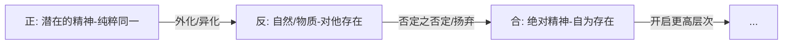

绝对精神并不是“先存在，然后决定成为自己”，
而是只有当它成为自己时，它才存在。

- [1. 前置](#1-前置)
- [2. 引言](#2-引言)
- [3. 绝对精神](#3-绝对精神)
  - [3.1. 克服“主客体对立”的必然性](#31-克服主客体对立的必然性)
    - [3.1.1. 纯粹的同一等于“虚无”](#311-纯粹的同一等于虚无)
    - [3.1.2. 认识的本质是“反思”](#312-认识的本质是反思)
    - [3.1.3. 力量只有在克服阻碍时才是真实的](#313-力量只有在克服阻碍时才是真实的)
  - [3.2. 自然是“异化”了的精神](#32-自然是异化了的精神)
  - [3.3. 历史作为“精神”的回游](#33-历史作为精神的回游)

## 1. 前置

- [[故事/纯粹理性批判]]

## 2. 引言

物自体是一种思维的极限。

先验感性、先验逻辑（知性）、先验辩证（理性）何以可能？

物自体何以被设定？

---



---

## 3. 绝对精神

```
宇宙的本质并非物质，而是一种被称为“绝对精神”的自我运动。
整个世界都是这种精神不断展开、自我实现、自我认识的过程。
```

问题在于：“意识”如何发现自身即是“世界”？

---

### 3.1. 克服“主客体对立”的必然性

常识告诉我们：“我”（主体）与“外部世界”（客体）彼此分离。

但请反思：当你观察一棵树时，你所把握的一切——绿色、坚硬、形态——都已经是被思维规定过的内容。

如果彻底剥离思维，所谓“物”只剩下不可触及、不可言说的“物自体”。

**逻辑推进：**
既然一切“存在”只能在思维中被把握，那么“存在”与“思维”在根本上具有同一性。

世界并非独立于精神之外的僵死对象，而是精神为了认识自身而设定的“他者”。

#### 3.1.1. 纯粹的同一等于“虚无”

设想一种完全没有差异、没有规定、没有对立的“纯粹精神”。

它如同一片绝对均一的白——正因没有任何区别，反而什么也无法呈现。

因此：

- “纯粹的存在”（无任何规定）
- “纯粹的无”

在逻辑上是不可区分的。

**结论：**
如果精神不产生差异，它就是空洞的、静止的、无意识的。
为了成为“有内容”的存在，精神必须生成对立。

#### 3.1.2. 认识的本质是“反思”

“认识自己”不是封闭的内省，而是一种经由他者的回返。

一个从未照镜子、从未与他人发生关系的人，不可能真正理解自身。

**为何必须外化？**
精神必须将自身投射为对象（自然、世界、他者），从而以“他者”的形式面对自己。

这就像“镜像”：

- 外部对象看似非我
- 实则是自我的展开形式

**关键在于回收：**
当精神在这个“非我”的世界中，通过实践与思考重新发现其内在逻辑属于自身时，真正的自我认识才得以完成。

#### 3.1.3. 力量只有在克服阻碍时才是真实的

真理不是一个静态结果，而是一个生成过程。

没有阻力的自由，只是空洞的可能性。

**为什么必须有对立？**

因为：

- 精神通过“否定自身”（外化为自然）
- 再通过“否定之否定”（在自然中重建理性）

才形成真正现实的自由。

**辩证结构：**

1. 自身（精神）
2. 异化（自然/他者）
3. 回归（自觉的理性）

自由，正是在这一运动中获得现实性。

---

### 3.2. 自然是“异化”了的精神

一个直接的疑问是：

如果世界本质是精神，为什么自然界显得冷漠、机械、甚至反人类？

**回答：**
这正是“异化”的结果。

精神为了从潜在走向现实，必须进入：

- 时间
- 空间
- 物质性

并呈现为自身的对立面。

自然并不是“非精神”，而是精神以“他者形式”存在。

就像：

- 艺术家的理念必须通过石头、颜料等物质媒介表达
- 绝对精神也必须通过自然这一“外在形式”展开自身

因此，自然不是精神的否定，而是精神的异乡。

---

### 3.3. 历史作为“精神”的回游

人类历史并非杂乱的偶然堆积，而是一个逐步走向自觉的过程。

这一过程表现为：

- 从本能 → 规范（法律）
- 从经验 → 表达（艺术）
- 从信仰 → 理解（宗教）
- 从表象 → 本质（哲学）

历史的本质，是精神不断将外在世界转化为理性结构的过程。

**最终时刻：**

当精神通过哲学意识到：

> 世界历史不过是自身实现自由的历程

它便完成了回归。

这就是：

**绝对知识** —— 精神不仅存在，而且知道自身为何存在。
