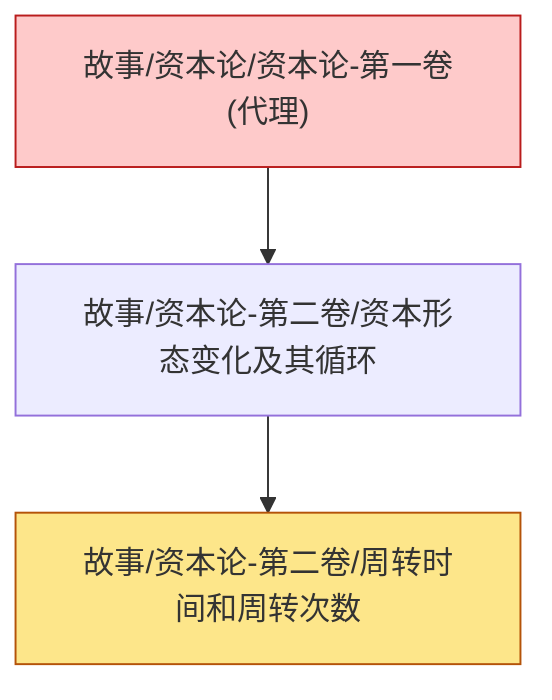

```mermaid
%%{init: {'flowchart': {'curve': 'stepAfter'}}}%%
graph TD
1["故事/资本论/资本论-第一卷(代理)"] --> 0["故事/资本论-第二卷/资本形态变化及其循环"]
0["故事/资本论-第二卷/资本形态变化及其循环"] --> 2["故事/资本论-第二卷/周转时间和周转次数"]
classDef leaf fill:#fde68a,stroke:#b45309
class 2 leaf
classDef externalRoot fill:#fecaca,stroke:#b91c1c
class 1 externalRoot
click 0 "/故事/资本论-第二卷/资本形态变化及其循环" "故事/资本论-第二卷/资本形态变化及其循环"
click 1 "/故事/资本论/资本论-第一卷(代理)" "故事/资本论/资本论-第一卷(代理)"
click 2 "/故事/资本论-第二卷/周转时间和周转次数" "故事/资本论-第二卷/周转时间和周转次数"
```