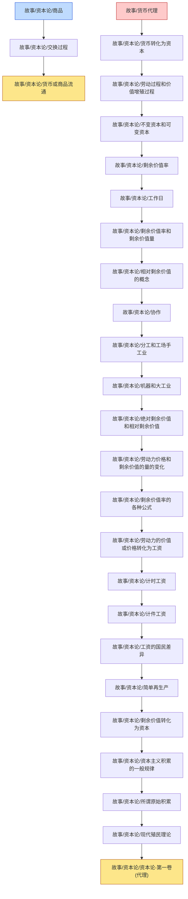

```mermaid
graph TD
1["故事/资本论/不变资本和可变资本"] --> 0["故事/资本论/剩余价值率"]
3["故事/资本论/所谓原始积累"] --> 2["故事/资本论/现代殖民理论"]
5["故事/资本论/交换过程"] --> 4["故事/资本论/货币或商品流通"]
7["故事/资本论/剩余价值转化为资本"] --> 6["故事/资本论/资本主义积累的一般规律"]
9["故事/资本论/劳动力的价值或价格转化为工资"] --> 8["故事/资本论/计时工资"]
11["故事/资本论/机器和大工业"] --> 10["故事/资本论/绝对剩余价值和相对剩余价值"]
2["故事/资本论/现代殖民理论"] --> 12["故事/资本论/资本论-第一卷(代理)"]
14["故事/资本论/货币转化为资本"] --> 13["故事/资本论/劳动过程和价值增殖过程"]
13["故事/资本论/劳动过程和价值增殖过程"] --> 1["故事/资本论/不变资本和可变资本"]
16["故事/资本论/相对剩余价值的概念"] --> 15["故事/资本论/协作"]
6["故事/资本论/资本主义积累的一般规律"] --> 3["故事/资本论/所谓原始积累"]
17["故事/资本论/分工和工场手工业"] --> 11["故事/资本论/机器和大工业"]
18["故事/货币代理"] --> 14["故事/资本论/货币转化为资本"]
19["故事/资本论/商品"] --> 5["故事/资本论/交换过程"]
21["故事/资本论/工资的国民差异"] --> 20["故事/资本论/简单再生产"]
8["故事/资本论/计时工资"] --> 22["故事/资本论/计件工资"]
10["故事/资本论/绝对剩余价值和相对剩余价值"] --> 23["故事/资本论/劳动力价格和剩余价值的量的变化"]
20["故事/资本论/简单再生产"] --> 7["故事/资本论/剩余价值转化为资本"]
22["故事/资本论/计件工资"] --> 21["故事/资本论/工资的国民差异"]
15["故事/资本论/协作"] --> 17["故事/资本论/分工和工场手工业"]
24["故事/资本论/剩余价值率的各种公式"] --> 9["故事/资本论/劳动力的价值或价格转化为工资"]
26["故事/资本论/工作日"] --> 25["故事/资本论/剩余价值率和剩余价值量"]
23["故事/资本论/劳动力价格和剩余价值的量的变化"] --> 24["故事/资本论/剩余价值率的各种公式"]
25["故事/资本论/剩余价值率和剩余价值量"] --> 16["故事/资本论/相对剩余价值的概念"]
0["故事/资本论/剩余价值率"] --> 26["故事/资本论/工作日"]
classDef leaf fill:#fde68a,stroke:#b45309
class 4,12 leaf
classDef root fill:#bfdbfe,stroke:#1d4ed8
class 19 root
classDef externalRoot fill:#fecaca,stroke:#b91c1c
class 18 externalRoot
click 0 "/故事/资本论/剩余价值率" "故事/资本论/剩余价值率"
click 1 "/故事/资本论/不变资本和可变资本" "故事/资本论/不变资本和可变资本"
click 2 "/故事/资本论/现代殖民理论" "故事/资本论/现代殖民理论"
click 3 "/故事/资本论/所谓原始积累" "故事/资本论/所谓原始积累"
click 4 "/故事/资本论/货币或商品流通" "故事/资本论/货币或商品流通"
click 5 "/故事/资本论/交换过程" "故事/资本论/交换过程"
click 6 "/故事/资本论/资本主义积累的一般规律" "故事/资本论/资本主义积累的一般规律"
click 7 "/故事/资本论/剩余价值转化为资本" "故事/资本论/剩余价值转化为资本"
click 8 "/故事/资本论/计时工资" "故事/资本论/计时工资"
click 9 "/故事/资本论/劳动力的价值或价格转化为工资" "故事/资本论/劳动力的价值或价格转化为工资"
click 10 "/故事/资本论/绝对剩余价值和相对剩余价值" "故事/资本论/绝对剩余价值和相对剩余价值"
click 11 "/故事/资本论/机器和大工业" "故事/资本论/机器和大工业"
click 12 "/故事/资本论/资本论-第一卷(代理)" "故事/资本论/资本论-第一卷(代理)"
click 13 "/故事/资本论/劳动过程和价值增殖过程" "故事/资本论/劳动过程和价值增殖过程"
click 14 "/故事/资本论/货币转化为资本" "故事/资本论/货币转化为资本"
click 15 "/故事/资本论/协作" "故事/资本论/协作"
click 16 "/故事/资本论/相对剩余价值的概念" "故事/资本论/相对剩余价值的概念"
click 17 "/故事/资本论/分工和工场手工业" "故事/资本论/分工和工场手工业"
click 18 "/故事/货币代理" "故事/货币代理"
click 19 "/故事/资本论/商品" "故事/资本论/商品"
click 20 "/故事/资本论/简单再生产" "故事/资本论/简单再生产"
click 21 "/故事/资本论/工资的国民差异" "故事/资本论/工资的国民差异"
click 22 "/故事/资本论/计件工资" "故事/资本论/计件工资"
click 23 "/故事/资本论/劳动力价格和剩余价值的量的变化" "故事/资本论/劳动力价格和剩余价值的量的变化"
click 24 "/故事/资本论/剩余价值率的各种公式" "故事/资本论/剩余价值率的各种公式"
click 25 "/故事/资本论/剩余价值率和剩余价值量" "故事/资本论/剩余价值率和剩余价值量"
click 26 "/故事/资本论/工作日" "故事/资本论/工作日"
```