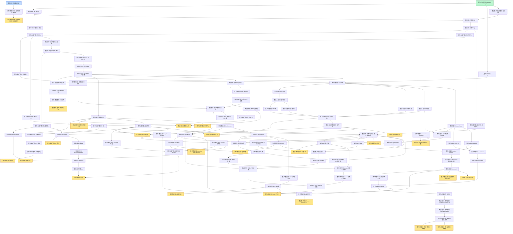

```mermaid
graph TD
1["数学/数理逻辑/一阶逻辑"] --> 0["数学/数理逻辑/一阶逻辑演算"]
2["数学/数理逻辑/命题逻辑演算"] --> 1["数学/数理逻辑/一阶逻辑"]
3["数学/数理逻辑/命题逻辑"] --> 2["数学/数理逻辑/命题逻辑演算"]
4["数学/朴素集合论/朴素集合论(代理)"] --> 3["数学/数理逻辑/命题逻辑"]
4["数学/朴素集合论/朴素集合论(代理)"] --> 5["数学/点集拓扑/拓扑空间"]
6["数学/朴素集合论/zorn_lemma"] --> 5["数学/点集拓扑/拓扑空间"]
8["数学/点集拓扑/子空间"] --> 7["数学/点集拓扑/连续映射"]
5["数学/点集拓扑/拓扑空间"] --> 8["数学/点集拓扑/子空间"]
10["数学/数学分析/real-number"] --> 9["数学/点集拓扑/度量空间"]
11["数学/点集拓扑/点集拓扑(代理)"] --> 9["数学/点集拓扑/度量空间"]
7["数学/点集拓扑/连续映射"] --> 12["数学/点集拓扑/紧空间"]
9["数学/点集拓扑/度量空间"] --> 13["数学/点集拓扑/product-metric-space"]
12["数学/点集拓扑/紧空间"] --> 11["数学/点集拓扑/点集拓扑(代理)"]
14["数学/点集拓扑/连通空间"] --> 11["数学/点集拓扑/点集拓扑(代理)"]
15["数学/点集拓扑/乘积空间"] --> 11["数学/点集拓扑/点集拓扑(代理)"]
16["数学/点集拓扑/序拓扑"] --> 11["数学/点集拓扑/点集拓扑(代理)"]
7["数学/点集拓扑/连续映射"] --> 14["数学/点集拓扑/连通空间"]
5["数学/点集拓扑/拓扑空间"] --> 15["数学/点集拓扑/乘积空间"]
5["数学/点集拓扑/拓扑空间"] --> 16["数学/点集拓扑/序拓扑"]
18["数学/测度论/测度论代理"] --> 17["数学/概率论/事件或事件类的独立性"]
17["数学/概率论/事件或事件类的独立性"] --> 19["数学/概率论/随机变量或随机变量族的独立性"]
21["数学/抽象代数/群论(群作用)"] --> 20["数学/抽象代数/群表示"]
22["数学/抽象代数/向量空间(内部直和)"] --> 20["数学/抽象代数/群表示"]
24["数学/抽象代数/向量空间(赋范向量空间)"] --> 23["数学/抽象代数/代数"]
26["数学/抽象代数/群论(循环群)"] --> 25["数学/抽象代数/环论(有限环)"]
28["数学/抽象代数/环论(一)"] --> 27["数学/抽象代数/环论(二)"]
29["数学/抽象代数/同态映射"] --> 27["数学/抽象代数/环论(二)"]
24["数学/抽象代数/向量空间(赋范向量空间)"] --> 30["数学/抽象代数/向量空间(内积空间)"]
31["数学/数学分析/complex-number"] --> 30["数学/抽象代数/向量空间(内积空间)"]
25["数学/抽象代数/环论(有限环)"] --> 32["数学/抽象代数/环论(杂)"]
33["数学/抽象代数/环论(多项式环)"] --> 32["数学/抽象代数/环论(杂)"]
35["数学/朴素集合论/naive-set-theory-1"] --> 34["数学/抽象代数/二元运算"]
37["数学/抽象代数/群论(二)"] --> 36["数学/抽象代数/群论(杂)"]
26["数学/抽象代数/群论(循环群)"] --> 36["数学/抽象代数/群论(杂)"]
39["数学/抽象代数/向量空间"] --> 38["数学/抽象代数/对偶空间"]
40["数学/抽象代数/拓扑向量空间"] --> 38["数学/抽象代数/对偶空间"]
42["数学/抽象代数/域论(域拓展)"] --> 41["数学/抽象代数/形式导数"]
4["数学/朴素集合论/朴素集合论(代理)"] --> 37["数学/抽象代数/群论(二)"]
43["数学/抽象代数/群论(幂运算)"] --> 26["数学/抽象代数/群论(循环群)"]
43["数学/抽象代数/群论(幂运算)"] --> 44["数学/抽象代数/环论(幂运算)"]
37["数学/抽象代数/群论(二)"] --> 21["数学/抽象代数/群论(群作用)"]
45["数学/抽象代数/群论(置换群)"] --> 21["数学/抽象代数/群论(群作用)"]
24["数学/抽象代数/向量空间(赋范向量空间)"] --> 46["数学/抽象代数/格"]
27["数学/抽象代数/环论(二)"] --> 47["数学/抽象代数/环论(商域)"]
48["数学/抽象代数/群论(一)"] --> 28["数学/抽象代数/环论(一)"]
44["数学/抽象代数/环论(幂运算)"] --> 49["数学/抽象代数/环论(二项式定理)"]
37["数学/抽象代数/群论(二)"] --> 50["数学/抽象代数/群论(高等群论)"]
52["数学/抽象代数/域论(有限域)"] --> 51["数学/抽象代数/Galois"]
53["数学/数学分析/实数构造/自然数"] --> 48["数学/抽象代数/群论(一)"]
34["数学/抽象代数/二元运算"] --> 48["数学/抽象代数/群论(一)"]
54["数学/抽象代数/向量空间(商空间)"] --> 22["数学/抽象代数/向量空间(内部直和)"]
30["数学/抽象代数/向量空间(内积空间)"] --> 22["数学/抽象代数/向量空间(内部直和)"]
37["数学/抽象代数/群论(二)"] --> 39["数学/抽象代数/向量空间"]
40["数学/抽象代数/拓扑向量空间"] --> 55["数学/抽象代数/抽象导数"]
11["数学/点集拓扑/点集拓扑(代理)"] --> 40["数学/抽象代数/拓扑向量空间"]
28["数学/抽象代数/环论(一)"] --> 56["数学/抽象代数/环论(有序环)"]
28["数学/抽象代数/环论(一)"] --> 57["数学/抽象代数/域论(带绝对值的域)"]
39["数学/抽象代数/向量空间"] --> 24["数学/抽象代数/向量空间(赋范向量空间)"]
57["数学/抽象代数/域论(带绝对值的域)"] --> 24["数学/抽象代数/向量空间(赋范向量空间)"]
27["数学/抽象代数/环论(二)"] --> 33["数学/抽象代数/环论(多项式环)"]
32["数学/抽象代数/环论(杂)"] --> 42["数学/抽象代数/域论(域拓展)"]
39["数学/抽象代数/向量空间"] --> 42["数学/抽象代数/域论(域拓展)"]
41["数学/抽象代数/形式导数"] --> 52["数学/抽象代数/域论(有限域)"]
4["数学/朴素集合论/朴素集合论(代理)"] --> 43["数学/抽象代数/群论(幂运算)"]
39["数学/抽象代数/向量空间"] --> 54["数学/抽象代数/向量空间(商空间)"]
37["数学/抽象代数/群论(二)"] --> 58["数学/抽象代数/群论(群列)"]
34["数学/抽象代数/二元运算"] --> 29["数学/抽象代数/同态映射"]
59["数学/朴素集合论/初等数论"] --> 45["数学/抽象代数/群论(置换群)"]
39["数学/抽象代数/向量空间"] --> 60["数学/抽象代数/函数空间"]
40["数学/抽象代数/拓扑向量空间"] --> 60["数学/抽象代数/函数空间"]
62["数学/测度论/分布函数的类型及分解"] --> 61["数学/测度论/一维离散分布的例子"]
5["数学/点集拓扑/拓扑空间"] --> 63["数学/测度论/class-of-sets"]
65["数学/测度论/S-integral"] --> 64["数学/测度论/符号测度"]
67["数学/测度论/measurable-mapping"] --> 66["数学/测度论/积空间sigma代数"]
62["数学/测度论/分布函数的类型及分解"] --> 68["数学/测度论/一维连续分布的例子"]
63["数学/测度论/class-of-sets"] --> 67["数学/测度论/measurable-mapping"]
63["数学/测度论/class-of-sets"] --> 69["数学/测度论/与R相关的Borel集"]
16["数学/点集拓扑/序拓扑"] --> 69["数学/测度论/与R相关的Borel集"]
67["数学/测度论/measurable-mapping"] --> 70["数学/测度论/measurable-function"]
71["数学/数学分析/converge"] --> 70["数学/测度论/measurable-function"]
69["数学/测度论/与R相关的Borel集"] --> 70["数学/测度论/measurable-function"]
73["数学/测度论/measure"] --> 72["数学/测度论/L-S-measure"]
74["数学/测度论/semi-ring"] --> 72["数学/测度论/L-S-measure"]
70["数学/测度论/measurable-function"] --> 75["数学/测度论/random-element"]
73["数学/测度论/measure"] --> 75["数学/测度论/random-element"]
63["数学/测度论/class-of-sets"] --> 74["数学/测度论/semi-ring"]
77["数学/测度论/L-integral"] --> 76["数学/测度论/三大积分收敛定理"]
64["数学/测度论/符号测度"] --> 78["数学/测度论/绝对连续与Radon-Nikodým定理"]
63["数学/测度论/class-of-sets"] --> 73["数学/测度论/measure"]
75["数学/测度论/random-element"] --> 79["数学/测度论/几乎处处收敛和依测度收敛"]
72["数学/测度论/L-S-measure"] --> 80["数学/测度论/L-measure"]
76["数学/测度论/三大积分收敛定理"] --> 65["数学/测度论/S-integral"]
80["数学/测度论/L-measure"] --> 65["数学/测度论/S-integral"]
78["数学/测度论/绝对连续与Radon-Nikodým定理"] --> 81["数学/测度论/相互奇异与Lebesgue分解定理"]
79["数学/测度论/几乎处处收敛和依测度收敛"] --> 77["数学/测度论/L-integral"]
81["数学/测度论/相互奇异与Lebesgue分解定理"] --> 62["数学/测度论/分布函数的类型及分解"]
83["数学/线性代数/svd"] --> 82["数学/线性代数/伪逆"]
22["数学/抽象代数/向量空间(内部直和)"] --> 82["数学/线性代数/伪逆"]
85["数学/线性代数/matrix"] --> 84["数学/线性代数/矩阵乘法"]
85["数学/线性代数/matrix"] --> 86["数学/线性代数/rank"]
39["数学/抽象代数/向量空间"] --> 85["数学/线性代数/matrix"]
45["数学/抽象代数/群论(置换群)"] --> 85["数学/线性代数/matrix"]
86["数学/线性代数/rank"] --> 87["数学/线性代数/diagonalization"]
88["数学/线性代数/norm"] --> 83["数学/线性代数/svd"]
87["数学/线性代数/diagonalization"] --> 88["数学/线性代数/norm"]
35["数学/朴素集合论/naive-set-theory-1"] --> 6["数学/朴素集合论/zorn_lemma"]
89["数学/数学分析/实数构造/整数"] --> 59["数学/朴素集合论/初等数论"]
91["数学/朴素集合论/naive-set-theory-2"] --> 90["数学/朴素集合论/计数原理"]
59["数学/朴素集合论/初等数论"] --> 91["数学/朴素集合论/naive-set-theory-2"]
90["数学/朴素集合论/计数原理"] --> 4["数学/朴素集合论/朴素集合论(代理)"]
24["数学/抽象代数/向量空间(赋范向量空间)"] --> 92["数学/数学分析/有限维赋范线性空间"]
9["数学/点集拓扑/度量空间"] --> 92["数学/数学分析/有限维赋范线性空间"]
23["数学/抽象代数/代数"] --> 93["数学/数学分析/Rn-代数-格"]
46["数学/抽象代数/格"] --> 93["数学/数学分析/Rn-代数-格"]
92["数学/数学分析/有限维赋范线性空间"] --> 93["数学/数学分析/Rn-代数-格"]
95["数学/数学分析/非负级数"] --> 94["数学/数学分析/级数"]
97["数学/数学分析/derivate"] --> 96["数学/数学分析/微分中值定理"]
9["数学/点集拓扑/度量空间"] --> 96["数学/数学分析/微分中值定理"]
99["数学/数学分析/赋范向量空间上的级数"] --> 98["数学/数学分析/banach代数上的级数"]
23["数学/抽象代数/代数"] --> 98["数学/数学分析/banach代数上的级数"]
100["数学/数学分析/一些标准的级数"] --> 98["数学/数学分析/banach代数上的级数"]
102["数学/数学分析/实数次幂"] --> 101["数学/数学分析/实数(代理)"]
94["数学/数学分析/级数"] --> 100["数学/数学分析/一些标准的级数"]
98["数学/数学分析/banach代数上的级数"] --> 103["数学/数学分析/banach代数上的指数"]
30["数学/抽象代数/向量空间(内积空间)"] --> 104["数学/数学分析/complex-inner-product"]
13["数学/点集拓扑/product-metric-space"] --> 104["数学/数学分析/complex-inner-product"]
102["数学/数学分析/实数次幂"] --> 105["数学/数学分析/holder不等式"]
106["数学/数学分析/一些标准的导数"] --> 105["数学/数学分析/holder不等式"]
31["数学/数学分析/complex-number"] --> 105["数学/数学分析/holder不等式"]
77["数学/测度论/L-integral"] --> 105["数学/数学分析/holder不等式"]
96["数学/数学分析/微分中值定理"] --> 106["数学/数学分析/一些标准的导数"]
103["数学/数学分析/banach代数上的指数"] --> 106["数学/数学分析/一些标准的导数"]
108["数学/数学分析/funct-limit"] --> 107["数学/数学分析/连续函数"]
13["数学/点集拓扑/product-metric-space"] --> 107["数学/数学分析/连续函数"]
109["数学/数学分析/无穷小"] --> 97["数学/数学分析/derivate"]
10["数学/数学分析/real-number"] --> 71["数学/数学分析/converge"]
110["数学/数学分析/一些标准的极限"] --> 102["数学/数学分析/实数次幂"]
71["数学/数学分析/converge"] --> 95["数学/数学分析/非负级数"]
24["数学/抽象代数/向量空间(赋范向量空间)"] --> 111["数学/数学分析/范数"]
77["数学/测度论/L-integral"] --> 112["数学/数学分析/复值可测函数的L积分"]
24["数学/抽象代数/向量空间(赋范向量空间)"] --> 109["数学/数学分析/无穷小"]
108["数学/数学分析/funct-limit"] --> 109["数学/数学分析/无穷小"]
24["数学/抽象代数/向量空间(赋范向量空间)"] --> 99["数学/数学分析/赋范向量空间上的级数"]
94["数学/数学分析/级数"] --> 99["数学/数学分析/赋范向量空间上的级数"]
71["数学/数学分析/converge"] --> 108["数学/数学分析/funct-limit"]
113["数学/数学分析/实数构造/实数"] --> 31["数学/数学分析/complex-number"]
71["数学/数学分析/converge"] --> 110["数学/数学分析/一些标准的极限"]
114["数学/数学分析/实数构造/广义实数"] --> 10["数学/数学分析/real-number"]
9["数学/点集拓扑/度量空间"] --> 115["数学/数学分析/函数序列"]
65["数学/测度论/S-integral"] --> 115["数学/数学分析/函数序列"]
77["数学/测度论/L-integral"] --> 116["数学/数学分析/平方可积"]
115["数学/数学分析/函数序列"] --> 117["数学/数学分析/Stone–Weierstrass"]
118["数学/数学分析/实数构造/有理数"] --> 113["数学/数学分析/实数构造/实数"]
49["数学/抽象代数/环论(二项式定理)"] --> 113["数学/数学分析/实数构造/实数"]
47["数学/抽象代数/环论(商域)"] --> 118["数学/数学分析/实数构造/有理数"]
4["数学/朴素集合论/朴素集合论(代理)"] --> 118["数学/数学分析/实数构造/有理数"]
113["数学/数学分析/实数构造/实数"] --> 114["数学/数学分析/实数构造/广义实数"]
35["数学/朴素集合论/naive-set-theory-1"] --> 53["数学/数学分析/实数构造/自然数"]
27["数学/抽象代数/环论(二)"] --> 89["数学/数学分析/实数构造/整数"]
56["数学/抽象代数/环论(有序环)"] --> 89["数学/数学分析/实数构造/整数"]
classDef leaf fill:#fde68a,stroke:#b45309
class 0,19,20,36,38,50,51,55,58,60,61,66,68,82,84,93,101,104,105,107,111,112,116,117 leaf
classDef root fill:#bfdbfe,stroke:#1d4ed8
class 18 root
classDef foundationRoot fill:#bbf7d0,stroke:#15803d
class 35 foundationRoot
click 0 "/数学/数理逻辑/一阶逻辑演算" "数学/数理逻辑/一阶逻辑演算"
click 1 "/数学/数理逻辑/一阶逻辑" "数学/数理逻辑/一阶逻辑"
click 2 "/数学/数理逻辑/命题逻辑演算" "数学/数理逻辑/命题逻辑演算"
click 3 "/数学/数理逻辑/命题逻辑" "数学/数理逻辑/命题逻辑"
click 4 "/数学/朴素集合论/朴素集合论(代理)" "数学/朴素集合论/朴素集合论(代理)"
click 5 "/数学/点集拓扑/拓扑空间" "数学/点集拓扑/拓扑空间"
click 6 "/数学/朴素集合论/zorn_lemma" "数学/朴素集合论/zorn_lemma"
click 7 "/数学/点集拓扑/连续映射" "数学/点集拓扑/连续映射"
click 8 "/数学/点集拓扑/子空间" "数学/点集拓扑/子空间"
click 9 "/数学/点集拓扑/度量空间" "数学/点集拓扑/度量空间"
click 10 "/数学/数学分析/real-number" "数学/数学分析/real-number"
click 11 "/数学/点集拓扑/点集拓扑(代理)" "数学/点集拓扑/点集拓扑(代理)"
click 12 "/数学/点集拓扑/紧空间" "数学/点集拓扑/紧空间"
click 13 "/数学/点集拓扑/product-metric-space" "数学/点集拓扑/product-metric-space"
click 14 "/数学/点集拓扑/连通空间" "数学/点集拓扑/连通空间"
click 15 "/数学/点集拓扑/乘积空间" "数学/点集拓扑/乘积空间"
click 16 "/数学/点集拓扑/序拓扑" "数学/点集拓扑/序拓扑"
click 17 "/数学/概率论/事件或事件类的独立性" "数学/概率论/事件或事件类的独立性"
click 18 "/数学/测度论/测度论代理" "数学/测度论/测度论代理"
click 19 "/数学/概率论/随机变量或随机变量族的独立性" "数学/概率论/随机变量或随机变量族的独立性"
click 20 "/数学/抽象代数/群表示" "数学/抽象代数/群表示"
click 21 "/数学/抽象代数/群论(群作用)" "数学/抽象代数/群论(群作用)"
click 22 "/数学/抽象代数/向量空间(内部直和)" "数学/抽象代数/向量空间(内部直和)"
click 23 "/数学/抽象代数/代数" "数学/抽象代数/代数"
click 24 "/数学/抽象代数/向量空间(赋范向量空间)" "数学/抽象代数/向量空间(赋范向量空间)"
click 25 "/数学/抽象代数/环论(有限环)" "数学/抽象代数/环论(有限环)"
click 26 "/数学/抽象代数/群论(循环群)" "数学/抽象代数/群论(循环群)"
click 27 "/数学/抽象代数/环论(二)" "数学/抽象代数/环论(二)"
click 28 "/数学/抽象代数/环论(一)" "数学/抽象代数/环论(一)"
click 29 "/数学/抽象代数/同态映射" "数学/抽象代数/同态映射"
click 30 "/数学/抽象代数/向量空间(内积空间)" "数学/抽象代数/向量空间(内积空间)"
click 31 "/数学/数学分析/complex-number" "数学/数学分析/complex-number"
click 32 "/数学/抽象代数/环论(杂)" "数学/抽象代数/环论(杂)"
click 33 "/数学/抽象代数/环论(多项式环)" "数学/抽象代数/环论(多项式环)"
click 34 "/数学/抽象代数/二元运算" "数学/抽象代数/二元运算"
click 35 "/数学/朴素集合论/naive-set-theory-1" "数学/朴素集合论/naive-set-theory-1"
click 36 "/数学/抽象代数/群论(杂)" "数学/抽象代数/群论(杂)"
click 37 "/数学/抽象代数/群论(二)" "数学/抽象代数/群论(二)"
click 38 "/数学/抽象代数/对偶空间" "数学/抽象代数/对偶空间"
click 39 "/数学/抽象代数/向量空间" "数学/抽象代数/向量空间"
click 40 "/数学/抽象代数/拓扑向量空间" "数学/抽象代数/拓扑向量空间"
click 41 "/数学/抽象代数/形式导数" "数学/抽象代数/形式导数"
click 42 "/数学/抽象代数/域论(域拓展)" "数学/抽象代数/域论(域拓展)"
click 43 "/数学/抽象代数/群论(幂运算)" "数学/抽象代数/群论(幂运算)"
click 44 "/数学/抽象代数/环论(幂运算)" "数学/抽象代数/环论(幂运算)"
click 45 "/数学/抽象代数/群论(置换群)" "数学/抽象代数/群论(置换群)"
click 46 "/数学/抽象代数/格" "数学/抽象代数/格"
click 47 "/数学/抽象代数/环论(商域)" "数学/抽象代数/环论(商域)"
click 48 "/数学/抽象代数/群论(一)" "数学/抽象代数/群论(一)"
click 49 "/数学/抽象代数/环论(二项式定理)" "数学/抽象代数/环论(二项式定理)"
click 50 "/数学/抽象代数/群论(高等群论)" "数学/抽象代数/群论(高等群论)"
click 51 "/数学/抽象代数/galois" "数学/抽象代数/Galois"
click 52 "/数学/抽象代数/域论(有限域)" "数学/抽象代数/域论(有限域)"
click 53 "/数学/数学分析/实数构造/自然数" "数学/数学分析/实数构造/自然数"
click 54 "/数学/抽象代数/向量空间(商空间)" "数学/抽象代数/向量空间(商空间)"
click 55 "/数学/抽象代数/抽象导数" "数学/抽象代数/抽象导数"
click 56 "/数学/抽象代数/环论(有序环)" "数学/抽象代数/环论(有序环)"
click 57 "/数学/抽象代数/域论(带绝对值的域)" "数学/抽象代数/域论(带绝对值的域)"
click 58 "/数学/抽象代数/群论(群列)" "数学/抽象代数/群论(群列)"
click 59 "/数学/朴素集合论/初等数论" "数学/朴素集合论/初等数论"
click 60 "/数学/抽象代数/函数空间" "数学/抽象代数/函数空间"
click 61 "/数学/测度论/一维离散分布的例子" "数学/测度论/一维离散分布的例子"
click 62 "/数学/测度论/分布函数的类型及分解" "数学/测度论/分布函数的类型及分解"
click 63 "/数学/测度论/class-of-sets" "数学/测度论/class-of-sets"
click 64 "/数学/测度论/符号测度" "数学/测度论/符号测度"
click 65 "/数学/测度论/s-integral" "数学/测度论/S-integral"
click 66 "/数学/测度论/积空间sigma代数" "数学/测度论/积空间sigma代数"
click 67 "/数学/测度论/measurable-mapping" "数学/测度论/measurable-mapping"
click 68 "/数学/测度论/一维连续分布的例子" "数学/测度论/一维连续分布的例子"
click 69 "/数学/测度论/与r相关的borel集" "数学/测度论/与R相关的Borel集"
click 70 "/数学/测度论/measurable-function" "数学/测度论/measurable-function"
click 71 "/数学/数学分析/converge" "数学/数学分析/converge"
click 72 "/数学/测度论/l-s-measure" "数学/测度论/L-S-measure"
click 73 "/数学/测度论/measure" "数学/测度论/measure"
click 74 "/数学/测度论/semi-ring" "数学/测度论/semi-ring"
click 75 "/数学/测度论/random-element" "数学/测度论/random-element"
click 76 "/数学/测度论/三大积分收敛定理" "数学/测度论/三大积分收敛定理"
click 77 "/数学/测度论/l-integral" "数学/测度论/L-integral"
click 78 "/数学/测度论/绝对连续与radon-nikodým定理" "数学/测度论/绝对连续与Radon-Nikodým定理"
click 79 "/数学/测度论/几乎处处收敛和依测度收敛" "数学/测度论/几乎处处收敛和依测度收敛"
click 80 "/数学/测度论/l-measure" "数学/测度论/L-measure"
click 81 "/数学/测度论/相互奇异与lebesgue分解定理" "数学/测度论/相互奇异与Lebesgue分解定理"
click 82 "/数学/线性代数/伪逆" "数学/线性代数/伪逆"
click 83 "/数学/线性代数/svd" "数学/线性代数/svd"
click 84 "/数学/线性代数/矩阵乘法" "数学/线性代数/矩阵乘法"
click 85 "/数学/线性代数/matrix" "数学/线性代数/matrix"
click 86 "/数学/线性代数/rank" "数学/线性代数/rank"
click 87 "/数学/线性代数/diagonalization" "数学/线性代数/diagonalization"
click 88 "/数学/线性代数/norm" "数学/线性代数/norm"
click 89 "/数学/数学分析/实数构造/整数" "数学/数学分析/实数构造/整数"
click 90 "/数学/朴素集合论/计数原理" "数学/朴素集合论/计数原理"
click 91 "/数学/朴素集合论/naive-set-theory-2" "数学/朴素集合论/naive-set-theory-2"
click 92 "/数学/数学分析/有限维赋范线性空间" "数学/数学分析/有限维赋范线性空间"
click 93 "/数学/数学分析/rn-代数-格" "数学/数学分析/Rn-代数-格"
click 94 "/数学/数学分析/级数" "数学/数学分析/级数"
click 95 "/数学/数学分析/非负级数" "数学/数学分析/非负级数"
click 96 "/数学/数学分析/微分中值定理" "数学/数学分析/微分中值定理"
click 97 "/数学/数学分析/derivate" "数学/数学分析/derivate"
click 98 "/数学/数学分析/banach代数上的级数" "数学/数学分析/banach代数上的级数"
click 99 "/数学/数学分析/赋范向量空间上的级数" "数学/数学分析/赋范向量空间上的级数"
click 100 "/数学/数学分析/一些标准的级数" "数学/数学分析/一些标准的级数"
click 101 "/数学/数学分析/实数(代理)" "数学/数学分析/实数(代理)"
click 102 "/数学/数学分析/实数次幂" "数学/数学分析/实数次幂"
click 103 "/数学/数学分析/banach代数上的指数" "数学/数学分析/banach代数上的指数"
click 104 "/数学/数学分析/complex-inner-product" "数学/数学分析/complex-inner-product"
click 105 "/数学/数学分析/holder不等式" "数学/数学分析/holder不等式"
click 106 "/数学/数学分析/一些标准的导数" "数学/数学分析/一些标准的导数"
click 107 "/数学/数学分析/连续函数" "数学/数学分析/连续函数"
click 108 "/数学/数学分析/funct-limit" "数学/数学分析/funct-limit"
click 109 "/数学/数学分析/无穷小" "数学/数学分析/无穷小"
click 110 "/数学/数学分析/一些标准的极限" "数学/数学分析/一些标准的极限"
click 111 "/数学/数学分析/范数" "数学/数学分析/范数"
click 112 "/数学/数学分析/复值可测函数的l积分" "数学/数学分析/复值可测函数的L积分"
click 113 "/数学/数学分析/实数构造/实数" "数学/数学分析/实数构造/实数"
click 114 "/数学/数学分析/实数构造/广义实数" "数学/数学分析/实数构造/广义实数"
click 115 "/数学/数学分析/函数序列" "数学/数学分析/函数序列"
click 116 "/数学/数学分析/平方可积" "数学/数学分析/平方可积"
click 117 "/数学/数学分析/stone–weierstrass" "数学/数学分析/Stone–Weierstrass"
click 118 "/数学/数学分析/实数构造/有理数" "数学/数学分析/实数构造/有理数"
```