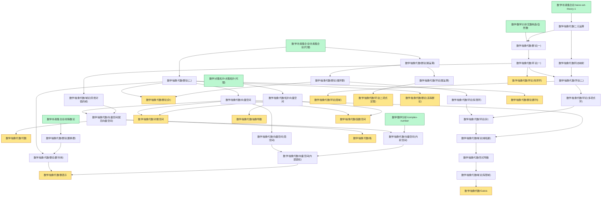

```mermaid
graph TD
1["数学/抽象代数/群论(群作用)"] --> 0["数学/抽象代数/群表示"]
2["数学/抽象代数/向量空间(内部直和)"] --> 0["数学/抽象代数/群表示"]
4["数学/抽象代数/向量空间(赋范向量空间)"] --> 3["数学/抽象代数/代数"]
6["数学/抽象代数/群论(循环群)"] --> 5["数学/抽象代数/环论(有限环)"]
8["数学/抽象代数/环论(一)"] --> 7["数学/抽象代数/环论(二)"]
9["数学/抽象代数/同态映射"] --> 7["数学/抽象代数/环论(二)"]
4["数学/抽象代数/向量空间(赋范向量空间)"] --> 10["数学/抽象代数/向量空间(内积空间)"]
11["数学/数学分析/complex-number"] --> 10["数学/抽象代数/向量空间(内积空间)"]
5["数学/抽象代数/环论(有限环)"] --> 12["数学/抽象代数/环论(杂)"]
13["数学/抽象代数/环论(多项式环)"] --> 12["数学/抽象代数/环论(杂)"]
15["数学/朴素集合论/naive-set-theory-1"] --> 14["数学/抽象代数/二元运算"]
17["数学/抽象代数/群论(二)"] --> 16["数学/抽象代数/群论(杂)"]
6["数学/抽象代数/群论(循环群)"] --> 16["数学/抽象代数/群论(杂)"]
19["数学/抽象代数/向量空间"] --> 18["数学/抽象代数/对偶空间"]
20["数学/抽象代数/拓扑向量空间"] --> 18["数学/抽象代数/对偶空间"]
22["数学/抽象代数/域论(域拓展)"] --> 21["数学/抽象代数/形式导数"]
23["数学/朴素集合论/朴素集合论(代理)"] --> 17["数学/抽象代数/群论(二)"]
24["数学/抽象代数/群论(幂运算)"] --> 6["数学/抽象代数/群论(循环群)"]
24["数学/抽象代数/群论(幂运算)"] --> 25["数学/抽象代数/环论(幂运算)"]
17["数学/抽象代数/群论(二)"] --> 1["数学/抽象代数/群论(群作用)"]
26["数学/抽象代数/群论(置换群)"] --> 1["数学/抽象代数/群论(群作用)"]
4["数学/抽象代数/向量空间(赋范向量空间)"] --> 27["数学/抽象代数/格"]
7["数学/抽象代数/环论(二)"] --> 28["数学/抽象代数/环论(商域)"]
29["数学/抽象代数/群论(一)"] --> 8["数学/抽象代数/环论(一)"]
25["数学/抽象代数/环论(幂运算)"] --> 30["数学/抽象代数/环论(二项式定理)"]
17["数学/抽象代数/群论(二)"] --> 31["数学/抽象代数/群论(高等群论)"]
33["数学/抽象代数/域论(有限域)"] --> 32["数学/抽象代数/Galois"]
34["数学/数学分析/实数构造/自然数"] --> 29["数学/抽象代数/群论(一)"]
14["数学/抽象代数/二元运算"] --> 29["数学/抽象代数/群论(一)"]
35["数学/抽象代数/向量空间(商空间)"] --> 2["数学/抽象代数/向量空间(内部直和)"]
10["数学/抽象代数/向量空间(内积空间)"] --> 2["数学/抽象代数/向量空间(内部直和)"]
17["数学/抽象代数/群论(二)"] --> 19["数学/抽象代数/向量空间"]
20["数学/抽象代数/拓扑向量空间"] --> 36["数学/抽象代数/抽象导数"]
37["数学/点集拓扑/点集拓扑(代理)"] --> 20["数学/抽象代数/拓扑向量空间"]
8["数学/抽象代数/环论(一)"] --> 38["数学/抽象代数/环论(有序环)"]
8["数学/抽象代数/环论(一)"] --> 39["数学/抽象代数/域论(带绝对值的域)"]
19["数学/抽象代数/向量空间"] --> 4["数学/抽象代数/向量空间(赋范向量空间)"]
39["数学/抽象代数/域论(带绝对值的域)"] --> 4["数学/抽象代数/向量空间(赋范向量空间)"]
7["数学/抽象代数/环论(二)"] --> 13["数学/抽象代数/环论(多项式环)"]
12["数学/抽象代数/环论(杂)"] --> 22["数学/抽象代数/域论(域拓展)"]
19["数学/抽象代数/向量空间"] --> 22["数学/抽象代数/域论(域拓展)"]
21["数学/抽象代数/形式导数"] --> 33["数学/抽象代数/域论(有限域)"]
23["数学/朴素集合论/朴素集合论(代理)"] --> 24["数学/抽象代数/群论(幂运算)"]
19["数学/抽象代数/向量空间"] --> 35["数学/抽象代数/向量空间(商空间)"]
17["数学/抽象代数/群论(二)"] --> 40["数学/抽象代数/群论(群列)"]
14["数学/抽象代数/二元运算"] --> 9["数学/抽象代数/同态映射"]
41["数学/朴素集合论/初等数论"] --> 26["数学/抽象代数/群论(置换群)"]
19["数学/抽象代数/向量空间"] --> 42["数学/抽象代数/函数空间"]
20["数学/抽象代数/拓扑向量空间"] --> 42["数学/抽象代数/函数空间"]
classDef leaf fill:#fde68a,stroke:#b45309
class 0,3,16,18,27,28,30,31,32,36,38,40,42 leaf
classDef foundationRoot fill:#bbf7d0,stroke:#15803d
class 11,15,23,34,37,41 foundationRoot
click 0 "/数学/抽象代数/群表示" "数学/抽象代数/群表示"
click 1 "/数学/抽象代数/群论(群作用)" "数学/抽象代数/群论(群作用)"
click 2 "/数学/抽象代数/向量空间(内部直和)" "数学/抽象代数/向量空间(内部直和)"
click 3 "/数学/抽象代数/代数" "数学/抽象代数/代数"
click 4 "/数学/抽象代数/向量空间(赋范向量空间)" "数学/抽象代数/向量空间(赋范向量空间)"
click 5 "/数学/抽象代数/环论(有限环)" "数学/抽象代数/环论(有限环)"
click 6 "/数学/抽象代数/群论(循环群)" "数学/抽象代数/群论(循环群)"
click 7 "/数学/抽象代数/环论(二)" "数学/抽象代数/环论(二)"
click 8 "/数学/抽象代数/环论(一)" "数学/抽象代数/环论(一)"
click 9 "/数学/抽象代数/同态映射" "数学/抽象代数/同态映射"
click 10 "/数学/抽象代数/向量空间(内积空间)" "数学/抽象代数/向量空间(内积空间)"
click 11 "/数学/数学分析/complex-number" "数学/数学分析/complex-number"
click 12 "/数学/抽象代数/环论(杂)" "数学/抽象代数/环论(杂)"
click 13 "/数学/抽象代数/环论(多项式环)" "数学/抽象代数/环论(多项式环)"
click 14 "/数学/抽象代数/二元运算" "数学/抽象代数/二元运算"
click 15 "/数学/朴素集合论/naive-set-theory-1" "数学/朴素集合论/naive-set-theory-1"
click 16 "/数学/抽象代数/群论(杂)" "数学/抽象代数/群论(杂)"
click 17 "/数学/抽象代数/群论(二)" "数学/抽象代数/群论(二)"
click 18 "/数学/抽象代数/对偶空间" "数学/抽象代数/对偶空间"
click 19 "/数学/抽象代数/向量空间" "数学/抽象代数/向量空间"
click 20 "/数学/抽象代数/拓扑向量空间" "数学/抽象代数/拓扑向量空间"
click 21 "/数学/抽象代数/形式导数" "数学/抽象代数/形式导数"
click 22 "/数学/抽象代数/域论(域拓展)" "数学/抽象代数/域论(域拓展)"
click 23 "/数学/朴素集合论/朴素集合论(代理)" "数学/朴素集合论/朴素集合论(代理)"
click 24 "/数学/抽象代数/群论(幂运算)" "数学/抽象代数/群论(幂运算)"
click 25 "/数学/抽象代数/环论(幂运算)" "数学/抽象代数/环论(幂运算)"
click 26 "/数学/抽象代数/群论(置换群)" "数学/抽象代数/群论(置换群)"
click 27 "/数学/抽象代数/格" "数学/抽象代数/格"
click 28 "/数学/抽象代数/环论(商域)" "数学/抽象代数/环论(商域)"
click 29 "/数学/抽象代数/群论(一)" "数学/抽象代数/群论(一)"
click 30 "/数学/抽象代数/环论(二项式定理)" "数学/抽象代数/环论(二项式定理)"
click 31 "/数学/抽象代数/群论(高等群论)" "数学/抽象代数/群论(高等群论)"
click 32 "/数学/抽象代数/galois" "数学/抽象代数/Galois"
click 33 "/数学/抽象代数/域论(有限域)" "数学/抽象代数/域论(有限域)"
click 34 "/数学/数学分析/实数构造/自然数" "数学/数学分析/实数构造/自然数"
click 35 "/数学/抽象代数/向量空间(商空间)" "数学/抽象代数/向量空间(商空间)"
click 36 "/数学/抽象代数/抽象导数" "数学/抽象代数/抽象导数"
click 37 "/数学/点集拓扑/点集拓扑(代理)" "数学/点集拓扑/点集拓扑(代理)"
click 38 "/数学/抽象代数/环论(有序环)" "数学/抽象代数/环论(有序环)"
click 39 "/数学/抽象代数/域论(带绝对值的域)" "数学/抽象代数/域论(带绝对值的域)"
click 40 "/数学/抽象代数/群论(群列)" "数学/抽象代数/群论(群列)"
click 41 "/数学/朴素集合论/初等数论" "数学/朴素集合论/初等数论"
click 42 "/数学/抽象代数/函数空间" "数学/抽象代数/函数空间"
```