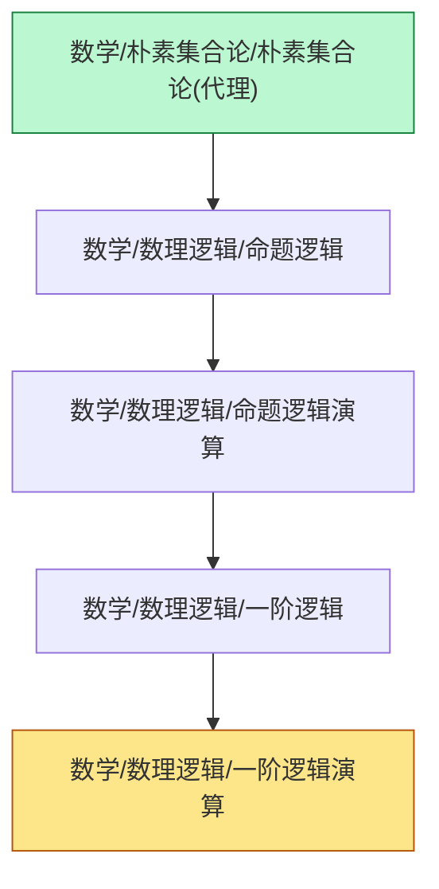

```mermaid
%%{init: {'flowchart': {'curve': 'stepAfter'}}}%%
graph TD
1["数学/数理逻辑/一阶逻辑"] --> 0["数学/数理逻辑/一阶逻辑演算"]
2["数学/数理逻辑/命题逻辑演算"] --> 1["数学/数理逻辑/一阶逻辑"]
3["数学/数理逻辑/命题逻辑"] --> 2["数学/数理逻辑/命题逻辑演算"]
4["数学/朴素集合论/朴素集合论(代理)"] --> 3["数学/数理逻辑/命题逻辑"]
classDef leaf fill:#fde68a,stroke:#b45309
class 0 leaf
classDef foundationRoot fill:#bbf7d0,stroke:#15803d
class 4 foundationRoot
click 0 "/数学/数理逻辑/一阶逻辑演算" "数学/数理逻辑/一阶逻辑演算"
click 1 "/数学/数理逻辑/一阶逻辑" "数学/数理逻辑/一阶逻辑"
click 2 "/数学/数理逻辑/命题逻辑演算" "数学/数理逻辑/命题逻辑演算"
click 3 "/数学/数理逻辑/命题逻辑" "数学/数理逻辑/命题逻辑"
click 4 "/数学/朴素集合论/朴素集合论(代理)" "数学/朴素集合论/朴素集合论(代理)"
```