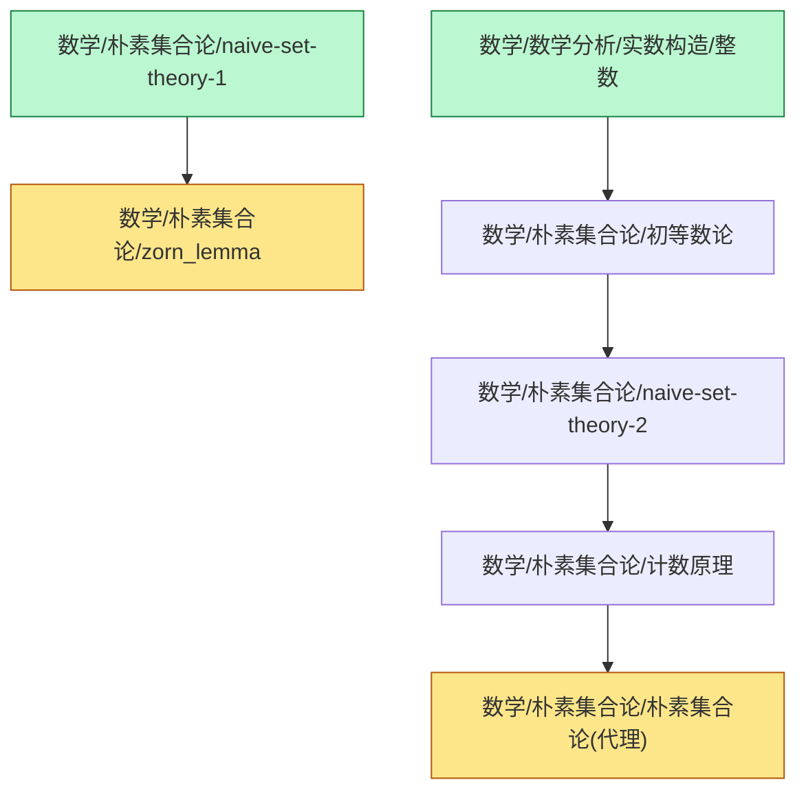

```mermaid
graph TD
1["数学/朴素集合论/naive-set-theory-1"] --> 0["数学/朴素集合论/zorn_lemma"]
3["数学/数学分析/实数构造/整数"] --> 2["数学/朴素集合论/初等数论"]
5["数学/朴素集合论/naive-set-theory-2"] --> 4["数学/朴素集合论/计数原理"]
2["数学/朴素集合论/初等数论"] --> 5["数学/朴素集合论/naive-set-theory-2"]
4["数学/朴素集合论/计数原理"] --> 6["数学/朴素集合论/朴素集合论(代理)"]
classDef leaf fill:#fde68a,stroke:#b45309
class 0,6 leaf
classDef foundationRoot fill:#bbf7d0,stroke:#15803d
class 1,3 foundationRoot
click 0 "/数学/朴素集合论/zorn_lemma" "数学/朴素集合论/zorn_lemma"
click 1 "/数学/朴素集合论/naive-set-theory-1" "数学/朴素集合论/naive-set-theory-1"
click 2 "/数学/朴素集合论/初等数论" "数学/朴素集合论/初等数论"
click 3 "/数学/数学分析/实数构造/整数" "数学/数学分析/实数构造/整数"
click 4 "/数学/朴素集合论/计数原理" "数学/朴素集合论/计数原理"
click 5 "/数学/朴素集合论/naive-set-theory-2" "数学/朴素集合论/naive-set-theory-2"
click 6 "/数学/朴素集合论/朴素集合论(代理)" "数学/朴素集合论/朴素集合论(代理)"
```