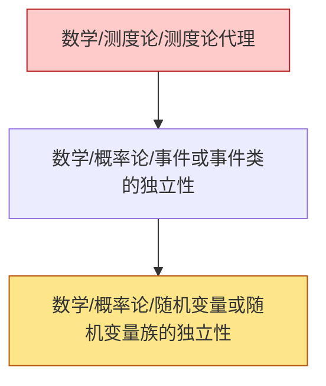

```mermaid
%%{init: {'flowchart': {'curve': 'stepAfter'}}}%%
graph TD
1["数学/测度论/测度论代理"] --> 0["数学/概率论/事件或事件类的独立性"]
0["数学/概率论/事件或事件类的独立性"] --> 2["数学/概率论/随机变量或随机变量族的独立性"]
classDef leaf fill:#fde68a,stroke:#b45309
class 2 leaf
classDef externalRoot fill:#fecaca,stroke:#b91c1c
class 1 externalRoot
click 0 "/数学/概率论/事件或事件类的独立性" "数学/概率论/事件或事件类的独立性"
click 1 "/数学/测度论/测度论代理" "数学/测度论/测度论代理"
click 2 "/数学/概率论/随机变量或随机变量族的独立性" "数学/概率论/随机变量或随机变量族的独立性"
```