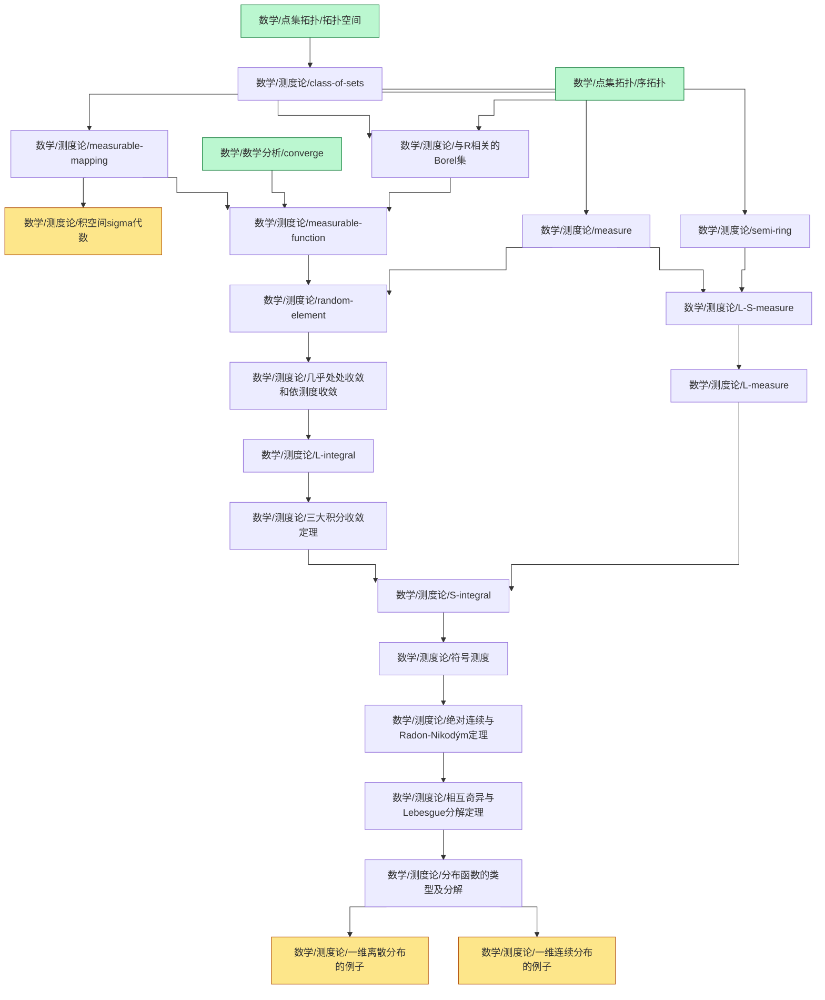

```mermaid
%%{init: {'flowchart': {'curve': 'stepAfter'}}}%%
graph TD
1["数学/测度论/分布函数的类型及分解"] --> 0["数学/测度论/一维离散分布的例子"]
3["数学/点集拓扑/拓扑空间"] --> 2["数学/测度论/class-of-sets"]
5["数学/测度论/S-integral"] --> 4["数学/测度论/符号测度"]
7["数学/测度论/measurable-mapping"] --> 6["数学/测度论/积空间sigma代数"]
1["数学/测度论/分布函数的类型及分解"] --> 8["数学/测度论/一维连续分布的例子"]
2["数学/测度论/class-of-sets"] --> 7["数学/测度论/measurable-mapping"]
2["数学/测度论/class-of-sets"] --> 9["数学/测度论/与R相关的Borel集"]
10["数学/点集拓扑/序拓扑"] --> 9["数学/测度论/与R相关的Borel集"]
7["数学/测度论/measurable-mapping"] --> 11["数学/测度论/measurable-function"]
12["数学/数学分析/converge"] --> 11["数学/测度论/measurable-function"]
9["数学/测度论/与R相关的Borel集"] --> 11["数学/测度论/measurable-function"]
14["数学/测度论/measure"] --> 13["数学/测度论/L-S-measure"]
15["数学/测度论/semi-ring"] --> 13["数学/测度论/L-S-measure"]
11["数学/测度论/measurable-function"] --> 16["数学/测度论/random-element"]
14["数学/测度论/measure"] --> 16["数学/测度论/random-element"]
2["数学/测度论/class-of-sets"] --> 15["数学/测度论/semi-ring"]
18["数学/测度论/L-integral"] --> 17["数学/测度论/三大积分收敛定理"]
4["数学/测度论/符号测度"] --> 19["数学/测度论/绝对连续与Radon-Nikodým定理"]
2["数学/测度论/class-of-sets"] --> 14["数学/测度论/measure"]
16["数学/测度论/random-element"] --> 20["数学/测度论/几乎处处收敛和依测度收敛"]
13["数学/测度论/L-S-measure"] --> 21["数学/测度论/L-measure"]
17["数学/测度论/三大积分收敛定理"] --> 5["数学/测度论/S-integral"]
21["数学/测度论/L-measure"] --> 5["数学/测度论/S-integral"]
19["数学/测度论/绝对连续与Radon-Nikodým定理"] --> 22["数学/测度论/相互奇异与Lebesgue分解定理"]
20["数学/测度论/几乎处处收敛和依测度收敛"] --> 18["数学/测度论/L-integral"]
22["数学/测度论/相互奇异与Lebesgue分解定理"] --> 1["数学/测度论/分布函数的类型及分解"]
classDef leaf fill:#fde68a,stroke:#b45309
class 0,6,8 leaf
classDef foundationRoot fill:#bbf7d0,stroke:#15803d
class 3,10,12 foundationRoot
click 0 "/数学/测度论/一维离散分布的例子" "数学/测度论/一维离散分布的例子"
click 1 "/数学/测度论/分布函数的类型及分解" "数学/测度论/分布函数的类型及分解"
click 2 "/数学/测度论/class-of-sets" "数学/测度论/class-of-sets"
click 3 "/数学/点集拓扑/拓扑空间" "数学/点集拓扑/拓扑空间"
click 4 "/数学/测度论/符号测度" "数学/测度论/符号测度"
click 5 "/数学/测度论/s-integral" "数学/测度论/S-integral"
click 6 "/数学/测度论/积空间sigma代数" "数学/测度论/积空间sigma代数"
click 7 "/数学/测度论/measurable-mapping" "数学/测度论/measurable-mapping"
click 8 "/数学/测度论/一维连续分布的例子" "数学/测度论/一维连续分布的例子"
click 9 "/数学/测度论/与r相关的borel集" "数学/测度论/与R相关的Borel集"
click 10 "/数学/点集拓扑/序拓扑" "数学/点集拓扑/序拓扑"
click 11 "/数学/测度论/measurable-function" "数学/测度论/measurable-function"
click 12 "/数学/数学分析/converge" "数学/数学分析/converge"
click 13 "/数学/测度论/l-s-measure" "数学/测度论/L-S-measure"
click 14 "/数学/测度论/measure" "数学/测度论/measure"
click 15 "/数学/测度论/semi-ring" "数学/测度论/semi-ring"
click 16 "/数学/测度论/random-element" "数学/测度论/random-element"
click 17 "/数学/测度论/三大积分收敛定理" "数学/测度论/三大积分收敛定理"
click 18 "/数学/测度论/l-integral" "数学/测度论/L-integral"
click 19 "/数学/测度论/绝对连续与radon-nikodým定理" "数学/测度论/绝对连续与Radon-Nikodým定理"
click 20 "/数学/测度论/几乎处处收敛和依测度收敛" "数学/测度论/几乎处处收敛和依测度收敛"
click 21 "/数学/测度论/l-measure" "数学/测度论/L-measure"
click 22 "/数学/测度论/相互奇异与lebesgue分解定理" "数学/测度论/相互奇异与Lebesgue分解定理"
```