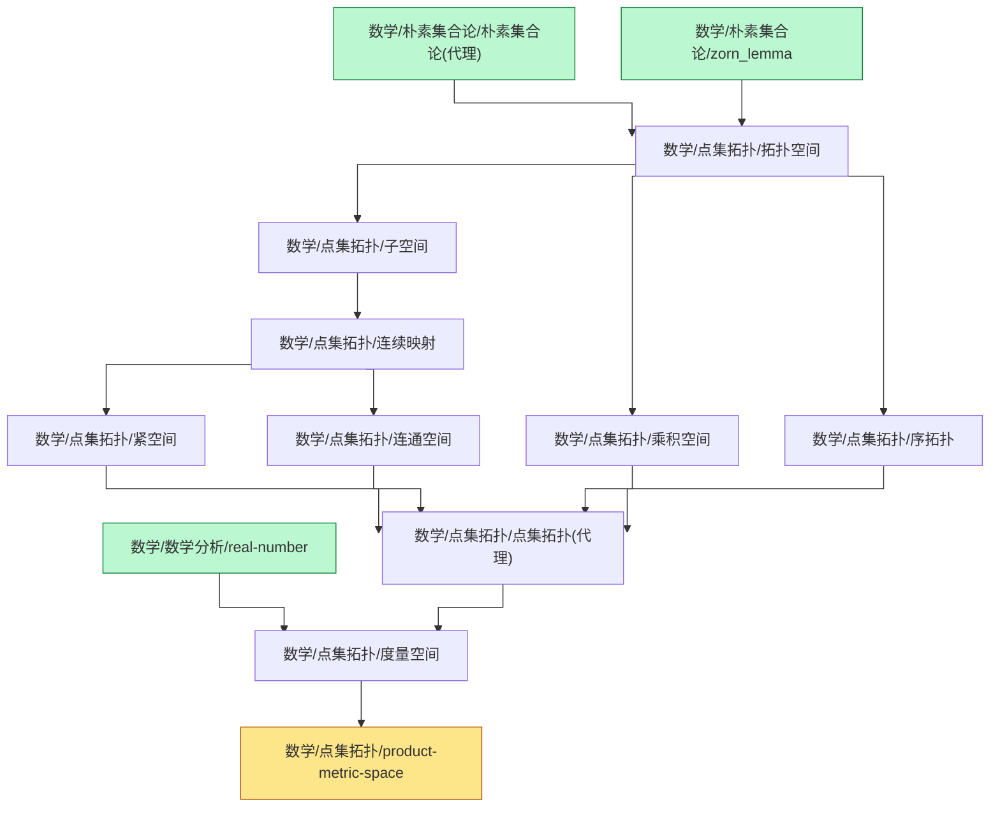

```mermaid
%%{init: {'flowchart': {'curve': 'stepAfter'}}}%%
graph TD
1["数学/朴素集合论/朴素集合论(代理)"] --> 0["数学/点集拓扑/拓扑空间"]
2["数学/朴素集合论/zorn_lemma"] --> 0["数学/点集拓扑/拓扑空间"]
4["数学/点集拓扑/子空间"] --> 3["数学/点集拓扑/连续映射"]
0["数学/点集拓扑/拓扑空间"] --> 4["数学/点集拓扑/子空间"]
6["数学/数学分析/real-number"] --> 5["数学/点集拓扑/度量空间"]
7["数学/点集拓扑/点集拓扑(代理)"] --> 5["数学/点集拓扑/度量空间"]
3["数学/点集拓扑/连续映射"] --> 8["数学/点集拓扑/紧空间"]
5["数学/点集拓扑/度量空间"] --> 9["数学/点集拓扑/product-metric-space"]
8["数学/点集拓扑/紧空间"] --> 7["数学/点集拓扑/点集拓扑(代理)"]
10["数学/点集拓扑/连通空间"] --> 7["数学/点集拓扑/点集拓扑(代理)"]
11["数学/点集拓扑/乘积空间"] --> 7["数学/点集拓扑/点集拓扑(代理)"]
12["数学/点集拓扑/序拓扑"] --> 7["数学/点集拓扑/点集拓扑(代理)"]
3["数学/点集拓扑/连续映射"] --> 10["数学/点集拓扑/连通空间"]
0["数学/点集拓扑/拓扑空间"] --> 11["数学/点集拓扑/乘积空间"]
0["数学/点集拓扑/拓扑空间"] --> 12["数学/点集拓扑/序拓扑"]
classDef leaf fill:#fde68a,stroke:#b45309
class 9 leaf
classDef foundationRoot fill:#bbf7d0,stroke:#15803d
class 1,2,6 foundationRoot
click 0 "/数学/点集拓扑/拓扑空间" "数学/点集拓扑/拓扑空间"
click 1 "/数学/朴素集合论/朴素集合论(代理)" "数学/朴素集合论/朴素集合论(代理)"
click 2 "/数学/朴素集合论/zorn_lemma" "数学/朴素集合论/zorn_lemma"
click 3 "/数学/点集拓扑/连续映射" "数学/点集拓扑/连续映射"
click 4 "/数学/点集拓扑/子空间" "数学/点集拓扑/子空间"
click 5 "/数学/点集拓扑/度量空间" "数学/点集拓扑/度量空间"
click 6 "/数学/数学分析/real-number" "数学/数学分析/real-number"
click 7 "/数学/点集拓扑/点集拓扑(代理)" "数学/点集拓扑/点集拓扑(代理)"
click 8 "/数学/点集拓扑/紧空间" "数学/点集拓扑/紧空间"
click 9 "/数学/点集拓扑/product-metric-space" "数学/点集拓扑/product-metric-space"
click 10 "/数学/点集拓扑/连通空间" "数学/点集拓扑/连通空间"
click 11 "/数学/点集拓扑/乘积空间" "数学/点集拓扑/乘积空间"
click 12 "/数学/点集拓扑/序拓扑" "数学/点集拓扑/序拓扑"
```