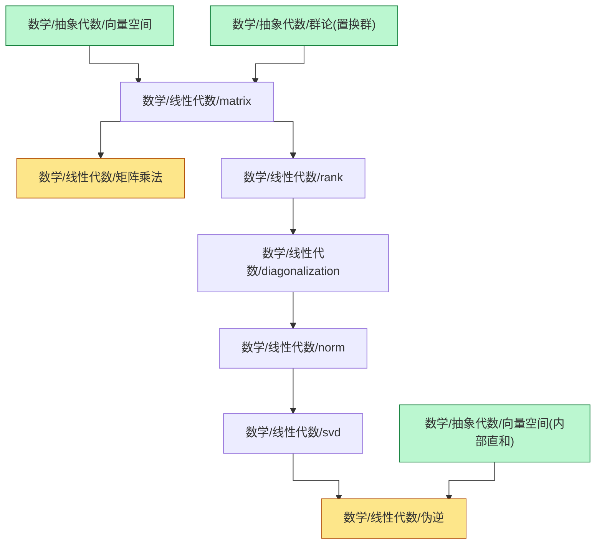

```mermaid
%%{init: {'flowchart': {'curve': 'stepAfter'}}}%%
graph TD
1["数学/线性代数/svd"] --> 0["数学/线性代数/伪逆"]
2["数学/抽象代数/向量空间(内部直和)"] --> 0["数学/线性代数/伪逆"]
4["数学/线性代数/matrix"] --> 3["数学/线性代数/矩阵乘法"]
4["数学/线性代数/matrix"] --> 5["数学/线性代数/rank"]
6["数学/抽象代数/向量空间"] --> 4["数学/线性代数/matrix"]
7["数学/抽象代数/群论(置换群)"] --> 4["数学/线性代数/matrix"]
5["数学/线性代数/rank"] --> 8["数学/线性代数/diagonalization"]
9["数学/线性代数/norm"] --> 1["数学/线性代数/svd"]
8["数学/线性代数/diagonalization"] --> 9["数学/线性代数/norm"]
classDef leaf fill:#fde68a,stroke:#b45309
class 0,3 leaf
classDef foundationRoot fill:#bbf7d0,stroke:#15803d
class 2,6,7 foundationRoot
click 0 "/数学/线性代数/伪逆" "数学/线性代数/伪逆"
click 1 "/数学/线性代数/svd" "数学/线性代数/svd"
click 2 "/数学/抽象代数/向量空间(内部直和)" "数学/抽象代数/向量空间(内部直和)"
click 3 "/数学/线性代数/矩阵乘法" "数学/线性代数/矩阵乘法"
click 4 "/数学/线性代数/matrix" "数学/线性代数/matrix"
click 5 "/数学/线性代数/rank" "数学/线性代数/rank"
click 6 "/数学/抽象代数/向量空间" "数学/抽象代数/向量空间"
click 7 "/数学/抽象代数/群论(置换群)" "数学/抽象代数/群论(置换群)"
click 8 "/数学/线性代数/diagonalization" "数学/线性代数/diagonalization"
click 9 "/数学/线性代数/norm" "数学/线性代数/norm"
```